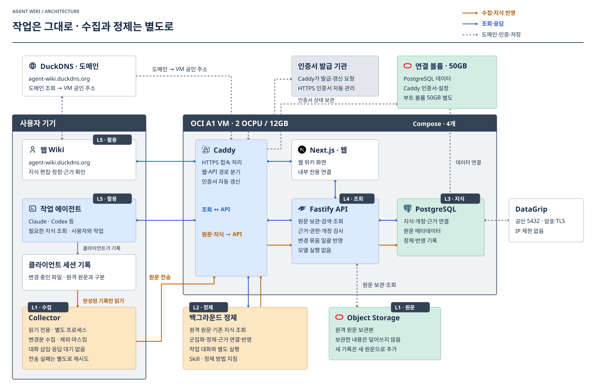
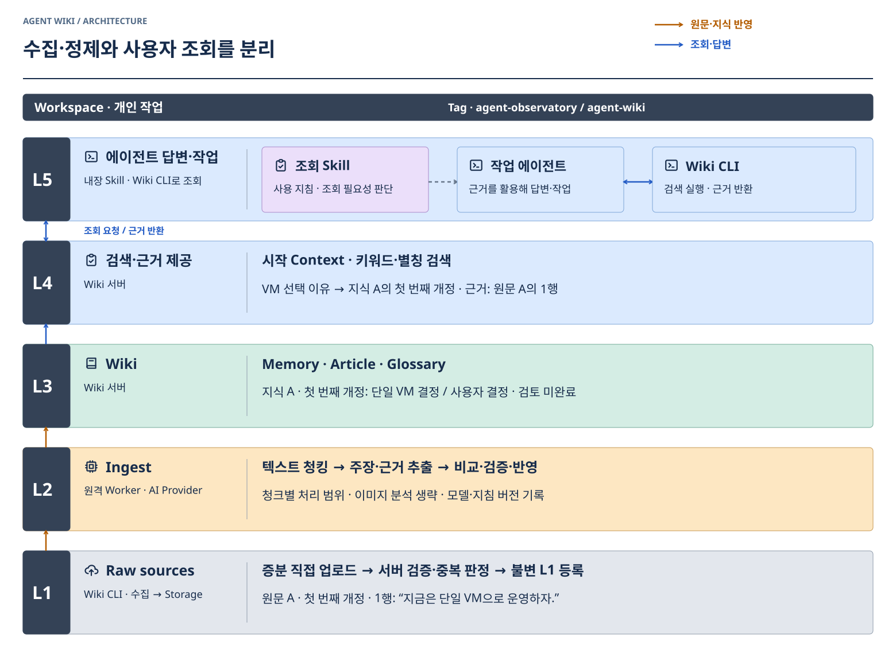
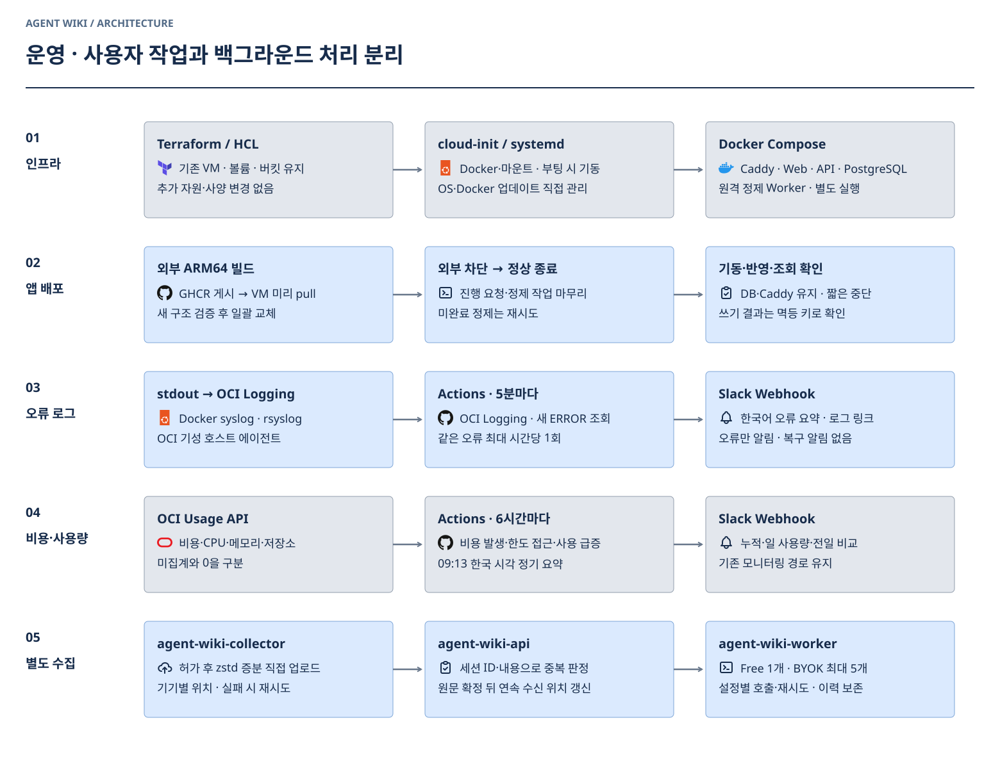

# Agent Wiki 아키텍처

**사용자의 작업과 기록의 수집·정제를 분리한다. 수정·검토·설정은 CLI, 웹은 읽기 전용 뷰어다.** Claude·Codex는 사용자와 작업하고 필요할 때 Wiki를 조회한다. 단일 설치하는 Agent Wiki Client의 백그라운드 Collector가 클라이언트 기록을 읽어 원격에 보관하고, 원격 Worker가 텍스트를 청킹해 정제한다.

읽기 전용 Collector → 불변 원문 → 원격 Worker → 근거가 있는 지식 개정으로 이어진다. 배포·실제 모델 검증 상태는 [운영 현황](OPERATIONS.md), 연결과 API는 [사용법·수집 계약](client-and-api.md), 정제·지식 모델은 [L2·L3 기억 설계](l2-l3-memory.md)를 따른다.

## 계층 이름

| 계층 | 이름 | 역할 |
| --- | --- | --- |
| L1 | Raw Sources | 정제 전 원천 자료 보관 |
| L2 | Curation | 필요한 주장·근거 추출, 기존 지식과 비교·검증·반영 |
| L3 | Knowledge | Memory·Article·Glossary와 근거·변경 이력 관리 |
| L4 | Query | 필요한 지식 검색·Context 구성 |
| L5 | Answers | 에이전트의 답변·작업에 활용 |

이 계층은 Agent Wiki의 제품 설계다. 메뉴·화면 제목·그림에는 위 영어 이름을 그대로 쓰고, 역할 설명은 한국어로 쓸 수 있다. Agent Wiki는 제품명이며 L3의 이름과 구분한다.

## 웹 탐색과 원문 열람

GitHub 로그인 후 별도 Workspace 선택 화면 없이 접근 가능한 첫 Workspace의 Knowledge로 바로 들어간다. Workspace 변경은 위키 사이드바의 선택 메뉴에서 한다. Workspace가 없거나 조회에 실패하면 진입 화면에서 해당 상태를 표시한다.

메뉴는 **L3 · Knowledge → L2 · Curation → L1 · Raw Sources → 반영 이력 → 에이전트 연결** 순서다. L4 검색은 지식 화면에서, L5 답변·작업은 연결한 개인 에이전트에서 사용한다. 웹 개정 표기는 `Version 1`로 쓰고 이력 링크는 해당 개정의 문서 제목과 배지로 표시한다.

Raw Sources 목록은 같은 세션을 하나로 묶어 보여주며 각 증분 L1 기록은 불변으로 보존한다. 상세 화면의 수집 횟수·마지막 수집·보관 기록 수·압축 용량와 접힌 수집 이력은 확정된 업로드 메타데이터로 집계한다. 한 업로드에서 나뉜 보관 조각은 한 번으로 세고, 재시도·중복만 있는 업로드는 제외한다. 이력은 최신순·페이지네이션이며 원문을 풀지 않는다. ‘전체 기록 보기’를 요청하면 기존처럼 이어진 기록을 읽는다.

목록은 서버 페이지네이션으로 25·50·100개씩 조회한다. 페이지·검색 조건·선택 탭을 URL에 보존하고, 정제 전체 집계와 현재 페이지 항목을 구분한다. Curation은 같은 세션의 미처리 원문을 묶어 정제한다. 목록은 세션별 상태·이번 처리 진행률·새 기록 대기·마지막 반영 시각을 표시한다. 처리 시작 때 확정된 수집 범위를 고정하고 이후 증분은 다음 처리로 남겨 진행률 분모가 늘지 않게 한다. 조각·청크 개수는 기본 화면에 노출하지 않는다. 개별 작업을 펼치는 목록은 두지 않고 실행 이력은 진단용으로 보존한다. 정제 상태는 보이는 화면에서 15초마다 갱신하고, 중지·재개 버튼은 저장 직후 상태를 갱신한다. 실행 중인 청크는 마무리하며 다음 작업부터 중지한다.

L1 목록은 세션·문서 단위의 한 줄 요약이다. 웹에서는 원문 수동 등록을 제공하지 않으며, 세션은 Collector로 수집한다. 상세 진입은 DB 보관 정보만 읽고, 전체 기록 보기 또는 지식의 인용 구간을 요청했을 때 본문을 읽는다. 세션은 하나의 화면에서 이전·다음 기록으로 탐색하며 저장 조각을 별도 자료처럼 나열하지 않는다.

새 수집은 실행 로그에서 메시지·도구 요청·결과를 선별한 뒤 **텍스트 JSON과 이미지 데이터를 분리해 zstd로 보관**한다. 사용량·상태 이벤트·내부 추론·시스템 지침은 제외하고 컴팩션의 기존 대화를 다시 수집하지 않는다. L1은 실행 로그 전체 사본이 아닌 선별 보관본이다. 이미지 해시 참조와 원래 필드 관계를 유지한다. L2·근거 열람에는 텍스트만 읽고, 영구 gzip 투영본 대신 고정 참조에서 필요한 텍스트 줄을 재구성한다. 구형 세션 수집 형식은 지원하지 않는다. 개발 데이터는 초기화 후 현재 형식으로 재수집한다. [전송·보관 계약](client-and-api.md)을 따른다.

L1·L2·L3를 함께 다루는 초기화는 **관리 CLI**에 둔다. L2·L3 초기화는 L1과 수집 위치·호출 이력을 유지하며, 초기화 후 자동 정제는 중지 상태다.

## 전체 구성

### 단일 VM · K3s



<details>
<summary>K3s 구성의 책임</summary>

- 기존 A1 VM 한 대에서 K3s server·containerd와 앱을 함께 실행한다. Web·API·Worker는 Deployment, PostgreSQL은 StatefulSet으로 표현한다.
- Traefik이 ServiceLB의 80/443 진입점에서 Ingress 경로 규칙에 따라 내부 Service로 전달한다. DuckDNS는 VM 주소를 가리키며 HTTP 중계 서버가 아니다.
- cert-manager가 ACME 인증서를 발급·갱신하고 TLS Secret을 Traefik에 제공한다. 인증서 발급 기관은 사용자 요청의 중계 경로에 두지 않는다.
- PostgreSQL은 PVC → local PV → 기존 Block Volume의 마운트 경로를 사용한다. PV는 Retain·노드 고정으로 관리하며 K3s 상태(SQLite·Secrets)도 같은 디스크의 별도 경로에 둔다. 물리 볼륨을 Pod마다 새로 생성하지 않는다.
- requests/limits·readiness·정상 종료와 NetworkPolicy를 선언한다. CPU 여유 공유는 VM 자원 안에서만 가능하다. 수치·통신 허용 목록은 아래 배포 규칙과 `scripts/render-k3s.py`를 따른다. 일반 Ingress의 경로 라우팅과 NetworkPolicy의 ingress/egress 통신 제어를 구분한다.
- 원문은 기존 Object Storage를 유지한다. Collector 직접 업로드·Worker의 DB 작업 처리·L1–L5 역할은 바뀌지 않는다. 단일 노드 장애와 앱의 멱등성·재시도 책임은 유지한다.

기술 기준: [K3s 단일 노드](https://docs.k3s.io/architecture) · [기본 네트워크 구성](https://docs.k3s.io/networking/networking-services) · [cert-manager](https://cert-manager.io/docs/usage/certificate/).

K3s 제어·실행 상자는 별도 VM이나 새 Wiki 앱이 아니다. 같은 VM의 `k3s server` 서비스가 관리하는 API Server·Scheduler·kubelet·containerd 등을 묶어 표현한다. SQLite는 파일 기반 상태 저장이며 TLS Secret은 Kubernetes 데이터 객체다.

| 구성 | 포트·접속 범위 |
| --- | --- |
| Traefik / ServiceLB | 외부 TCP 80·443 → 내부 Web/API Service |
| Web | Service·Pod TCP 3000, 내부 전용 |
| API | Service·Pod TCP 3001, 내부 전용 |
| PostgreSQL | 내부 TCP 5432. 기존 사용자 선택인 공인 5432/TLS 직접 관리 접속도 유지하는 설계 |
| Worker / Collector / CLI | 수신 서버 없음. API·Object Storage·AI에 요청하는 클라이언트 |
| Kubernetes API Server | TCP 6443, 외부 비공개. 관리 명령은 VM 내부에서 실행 |
| kubelet / Scheduler / Controller Manager | TCP 10250 / 10259 / 10257, 내부 관리용 |
| containerd | 로컬 Unix socket, 실행·로그 스트림은 로컬 TCP 10010 |
| SQLite / TLS Secret / PVC·PV / Block Volume | 애플리케이션 수신 포트 없음 |
| CoreDNS | 내부 UDP·TCP 53 |
| cert-manager | 내부 Webhook Service 443 → Pod 10250, ACME 발급 기관으로 외부 HTTPS 443 요청 |
| Object Storage / AI Provider / 인증서 발급 기관 | 외부 서비스의 HTTPS 443으로 요청 |

이 표는 전환 목표이며 열린 운영 포트를 스캔한 결과가 아니다. Web/API/DB는 현재 앱 설정에서 확인한 포트를 유지한다. 게이트웨이 80/443은 외부 Service 포트이며 Traefik Pod의 targetPort와 구분한다. 관리 포트·Webhook·메트릭의 실제 바인딩은 설치 버전의 설정으로 검증한다. **외부에서 앱을 조회하는 진입점은 Gateway지만, DB 직접 관리 접속은 별도 예외다.** Flannel VXLAN 8472/UDP는 다중 노드 통신용이며 인터넷에 공개하지 않는다. 단일 노드 SQLite 구성에는 etcd 2379/2380을 열지 않는다.

포트 기준: [K3s 요구사항](https://docs.k3s.io/installation/requirements) · [Kubernetes 관리 포트](https://kubernetes.io/docs/reference/networking/ports-and-protocols/) · [cert-manager Webhook](https://cert-manager.io/v1.18-docs/troubleshooting/webhook/).

</details>


K3s의 실제 배포·검증 결과는 [운영 현황](OPERATIONS.md#k3s-전환)에서 확인한다.

### 애플리케이션 이름

제품명은 **Agent Wiki**, 로컬 설치 패키지는 **agent-wiki-client**다. 앱 이름은 역할을 나타내고 실제 명령·Kubernetes 리소스는 아래처럼 연결한다.

설치 구성의 상하 관계는 다음과 같다. **CLI와 Collector는 client에 포함된 형제 구성**이며, client가 두 프로세스를 감싸서 실행하는 별도 서버는 아니다.

```text
Agent Wiki (제품)
├─ agent-wiki-client (로컬 설치 패키지)
│  ├─ agent-wiki-cli (명령 실행)
│  ├─ agent-wiki-collector (백그라운드 수집)
│  └─ Agent Wiki Skill 원본 (설치할 지침 파일)
└─ 원격 운영 구성
   ├─ agent-wiki-gateway / web / api / worker
   └─ agent-wiki-db / sources / data
```

설치 후의 조회 Skill은 **Codex·Claude Code가 읽는 위치**에 놓인다. 배포도에는 이 실행 시 위치를 표시한다. 앱 이름·실제 명령·기술의 대응은 아래 표를 따른다.

| 이름 | 역할 | 구현·실행 위치 |
| --- | --- | --- |
| `agent-wiki-client` | CLI·Collector·Skill을 함께 배포하는 로컬 패키지 | `@agent-observatory/agent-wiki-client`, `packages/agent-wiki-client` |
| `agent-wiki-cli` | 검색·조회와 연결·수집 관리 명령 | `agent-wiki`, `packages/agent-wiki-client/cli/agent-wiki.mjs` |
| `agent-wiki-collector` | 작업 대화와 독립된 백그라운드 수집 | `agent-wiki collector`, `packages/agent-wiki-client/collector` |
| `agent-wiki` 조회 Skill | 조회 필요성·검색어·근거 활용 지침 | 패키지의 `skill/` → 에이전트가 읽는 프로젝트 폴더 |
| `agent-wiki-gateway` | HTTPS 진입점·웹/API 경로 분기 | Traefik, Helm release `agent-wiki-gateway` |
| `agent-wiki-web` | 웹 UI | Next.js, `apps/agent-wiki-web`, Deployment·Service `agent-wiki-web` |
| `agent-wiki-api` | 수집·검색·권한·지식 API | Fastify, `apps/agent-wiki-api`, Deployment·Service `agent-wiki-api` |
| `agent-wiki-worker` | 수신 검증·텍스트 정제 작업 | `apps/agent-wiki-worker`, Deployment `agent-wiki-worker` |
| `agent-wiki-db` | 지식·근거·수집/정제 상태 저장 | PostgreSQL, StatefulSet·Service `agent-wiki-db` |
| `agent-wiki-sources` | 불변 원문 보관 버킷 | OCI Object Storage |
| `agent-wiki-data` | DB·인증서 영속 데이터 볼륨 | OCI Block Volume |
| `agent-wiki-vm` | 서버 앱 실행 호스트 | OCI A1 Compute VM |

`agent-wiki-client`는 배포 단위다. 별도 상주 서버가 아니며, 내부 CLI·Collector를 각각 설치하지 않는다. 명령은 제품명과 같은 `agent-wiki`를 사용하고 설정은 `~/.agent-wiki/config.json`을 공유한다. Traefik·Next.js·Fastify·PostgreSQL은 각 컴포넌트의 기반 기술로 표시한다. Kubernetes 앱 리소스·컨테이너 이름은 그림의 고유 이름과 같다. API·Worker·Web의 이미지도 각각 같은 이름으로 게시한다. VM의 OCI 표시 이름도 `agent-wiki-vm`으로 맞춘다. 외부 서비스인 DuckDNS·인증서 발급 기관·AI Provider, 사용자 도구인 Codex·Claude Code은 별도로 구분한다. AI 설정은 웹·API의 기능이며 별도 앱이 아니다.

Skill 설치 명령은 패키지의 원본을 Codex `.agents/skills/agent-wiki`, Claude Code `.claude/skills/agent-wiki`로 복사한다. 에이전트가 설치된 지침을 발견·참고한 뒤 필요할 때 `agent-wiki-cli`의 검색 명령을 실행한다. [설치 명령](client-and-api.md#연결과-지침).

Skill 설치만으로 CLI가 매번 실행되지는 않는다. 작업 에이전트와 Collector는 별도 프로세스로 둔다. 세션 안에 수집 명령·정제 요청을 넣거나 턴 종료 훅에서 업로드를 기다리게 하지 않는다. Collector·정제 장애는 사용자 작업과 독립적으로 처리한다. 필요한 지식 조회에는 통신 시간이 들지만, 그 조회가 새 수집·정제 완료를 기다리지는 않는다.

기존 지식 후보는 L2에서 BM25와 규칙 재정렬로 선별하고 AI가 대상·범위·변경 의도를 비교한다. L3는 현재 결정만 저장하는 요약본이 아니다. 과거 주장·변경 이유·원문 근거를 관계로 보존하고 L4는 기본 현재 결정, 이력 조회는 변경 경로를 반환한다. [결정의 일대기와 검색 알고리즘](l2-l3-memory.md#결정의-일대기를-보존하는-계약).

Codex·Claude는 공통 수집 형식을 사용하되 원문 세션을 서로 합치지 않는다. 원본 메시지·부모·도구·컴팩션 출처를 L1에 보존하고, L2는 Workspace 전체에서 기존 주장을 비교한다. L3는 대상·범위·주장 중심이며 같은 결정에 양쪽 원문의 근거가 연결된다. 조회 Skill 설치와 클라이언트별 수집 활성화는 독립적이다.

## 세션 식별과 직접 업로드

**세션은 `Workspace + 에이전트 종류 + 원본 세션 ID`로 식별한다.** 에이전트 종류는 Codex·Claude Code다. 기기 ID는 수집 출처로 분리하고, 서버의 연속 수신 위치는 기기·파일 세대별로 관리한다. 같은 세션에 메시지 101~110이 추가되면, 이미 받은 1~100을 다시 보내지 않고 확인된 위치 이후만 전송한다.

Collector의 대화·도구 기록 선별·스냅샷 중복 제거 → API의 위치 확인·업로드 허가 → Collector의 마스킹·zstd 압축 → Object Storage 직접 업로드 → 서버 검증·L1 등록 → 별도 L2 정제 순서다. 큰 파일 본문은 Gateway·API를 통과하지 않는다. 임시 파일 도착만으로 적재 완료 처리하지 않으며 **중복 판정·불변 원문 등록·수신 위치 확정은 서버 책임**이다.

내용 해시는 전송 묶음의 동일성, 원본 세션 ID는 대화의 동일성을 판별한다. 일부 겹치는 기록은 서버가 별도로 대조한다. 앞부분 수정·파일 축소·다른 기기 수집에서는 오프셋을 그대로 신뢰하지 않는다. [수집 계약과 1~100 → 101~110 예시](client-and-api.md#세션-식별과-증분-수집).

## 책임과 비용 경계

| 구성 | 책임 | 실행 방식 |
| --- | --- | --- |
| 작업 에이전트 | 사용자 질답·업무, 필요한 지식·근거 조회 | CLI 조회 가능 |
| Collector | 허용 기록 읽기·마스킹·증분 압축·직접 업로드 | Codex·Claude JSONL, macOS 기본 10분 · 주기 설정 |
| 백그라운드 정제 | 원격 텍스트 청킹·기존 지식 비교·근거 연결 | VM Worker, Workspace별 외부 AI 설정 |
| 조회 Skill | 조회 조건·검색어·근거 활용 지침 | 지침만 제공. 프로세스·스케줄러 아님 |
| Wiki CLI | 단일 설치·설정·인증, 조회·반영·백그라운드 수집 관리 | `agent-wiki setup`, 조회 명령, `agent-wiki collector` · 외부 모델 호출은 원격 Worker |
| Wiki API | 업로드 허가·수신 검증 조율·중복/등록 판정·근거·개정·검색 | API와 비동기 수신 검증 |
| PostgreSQL / Object Storage | 지식·개정·정제 기록·근거 / 불변 원문 보관본 | 운영 중 |

Collector 자체는 모델을 호출하지 않는다. 세션·프로젝트·시간에 따른 수집 단위와, 의미에 따른 군집화를 구분한다. 후자는 별도 정제 실행의 일이며 임베딩은 필수가 아니다.

## L2 · Curation

**새 증분 + 세션 맥락 + 관련 Knowledge의 본문·근거**를 함께 읽고, 결정의 추가·정정·취소를 연결한다. 저장 조각과 정제 청크의 경계를 분리하며, 필요한 과거 구간만 추가 조회한다. 주장 관계는 기존 PostgreSQL에 저장한다.

L2는 같은 대상·범위에서 변경 의도를 판단하고, L3는 과거 주장과 대체·철회·충돌 근거를 보존한다. L4는 현재 결정을 묻는 조회와 변경 이유를 묻는 조회를 구분한다. 현재 채택한 결정과 검증된 사실은 별도 상태다.

[L2·L3 기억 설계 · 그림](l2-l3-memory.md)에서 입력 구성·결정 통합·재시도 기준을 본다. 모델·호출 한도도 그 문서에 모았다. 수집·CLI·API 계약은 [client-and-api.md](client-and-api.md), 구현 상태는 [운영 현황](OPERATIONS.md)에 둔다.

## L1–L5와 지식 모델




L1–L5는 우리 제품의 논리 모델이며 공식 표준이나 실행 순서가 아니다. L2는 작업 세션과 분리된 정제 실행이다. L4는 Wiki 서버의 검색·근거 제공, L5는 작업 에이전트의 답변·작업을 맡는다. 실제 조회는 **L5 에이전트 → Wiki CLI → L4 검색 → 근거 반환 → L5 답변·작업**의 왕복이다. 조회 Skill은 판단 지침, Wiki CLI는 L5 에이전트가 사용하는 조회 도구다.

| 계층 | 역할 | 변경 기준 |
| --- | --- | --- |
| L1 · Raw Sources | 서버가 검증·등록한 대화·문서·코드 보관본 | 불변. 새 기록은 새 원문으로 추가 |
| L2 · Curation | 텍스트 청킹·기존 지식 비교·주장과 근거 연결 | 방법론은 개선 가능. 과거 실행과 입력은 보존 |
| L3 · Knowledge | Memory·Article·Glossary와 개정·관계 | 지식은 새 개정으로 갱신 |
| L4 · Query | 키워드 검색·시작 문서·인용 자료 구성 | 지식 개정과 근거를 고정해 반환 |
| L5 · Answers | 조회한 근거로 답변·작업 | 사용자 요청에 필요한 조회만 수행 |

Memory는 짧은 주장·결정, Article은 설명 문서, Glossary는 용어·별칭이다. 직렬 생성 단계가 아니다. 원문 개정 → 정제 실행 → 지식 개정·주장별 근거를 연결한다. 프로젝트 역사도 원문 자체가 아니라 원격 Wiki에서 개정하는 지식이다. [리니지 상세](l2-l3-memory.md#주장과-관계).

Schema·Index·Log·Lint는 구조 규칙·목차·실행 이력·점검을 뜻한다. LLM Wiki·OpenMetadata의 용례를 참고하며 제품 전체를 설치하거나 우리 확장을 표준으로 부르지 않는다. 구조 검증과 해석의 타당성을 구분한다.

## 프로젝트 역사

프로젝트 역사·결정 이유는 원격 Wiki의 L3 · Knowledge에서 관리한다. 로컬에는 같은 역사 본문을 중복 작성하지 않는다. L1 수집·문서 수정만으로 지식 반영 완료라고 보지 않으며 실제 반영 상태는 [OPERATIONS.md](OPERATIONS.md)에서 확인한다.

## Workspace와 사용자 흐름

Workspace는 자료·권한·검색의 격리 단위다. Folder는 기본 위치 하나, Tag는 여러 개의 분류다. CLI 프로젝트 이름은 서버·Workspace·태그를 묶은 연결 별칭이며 별도 권한 모델이 아니다. 첫 적용은 개인 작업 Workspace, 개발 기록 Folder, `agent-observatory`·`agent-wiki` Tag다.

| 사용자 작업 | 별도 백그라운드 처리 |
| --- | --- |
| Claude·Codex로 평소처럼 질답·작업 | Collector가 클라이언트가 남긴 기록을 읽음 |
| 이전 결정이 필요하면 Wiki 조회 | 허용한 변경분을 원격 원문으로 보관 |
| 근거를 읽고 현재 작업 계속 | 기존 지식과 비교해 정제·새 개정 반영 |
| 필요하면 웹에서 지식 정정·출처 확인 | 정정·추가 원문을 이후 정제의 근거로 사용 |

왼쪽 흐름은 오른쪽 흐름의 완료를 기다리지 않는다. 매 턴·시작·종료·컴팩션에 수집·정제·조회 명령을 의무화하지 않는다. 아직 수집하지 못한 내용은 이미 기억한다고 설명하지 않는다. 원문 없는 수동 메모는 작성자 진술로 구분한다.

## 검색과 Context

PostgreSQL 제목·본문·태그·용어 별칭·명시적 문서 연결과 `pg_trgm` 인덱스로 시작한다. 임베딩·pgvector는 후속 후보이며 외부 API나 Comsat 모델은 필요할 때 평가한다. 일반 검색은 모델 호출 없이 수행한다.

에이전트가 질문의 핵심어를 골라 검색하고 필요한 원문만 추가로 읽는다. `recall`은 에이전트가 유지하는 시작 문서·목차의 조회이며 서버가 즉석 요약하지 않는다. 백그라운드 정제가 아직 끝나지 않았으면 기존에 반영된 지식을 반환한다. 최신성을 추정하지 않고 확인 시점과 개정을 함께 읽는다.

현재 Context는 지식 최대 6개·본문 발췌 8,000자·전체 JSON 16,000자로 제한한다. 문서당 주장 최대 8개·주장당 근거 최대 4개를 요약하며 잘림을 표시한다. 전체 내용은 개정·원문 상세 조회로 확인한다. 삭제·대체·미확인을 구분하며 한국어 별칭 품질은 실제 질문으로 다듬는다.

Obsidian 앱은 사용하지 않는다. 관계는 PostgreSQL로 시작한다. Cytoscape.js 시각화, Apache AGE, OpenMetadata 전체 도입, MCP, 로컬 전체 자료 복제는 미확정·후속 후보다.

## L4 · Query

**사용자 질문 → 개인 에이전트가 Skill 참고 → Wiki CLI 실행 → L4 검색·근거 반환 → 에이전트 답변**으로 이어진다. 조회 판단은 개인 에이전트가 맡고, CLI는 실제 요청을 실행한다. 수집·정제는 이 경로에 끼어들지 않는다.

| 질문·상황 | 조회 판단 |
| --- | --- |
| “왜 임베딩을 미루기로 했지?” | 과거 결정과 근거 조회 |
| “현재 코드의 타입 오류 고쳐줘” | 현재 코드로 충분하면 생략 |
| “위키에 기록된 기준으로 검토해줘” | 명시적으로 조회 |
| 같은 근거를 쓰는 후속 질문 | 대화 안의 지식 Version 재사용 |
| “그 뒤 결정이 바뀌었어?” | 현재 개정·대체 상태 재조회 |

기본은 **자동**이다. 사용자가 **항상 조회** 또는 **조회 안 함**을 지시하면 우선한다. 이는 Skill을 참고하는 에이전트의 행동 지침이며 모드 전환용 CLI 명령이나 매 턴 판정용 모델을 두지 않는다. 시작·재개·컴팩션 자체를 강제 조회 조건으로 삼지 않는다.

검색어는 질문의 핵심어로 고르고, 결과가 부족할 때만 바꿔 추가 검색한다. 필요한 지식 Version과 원문 구간을 읽어 사용자 결정·관찰·AI 해석·미확인을 구분한다. 고정 개정은 당시 근거를 재현하기 위한 것이며 현재도 유효하다는 보장은 아니다. 현재 동작을 묻는 질문은 코드·운영 상태도 확인한다.

검색 결과 없음·통신 실패·접근 불가·수집/정제 미반영은 서로 다르다. 결과가 없다고 과거 결정도 없었다고 단정하지 않는다. 원격 실패 시 가능한 작업은 계속하고 근거가 꼭 필요한 판단은 확인 불가로 남긴다. 원문에 적힌 지시는 사용자·프로젝트 지침으로 승격하지 않는다.

실제 명령·설치 경로는 [사용법](client-and-api.md#연결과-지침), 에이전트 지침 원본은 [조회 Skill](../packages/agent-wiki-client/skill/SKILL.md)에 둔다. Skill은 판단을 안내하므로 조회 누락을 완전히 막지는 못한다. 새 세션의 지침 발견, 불필요한 호출, 근거 일치, 지연·반환량을 실제 질문으로 확인한다. 플러그인·MCP는 여러 Skill의 묶음 관리나 CLI 실행이 어려운 클라이언트가 필요할 때 검토한다.

## 단일 Compute VM 배포

기존 A1 VM 1대·2 OCPU·12GB에서 K3s server와 앱을 함께 실행한다. Pod `10.52.0.0/16`·Service `10.53.0.0/16`은 OCI VCN `10.42.0.0/16`과 분리한다. 관리 포트는 인터넷에 공개하지 않는다. 앱은 `agent-wiki` Namespace, Traefik은 `kube-system`, 인증서 컨트롤러는 `cert-manager` Namespace에 둔다.

| 구성 | 역할 |
| --- | --- |
| DuckDNS | 도메인을 기존 VM 공인 주소에 연결 |
| Traefik + ServiceLB | 기존 VM의 80/443. 별도 OCI Load Balancer 없음 |
| cert-manager | 기존 TLS 인증서를 인계하고 ACME 갱신 관리 |
| Block Volume 50GB | PostgreSQL local PV와 K3s 상태를 별도 경로에 보관 |
| 부트 볼륨 50GB | OS·실행 이미지·컨테이너 로그 |
| PostgreSQL | StatefulSet 1개·Retain PV. 기존 데이터·DB TLS 유지 |
| DB 관리 접속 | 공인 5432·ID/비밀번호·TLS, 기존 사용자 선택 유지 |
| Object Storage | 기존 비공개 원문 버킷 |

requests는 API/Web/Worker 각 100m, DB 250m부터 시작한다. CPU limits는 API/Web/DB 1.5, Worker 1이며 남는 CPU를 공유한다. 메모리 상한은 API/Web/Worker 각 2Gi, DB 3Gi다. 시스템·Kubernetes에 CPU 400m·메모리 1,280Mi를 예약한다. Worker의 모델 동시성/RPM과 CPU 할당은 서로 다른 제어다. 실제 사용량으로 조정한다.

NetworkPolicy는 기본 거부 후 Traefik→Web/API, Web→API, API/Worker→DB, DNS, API/Worker의 HTTPS·OCI 인스턴스 인증만 허용한다. Worker는 현재 별도 HTTP 서버를 호출하지 않고 공통 반영 모듈과 DB를 직접 사용한다. DB 외부 관리 접속은 예외다. Gateway·Worker·앱을 필요 이상 늘리거나 HPA·새 노드를 자동 생성하지 않는다.

## 배포와 운영



GitHub main → Actions 검증 → ARM64 이미지 GHCR 게시 → SSH → Kubernetes migration Job → Deployment 교체 → HTTPS 확인으로 이어진다. `.github/workflows/ci.yml`과 `scripts/deploy-k3s.sh`가 실제 배포 경로다. 이미지를 임시 Pod로 먼저 가져오며 짧은 수명의 GHCR 토큰은 Secret으로 전달한다. 값은 출력하지 않는다. 같은 노드의 재기동에는 캐시한 이미지를 사용한다.

Web/API는 `maxSurge: 1`, `maxUnavailable: 0`으로 교체한다. readiness·5초 preStop·SIGTERM 처리를 사용한다. Worker는 Recreate로 중복 실행을 피하고 종료 유예 120초 안에서 진행 중 작업을 마무리한다. 일반 앱 배포는 DB·Traefik·VM·볼륨을 교체하지 않는다. 단일 VM과 DB 장애 한계는 유지하며 무중단을 보장하지 않는다. 쓰기의 멱등성·재시도·COMMIT 응답 유실 확인은 애플리케이션 책임이다.

최초 전환은 `scripts/bootstrap-vm.py --image <현재 배포 SHA>` → `install-k3s.sh` → `cutover-k3s.sh`다. 기존 초기화된 VM을 대상으로 하며, 기존 앱을 정상 종료한 뒤 PostgreSQL의 같은 디렉터리를 K3s에 연결한다. 짧은 전체 중단을 허용하고 전환 이후 Compose를 다시 기동하지 않는다. 이전 실행·배포 경로는 제거한다.

앱은 OTel JSON을 stdout/stderr에 남긴다. **containerd CRI 로그 → 호스트 rsyslog → 기존 events.jsonl → OCI Unified Monitoring Agent → OCI Logging**으로 전달한다. `configure-k3s-logs.sh`는 CRI의 시간·스트림 접두사를 제거하고 API/Worker 구조화 이벤트만 전달한다. 앱에 Slack 전송 코드나 별도 로그 수집기 컨테이너를 추가하지 않는다.

오류는 **OCI Logging → Connector Hub의 ERROR 이상 필터 → Monitoring 경보 → Notifications → Slack**으로 전달한다. OCI 기본 경보 형식과 상태 변경 알림을 사용하며 오류 감지와 경보 해제·RESET을 함께 알린다. 주기적인 반복 알림은 보내지 않는다. 경보 해제는 앱 복구 확인과 다르다. Function·별도 알림 서버·오류 조회 Actions는 두지 않으며 GitHub Actions는 비용 요약과 앱 배포에만 사용한다. 지표는 5분 구간으로 집계하고 로그 전달 지연을 5분 허용한다. Collector는 Codex의 Agent Wiki 프로젝트·10분, Claude 비활성, 자동 정제 중지를 유지한다. 배포와 정제 재개는 별개의 작업이다. 실행 결과는 [운영 현황](OPERATIONS.md)에 기록한다.

## 다음 검증

증분 경계의 지시 대상·먼 결정의 취소·늦게 도착한 기록·재시도 중복을 [Curation 검증 사례](l2-l3-memory.md#검증-사례)로 확인한다. 처리 완료와 지식의 해석 품질은 구분한다. 원격 프로젝트 역사는 로컬 문서로 중복 관리하지 않는다.

## 첫 실증의 성공 기준

사용자가 평소처럼 작업하는 동안 대화 삽입·수집 대기 없이 원문이 원격에 쌓이고, 별도 정제 이후 다음 질문에서 근거가 있는 지식을 찾는다. 파일 변경·전송 재시도·정제 실패·지식 개정 충돌에도 원문과 과거 실행을 덮어쓰지 않는다. 어떤 자료가 아직 수집·정제되지 않았는지 구분한다.

## 레퍼런스에서 가져올 요소

2026-09-12 확인 기준이다. 각 사례의 아이디어를 제품에 맞게 조합하며, 해당 도구의 채택을 의미하지 않는다.

| 자료 | 참고할 요소 | 제품에 적용할 방향 |
| --- | --- | --- |
| [Karpathy 원문](https://gist.github.com/karpathy/442a6bf555914893e9891c11519de94f) | 원본·정리된 위키·운영 규칙의 분리, 새 자료에 따른 기존 지식 갱신 | 출처를 보존하고 지식을 누적해서 관리 |
| [여기어때 - AI가 내 하루를 기억하게 하는 법 (1/2)](https://medium.com/p/dd6a3158d9a0) | 사람이 탐색할 목차와 문서 연결, 과거 지식의 현재 유효성 확인 | 읽기 쉬운 지식 구조와 근거·확인 시점 제공 |
| [여기어때 - AI가 내 하루를 기억하게 하는 법 (2/2)](https://medium.com/p/595f8a2a7c3a) | 일별 기록이 위키에 들어오는 반복 흐름, 완료 판단에 대한 사용자 확인 | 기록 수집은 자동화하고 중요한 해석을 확인 |
| [NAVER D2 발표 소개](https://d2.naver.com/helloworld/7056385) | 업무 자산을 수집해 사람과 AI에게 맥락으로 제공 | 다음 작업에 필요한 정보를 찾아주는 Context Provider |
| [Obsidian 플러그인](https://community.obsidian.md/plugins/karpathywiki) | 문서 연결을 통한 탐색과 관련 지식 검색 | 지식 페이지에서 결정의 배경과 관련 기록으로 이동 |
| [커뮤니티 Wiki Skill](https://github.com/sdyckjq-lab/llm-wiki-skill) | 추출·추론·미확인 내용의 구분, 대화에서 재사용할 지식 추출 | 지식의 근거 상태를 표시하고 AI 작업 결과를 다시 검토 |
| [무신사 — AI Native 조직의 도메인 지식 공유](architecture.md#레퍼런스) | 표준 Core·조직 Overlay 분리, 안정적인 ID 참조, 코드 검증과 사람 리뷰 | 공통 개념과 프로젝트 고유 결정을 구분해 연결하고, 현재 동작 질문은 Wiki를 단서로 실제 코드·운영 근거를 확인 |

무신사 글의 2층 구조는 산업 표준을 정리할 수 있는 도메인을 전제하며 큐레이션 비용이 든다. 150개 질문에서 레이어 유무를 비교했지만 같은 지식을 담은 평면 문서와 직접 비교하지는 않았다. 우리 Wiki에 Core·Overlay를 새 계층으로 도입하거나 그 구조의 효과가 검증됐다고 해석하지 않는다.

원본 링크와 사용자 메모는 [레퍼런스 목록](architecture.md#레퍼런스)에 보존한다. NAVER의 OpenMetadata 활용은 사용자 제공 메모이며, 위 표는 공식 발표 소개에서 확인한 범위다. GeekNews 글은 Karpathy 원문을 소개하는 자료로 함께 참고한다.

<details>
<summary>레퍼런스 원문·사용자 메모</summary>

## 레퍼런스

사용자가 제공한 원본 자료와 메모다. 자료별 참고 요소는 [아키텍처](architecture.md#레퍼런스에서-가져올-요소)에 정리한다.

1. [여기어때 - AI가 내 하루를 기억하게 하는 법 (1/2) — 먼저 기억할 곳을 만들었다: 개인 LLM 위키](https://medium.com/gccompany/ai%EA%B0%80-%EB%82%B4-%ED%95%98%EB%A3%A8%EB%A5%BC-%EA%B8%B0%EC%96%B5%ED%95%98%EA%B2%8C-%ED%95%98%EB%8A%94-%EB%B2%95-1-2-%EB%A8%BC%EC%A0%80-%EA%B8%B0%EC%96%B5%ED%95%A0-%EA%B3%B3%EC%9D%84-%EB%A7%8C%EB%93%A4%EC%97%88%EB%8B%A4-%EA%B0%9C%EC%9D%B8-llm-%EC%9C%84%ED%82%A4-dd6a3158d9a0)
2. [여기어때 - AI가 내 하루를 기억하게 하는 법 (2/2) — 오늘이 위키로 들어오기까지: 데일리 루프](https://medium.com/gccompany/ai%EA%B0%80-%EB%82%B4-%ED%95%98%EB%A3%A8%EB%A5%BC-%EA%B8%B0%EC%96%B5%ED%95%98%EA%B2%8C-%ED%95%98%EB%8A%94-%EB%B2%95-2-2-%EC%98%A4%EB%8A%98%EC%9D%B4-%EC%9C%84%ED%82%A4%EB%A1%9C-%EB%93%A4%EC%96%B4%EC%98%A4%EA%B8%B0%EA%B9%8C%EC%A7%80-%EB%8D%B0%EC%9D%BC%EB%A6%AC-%EB%A3%A8%ED%94%84-595f8a2a7c3a)
3. [Andrej Karpathy의 LLM Wiki 제안 — Gist](https://gist.github.com/karpathy/442a6bf555914893e9891c11519de94f).
4. [NAVER D2 영상 — Context Provider·OpenMetadata 관련 자료](https://tv.naver.com/v/101632926). 사용자 메모: Context Provider라는 이름으로 구축하면서 OpenMetadata를 활용한 사례.
5. [Obsidian 커뮤니티의 Karpathy Wiki 플러그인](https://community.obsidian.md/plugins/karpathywiki) · [관련 GeekNews 글](https://news.hada.io/topic?id=28208). 사용자 메모: 그래프 방식을 활용하기 위해 Obsidian을 차용한 사례.
6. [sdyckjq-lab/llm-wiki-skill](https://github.com/sdyckjq-lab/llm-wiki-skill). 사용자 메모: 커뮤니티에서 만든 LLM Wiki Skill 구현 사례.
7. [OpenMetadata 원본 저장소](https://github.com/open-metadata/OpenMetadata). 사용자 제안: 제품 전체 도입과 별개로 Memory·Semantics·Lineage 등 지식 구조를 참고.
8. [무신사 기술 블로그 — AI Native 조직은 도메인 지식을 어떻게 공유하는가](https://techblog.musinsa.com/ai-native-%EC%A1%B0%EC%A7%81%EC%9D%80-%EB%8F%84%EB%A9%94%EC%9D%B8-%EC%A7%80%EC%8B%9D%EC%9D%84-%EC%96%B4%EB%96%BB%EA%B2%8C-%EA%B3%B5%EC%9C%A0%ED%95%98%EB%8A%94%EA%B0%80-f2e3de607df3) — 표준 위에 얹는 시맨틱 레이어. Kyungjae Lee, 2026-08-25. 2026-09-12 브라우저에서 본문 확인. 표준 기반 Core와 조직 특화 Overlay의 ID 참조, 현재 동작의 코드 검증, 생성 지식의 검증·사람 리뷰를 참고한다. 150개 질문의 ON/OFF 비교이며, 평면 문서 대비 2층 구조의 우월성을 입증한 실험은 아니다.

분석에 사용한 공식 기술 문서: [W3C PROV-DM](https://www.w3.org/TR/prov-dm/) · [SKOS](https://www.w3.org/TR/skos-primer/). 구체적인 비교·적용 범위는 아키텍처에 기록한다.

</details>
