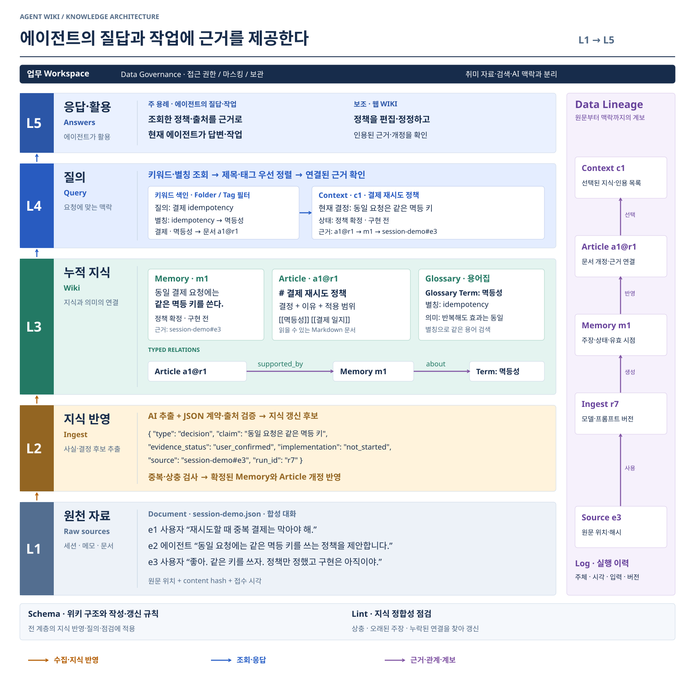
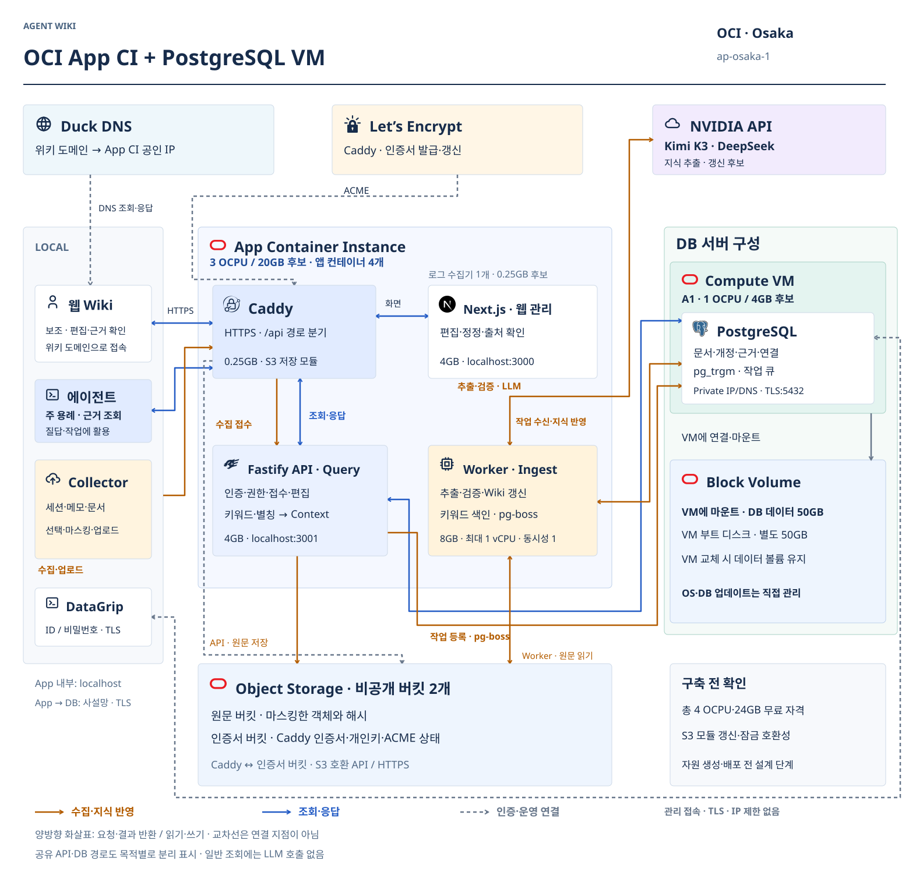
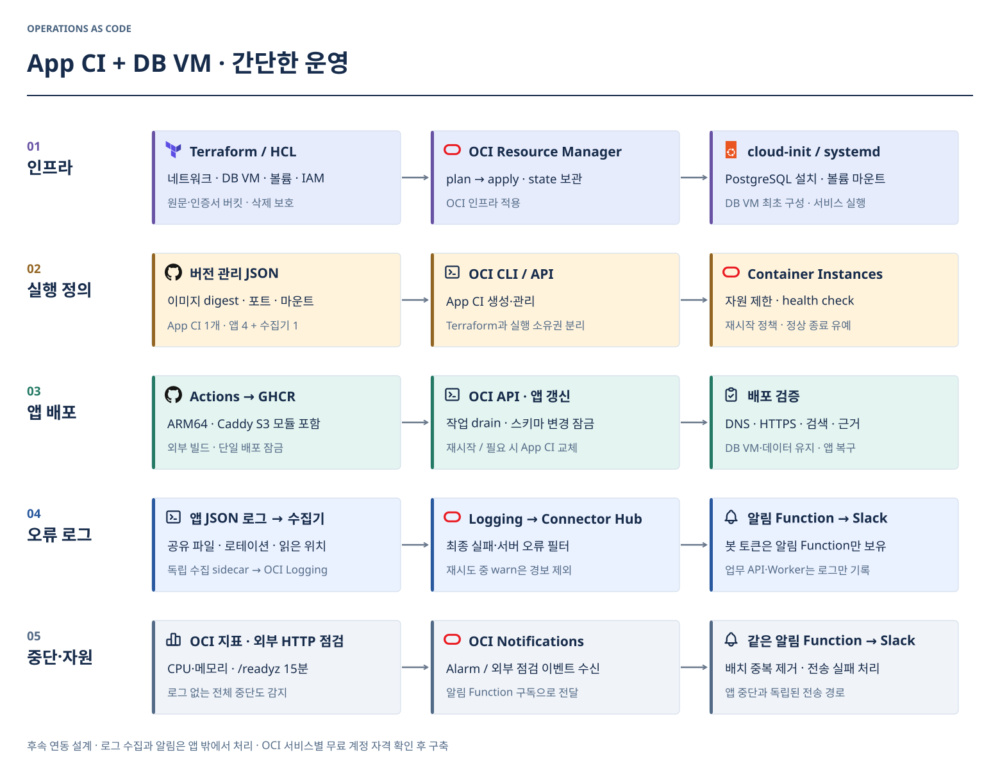

# Agent Wiki 아키텍처

[Wiki 문서와 레퍼런스](README.md)

**주 용례는 에이전트가 질답·작업 중 필요한 근거 자료를 조회하는 것이다.** Wiki는 원천 자료를 축적·정리해 인용 가능한 Context를 제공한다. 웹은 편집·정정·근거 확인을 위한 보조 화면이며 Workspace로 업무·취미를 격리한다.

2026-09-12 설계안. 앱·인프라 구현과 배포는 아직 하지 않았다. 초기 검색은 키워드 방식이며, 지식 추출은 NVIDIA LLM을 사용한다. 임베딩과 OpenMetadata 전체 도입은 보류한다.

## 공통 용어: LLM Wiki · OpenMetadata

**계층·작업 이름은 Karpathy의 LLM Wiki, 지식 객체·용어집·계보는 OpenMetadata v2.0.x를 기준으로 통일한다.** 아래 표가 Wiki 문서·그림·향후 API와 스키마의 용어 기준이다. 두 자료의 개념을 조합한 제품 설계이며, L1–L5 자체가 외부 표준은 아니다.

### 계층과 작업

| 위치 | 기준 이름 | 한글·책임 | 출처 |
| --- | --- | --- | --- |
| L1 | **Raw sources** | 원천 자료. 개별 입력은 Source, 업로드한 파일 기록은 Document | LLM Wiki / OpenMetadata Documents |
| L2 | **Ingest** | 지식 반영. 읽기·추출·검증 후 기존 Wiki에 반영하는 작업 | LLM Wiki |
| L3 | **Wiki** | 누적 지식. Memory·Article·Glossary와 연결을 보관 | LLM Wiki + OpenMetadata |
| L4 | **Query** | 질의. 현재 지식을 검색하고 인용할 근거를 선택 | LLM Wiki |
| L5 | **Answers** | 응답·활용. 근거와 함께 답하거나 다음 에이전트 작업에 전달 | LLM Wiki의 Query 산출물에서 차용 |
| 공통 규칙 | **Schema** | 위키의 구조·작성 관례·작업 절차 | LLM Wiki |
| 유지 작업 | **Lint** | 상충·오래된 주장·연결 누락 등을 점검 | LLM Wiki |
| 탐색 | **Index** | 지식 페이지를 찾기 위한 목차 | LLM Wiki |
| 작업 이력 | **Log** | Ingest·Query·Lint의 시간순 실행 기록 | LLM Wiki |

[LLM Wiki 원문](https://gist.github.com/karpathy/442a6bf555914893e9891c11519de94f)의 개념을 제품에 맞게 조합했다. Schema는 작성·운영 관례이며 DB 스키마와 구분한다. Index·Log는 역할 이름으로, 특정 파일 형식을 강제하지 않는다.

### 지식 객체와 관리

| 기준 이름 | 의미 | Wiki 예시·적용 범위 |
| --- | --- | --- |
| **Source · 원천 자료** | Wiki 작성에 사용하는 개별 입력 | `session-demo#e3`로 특정 발언 참조. LLM Wiki의 raw source |
| **Document · 입력 문서** | 업로드한 파일의 관리 기록 | 세션 JSON·메모 파일·PDF. Source 중 파일로 받은 자료에 사용 |
| **Memory · 기억** | 짧고 재사용 가능한 사실·정의·선호 | `m1`: 같은 결제 요청은 같은 멱등 키. 결정 상태는 제품 확장 |
| **Article · 지식 문서** | 지속적으로 작성·개정하는 긴 설명 문서 | `a1@r1`: 결제 재시도 정책. 일별 업무 일지도 Article의 한 유형 |
| **Glossary · 용어집** | 정의와 관계를 관리하는 용어 모음 | 결제 용어집 |
| **Glossary Term · 용어** | 용어집에 속한 개별 개념 | 멱등성, 별칭 idempotency, 관련 용어 |
| **Data Lineage · 데이터 계보** | 입력에서 결과물로 이어지는 변환·사용 관계 | Source → Ingest 실행 → Memory → Article 개정 → Context |
| **Data Governance · 데이터 관리 정책** | 데이터의 접근·분류·보관 등을 통제하는 규칙 | Workspace별 접근 권한·마스킹·정정·삭제 |
| **Folder · 폴더** | 문서를 계층적으로 정리하는 단위 | 프로젝트 / 장애 대응 / 학습 |
| **Tag · 태그** | 여러 항목에 붙이는 분류·탐색 표시 | Redis, 성능, 독서. 권한 경계로 사용하지 않음 |
| **Context · 맥락** | 사람·AI가 작업을 이해하는 데 쓰는 관련 지식 | 요청별 현재 결정·제약·인용. 전달 묶음의 형식은 제품 설계 |

[Documents](https://docs.open-metadata.org/v2.0.x/how-to-guides/context-center/documents) · [Memories](https://docs.open-metadata.org/v2.0.x/how-to-guides/context-center/memories) · [Articles](https://docs.open-metadata.org/v2.0.x/how-to-guides/context-center/articles) · [Glossary](https://docs.open-metadata.org/v2.0.x/how-to-guides/data-governance/glossary) · [Data Lineage](https://docs.open-metadata.org/v2.0.x/how-to-guides/data-lineage) · [Data Governance](https://docs.open-metadata.org/v2.0.x/how-to-guides/data-governance) · [Context Center](https://docs.open-metadata.org/v2.0.x/how-to-guides/context-center)

Document는 입력 파일, Article은 유지·개정하는 위키 페이지다. 추출 결과는 검증 전까지 지식 변경 후보로 취급한다.

Workspace 격리와 `supported_by`·`about`·`supersedes` 관계는 우리 제품 계약이다. Data Lineage는 파생 경로, Log는 실행 이력이다. [W3C PROV-DM](https://www.w3.org/TR/prov-dm/)은 출처 모델 참고 자료로 둔다.

### 갱신과 검색의 책임

1. Ingest가 Raw sources를 읽고 후보를 추출한다. Source와 Memory의 ID를 연결하고 제안·확정·구현 완료를 구분한다.
2. Wiki에 Memory·Article 개정을 반영한다. 이전 결정을 대체할 때는 유효 시점과 `supersedes`를 기록한다.
3. 같은 트랜잭션에 색인 갱신 작업을 등록한다. 키워드 검색 인덱스는 개정 ID로 재생성할 수 있게 관리한다.
4. Query는 Workspace·권한·삭제·유효성 조건을 검색과 관계 확장에 적용한다. Context에 담기 전 현재 개정과 인용을 재검사한다.
5. Lint는 상충·오래된 주장·누락된 연결을 점검한다. 정정·삭제 시 Data Lineage로 영향을 찾고 문서·색인·Context 캐시를 재계산한다.
6. Ingest·Query·Lint의 실행 주체·시각·입력·버전을 Log에 기록한다. Log의 순서만으로 파생 관계를 추론하지 않는다.

Data Lineage는 L1–L4를 가로지르며, Data Governance와 Schema는 전 계층에 적용한다. 원천 자료가 만료·삭제되면 근거 본문을 볼 수 없음을 표시한다. 해시만으로 내용의 진위를 증명했다고 표현하지 않는다.

## 지식 저장·조회와 웹 편집: 무엇을 재사용할까

사람과 에이전트는 같은 Article·Memory·개정을 사용한다. 편집기는 기준 개정을 전송하고 서버의 현재 개정과 다르면 충돌로 처리한다.

| 범위 | 재사용 후보 | 제품에서 구현할 것 |
| --- | --- | --- |
| 저장·검색 | PostgreSQL·pg_trgm | 지식 모델·Workspace 제약·검색 순위 |
| 관계 조회 | SQL JOIN·[재귀 CTE](https://www.postgresql.org/docs/current/queries-with.html) | 근거·주제·대체 관계와 탐색 범위 |
| 그래프 화면 | [Cytoscape.js](https://js.cytoscape.org/) | 노드·간선 선택과 근거 열기 |
| 웹 읽기·편집 | 기존 편집기·Markdown 렌더러, 선정 전 | 문서 URL·목차·링크·개정·권한 통합 |

Obsidian 앱은 사용하지 않는다. Markdown·위키 링크·역방향 참조의 재사용 범위와 웹 편집기는 미확정이다. Cytoscape.js는 시각화 후보이며 관계는 PostgreSQL에 저장한다. [Apache AGE](https://age.apache.org/)는 SQL로 부족한 그래프 질의가 확인될 때 평가한다.

## 초기 검색과 임베딩 보류

**키워드·Folder·Tag·용어집 별칭·문서 연결로 검색한다.** 검색·Context 구성에 AI 호출은 필요하지 않다.

### 키워드에서 Context까지

| 단계 | 초기 동작 | 결과 |
| --- | --- | --- |
| 검색 자료 준비 | Article 제목·본문, Memory 본문, Tag·용어집 이름과 별칭을 정규화 | 검색할 문자열·명시적인 분류와 관계 |
| 키워드 조회 | PostgreSQL에서 제목·본문 부분 일치와 용어·태그 일치를 조회 | 같은 Workspace의 문서 개정 후보 |
| 범위·순위 | Folder·Tag 조건을 적용하고 제목·태그·용어 일치를 본문 일치보다 우선 | 검색된 이유가 드러나는 문서 목록 |
| 연결 확인 | 문서 링크·역방향 참조·근거 관계를 제한된 범위에서 조회 | 관련 Article·Memory·Source |
| Context 구성 | 현재 권한·개정·삭제 상태를 재검사하고 길이 한도 안에서 본문·인용을 선택 | 에이전트에 전달하거나 사람이 복사할 Context |

제목·본문 부분 일치를 `pg_trgm` GIN 인덱스로 가속한다. 키워드 추출은 검색 표현을 고르는 처리, 역색인은 표현에서 문서를 찾는 구조다. 초기에는 별도 AI 키워드 추출 없이 문자열·사용자 태그·별칭을 사용한다.

`pg_trgm`은 문자 조각 색인이며 한국어 형태소·의미 검색은 아니다. 짧은 검색어의 전체 스캔과 조사·띄어쓰기·별칭 누락을 측정한다. 문서량이 늘면 한국어 토큰화·전문 검색을 평가한다. [pg_trgm](https://www.postgresql.org/docs/current/pgtrgm.html#PGTRGM-INDEX) · [전문 검색 색인](https://www.postgresql.org/docs/current/textsearch-indexes.html)

같은 합성 결제 정책 예제를 검색하면 다음과 같다. 별칭은 동일 용어의 다른 표기이며, `중복 결제`처럼 관련된 표현은 자동으로 동의어로 확정하지 않는다.

| 입력·중간 결과 | 값 |
| --- | --- |
| 요청 범위 | 업무 Workspace · Folder: 결제 · Tag: 재시도 |
| 검색어 | `결제 idempotency` |
| 용어집 별칭 | `idempotency → 멱등성` |
| 조회 단서 | 제목의 `결제`, 연결 용어 `멱등성`, 태그 `재시도` |
| 선택 문서 | `a1@r1` · 결제 재시도 정책 |
| 근거 확인 | `a1@r1 → m1 → session-demo#e3` |
| Context `c1` | 동일 요청은 같은 멱등 키 · 정책 확정/구현 전 · 개정·출처 인용 |

검색 점수는 사실의 확신도가 아니다. 문서가 있어도 표현이 크게 다르면 검색에 실패할 수 있다. 이 실패 사례와 한국어 조사·띄어쓰기·영문 별칭 검색 결과를 모아 검색 개선 순서를 정한다.

### 에이전트 조회가 주 흐름

`사용자 질문 → 현재 에이전트 → 원격 Query API → 근거 Context → 현재 에이전트의 답변·작업`

Wiki는 질문과 관련된 자료를 반환하고, 답변은 사용자가 이미 쓰는 에이전트가 생성한다. 일반 조회에서 Wiki 서버의 NVIDIA LLM을 다시 호출하지 않는다. 이 Context는 모델 학습 데이터가 아니라 질의 시 참고하는 외부 근거다.

혼자 사용하는 초기 구성은 **필요할 때 원격 조회**하는 방식을 권장한다. 로컬 DB·전체 문서 복제·동기화 서버는 두지 않는다. CLI·MCP 등 접근 방식과 에이전트 인증은 구현 전에 정한다.

| 상황 | 조회 방식 |
| --- | --- |
| 프로젝트 작업 시작·이전 결정 질문 | Workspace와 질문을 보내 관련 발췌·문서 ID·개정·출처·조회 시각을 한 번에 받음 |
| 같은 주제의 후속 질문 | 이미 받은 Context를 대화 안에서 재사용 |
| 새로운 주제·근거 부족·정정 후·최신 상태 확인 | 원격에서 다시 조회 |
| 서버에 연결할 수 없음 | 조회 실패를 표시하고 기존 Context는 확인 시점과 함께 사용 |

예: “결제 재시도 정책이 뭐였지?” → `a1@r1`, 같은 멱등 키 사용 결정, `session-demo#e3`, 정책 확정/구현 전 상태를 반환한다. “그럼 테스트는?”에는 이 근거를 재사용하되 최신 구현 상태가 필요하면 새로 조회한다.

응답은 상위 문서의 필요한 발췌와 인용만 길이 한도 안에서 반환한다. 대화에 전달한 자료는 서버에서 정정·삭제해도 자동 회수되지 않으므로 최신 여부를 단정하지 않는다. Workspace 전환은 새 대화·맥락으로 분리한다. 영속 로컬 캐시는 실제 지연·호출량을 측정한 뒤 필요할 때 검토한다.

### 임베딩의 후속 후보

키워드 검색의 누락 사례가 쌓였을 때 다음 두 경로를 평가한다. 작은 모델을 포함한 임베딩 모델을 지금 OCI에 추가 설치하지 않는다.

| 후보 | 도입 전에 확인할 것 |
| --- | --- |
| 외부 임베딩 API | 한국어 검색 품질, 호출료·무료 제한, 데이터 보관·학습 정책, 가용성 |
| 사용자가 제시한 [sionic-ai/comsat-embed-ko-8b-preview](https://huggingface.co/sionic-ai/comsat-embed-ko-8b-preview) 직접 실행 | 실행 위치·메모리·처리 시간·양자화 품질·라이선스 |

Comsat은 8B·4,096차원 모델이며 공개 가중치 라이선스는 CC BY-NC 4.0이다. 맥북 실행은 검토 후보이며 설치·호출·품질 검증을 완료한 것이 아니다. 현재 앱 자원 배분에 모델 실행 자원은 포함하지 않는다. 위 사양·라이선스는 2026-09-12 모델 카드 확인 기준이며 채택 전에 다시 확인한다.

도입 시 문서와 검색 질문에 같은 임베딩 모델·버전을 사용하고, 모델을 바꾸면 기존 자료도 다시 임베딩한다. 외부 API와 직접 실행 모델의 서로 다른 벡터를 한 검색 공간에 섞지 않는다. 맥북에서 처리한다면 새 검색 질문도 맥북 실행에 의존하므로 가동 시간과 연결 방법을 정해야 한다. [pgvector](https://github.com/pgvector/pgvector)는 이때 검토할 벡터 검색 확장이며 그래프 확장이 아니다.

## Container Instances와 DB VM 배포

**앱은 OCI Container Instances, DB는 별도 Compute VM에 PostgreSQL을 설치한다.** 단일 DB로 시작하며 DB VM의 OS·PostgreSQL 업데이트는 우리가 맡는다. Supabase와 OCI 관리형 DB는 사용하지 않는다. CI 무료 계정 자격과 Caddy S3 저장 모듈의 실제 연동은 구축 전 확인 사항이다.

### 실행 단위와 자원 배분

| 실행 단위 | 규모 초안 | 책임 |
| --- | --- | --- |
| App Container Instance | A1 · 3 OCPU / 20GB · 1개 후보 | Caddy·Next.js·Fastify API·Worker + 로그 수집기 |
| DB Compute VM | A1 · 1 OCPU / 4GB · 1대 후보 | PostgreSQL 단일 인스턴스, OS·DB 직접 관리 |

합계 4 OCPU·24GB는 무료 계정 자격 확인 전 후보 배분이다. DB를 추가하면서 앱의 기존 4 OCPU·24GB를 그대로 유지하지 않는다.

| 앱 컨테이너 | 메모리 상한 초안 | 자원 정책 |
| --- | --- | --- |
| Caddy | 0.25GB | HTTPS·경로 분기 |
| 로그 수집 sidecar | 0.25GB 후보 | 파일 수집·OCI Logging 전송, Slack 접근 없음 |
| Next.js | 4GB | 화면·SSR·정적 자산, 빌드는 GitHub Actions |
| Fastify API | 4GB | 인증·접수·검색·편집 |
| Worker | 8GB | 최대 1 vCPU, 초기 작업·AI 호출 동시성 1 |

앱 4개와 로그 수집기 1개의 메모리 상한 합계는 16.5GB다. DB VM의 4GB는 OS·PostgreSQL 전체 예산이며 DB 연결 수를 작게 제한한다. 초기 부하를 확인해 조정하며 복제·자동 장애 조치는 두지 않는다.

### PostgreSQL과 영속 상태

DB VM에는 PostgreSQL을 직접 설치하고 systemd로 실행한다. cloud-init으로 최초 설치·볼륨 마운트·서비스 설정을 준비한다. 패키지 버전은 구축 시 고정하며 업데이트는 별도 유지보수 작업으로 처리한다. 앱은 제한된 역할을 사용하고 DDL은 마이그레이션 역할로 분리한다.

검색은 `pg_trgm`, 필요한 암호화 기능은 `pgcrypto`를 사용한다. 작업 큐는 `pg-boss`를 유지하며 실제 선택 버전의 DDL·잠금·재시도 동작을 구현 단계에서 확인한다. [pg_trgm](https://www.postgresql.org/docs/current/pgtrgm.html) · [pgcrypto](https://www.postgresql.org/docs/current/pgcrypto.html)

| 저장 대상 | 위치 | 관리 경계 |
| --- | --- | --- |
| DB VM의 OS·패키지 | Boot Volume 50GB 후보 | DB 데이터 볼륨과 분리 |
| 문서·개정·관계·작업 큐 | DB VM에 연결한 Block Volume 50GB 후보 | PostgreSQL 데이터 디렉터리, 앱 CI에 마운트하지 않음 |
| 마스킹한 원천 자료 | 비공개 Object Storage 원문 버킷 | 불변 객체·해시·Workspace 기록 |
| Caddy 인증서·개인키·ACME 상태 | 별도 비공개 Object Storage 인증서 버킷 | S3 저장 모듈로 읽기·갱신, 앱 교체 후 동일 상태 재사용 |
| 업로드 처리·압축 해제·캐시 | 크기 제한한 앱 임시 공간 | 앱 재생성 시 소실 가능 |

DB 데이터 볼륨은 VM 교체 때 유지·재연결한다. Terraform에서 데이터 볼륨 삭제를 방지하고 DB 서비스는 볼륨 마운트 후 시작한다. 백업은 초기 범위에서 제외한다.

### 주소·HTTPS·네트워크

도메인은 `agent-wiki.duckdns.org`로 등록했다. 현재 기본안은 App CI의 Caddy가 HTTPS를 종료하는 방식이며 도메인 IP 갱신·인증서 발급은 아직이다. [Duck DNS FAQ](https://www.duckdns.org/faqs.jsp) · [Caddy HTTPS](https://caddyserver.com/docs/automatic-https)

같은 Container Instance의 컨테이너는 네트워크 namespace를 공유한다. Next.js·API는 loopback의 서로 다른 포트를 사용하고 Caddy만 외부 80/443을 받는다. Worker 관리 포트도 외부에 노출하지 않는다. [OCI 네트워크 예제](https://docs.oracle.com/en/learn/manage-oci-container-instances/index.html)

API·Worker는 같은 VCN의 **DB VM private IP/DNS:5432에 TLS로 연결**한다. 앱은 사설 경로를 사용하며 서버 인증서를 검증한다. 관리자는 DataGrip에서 DB VM 공인 주소의 5432 포트로 직접 접속한다. Bastion·SSH 터널 없이 별도 관리 계정 ID/비밀번호를 사용한다. 카페 등 이동 중에도 접속할 수 있도록 관리 접속에는 IP 제한을 두지 않는다. 외부 5432는 모든 IPv4 주소에서 허용하며, `pg_hba.conf`는 지정 DB·관리 계정에만 해당 규칙을 적용한다. 앱 계정은 사설 경로로 제한하고 관리 계정에는 별도의 강한 비밀번호를 사용한다. `hostssl`과 `scram-sha-256`을 사용하고 DataGrip은 신뢰할 CA와 `verify-full`로 서버 주소를 검증한다. 클라이언트 인증서는 요구하지 않는다. DB 인증서와 개인키는 DB VM 디스크에 보관하며 웹 HTTPS 인증서와 구분한다. [PostgreSQL TLS](https://www.postgresql.org/docs/current/ssl-tcp.html) · [접속 규칙](https://www.postgresql.org/docs/current/auth-pg-hba-conf.html) · [서버 인증서 검증](https://www.postgresql.org/docs/current/libpq-ssl.html)

DB 구성 시 `.env.local`에 DataGrip용 `PG_ADMIN_HOST`, `PG_ADMIN_PORT`, `PG_ADMIN_DATABASE`, `PG_ADMIN_USER`, `PG_ADMIN_PASSWORD`, `PG_ADMIN_SSLMODE`, `PG_ADMIN_SSLROOTCERT`를 기록한다. 실제 값은 아직 생성하지 않았으며 앱 계정과 분리한다. DB 인증서에는 앱 사설 주소와 관리자 접속 주소에 맞는 SAN을 포함한다.

App CI는 Internet Gateway로 GHCR·NVIDIA API에 접근한다. DB VM의 패키지 설치·업데이트와 관리자 접속 경로는 무료 한도 안에서 구성하고 DB 접근 경로와 분리한다. 별도 NAT Gateway·Load Balancer·FSS는 기본 구성에 넣지 않는다.

### HTTPS 인증서 저장

**Caddy는 App CI에 유지하고 인증서·개인키·ACME 상태를 별도 비공개 Object Storage 버킷에 저장한다.** S3 저장 모듈을 포함한 Caddy 이미지를 빌드하고 OCI S3 호환 API로 읽기·갱신한다. 원문 버킷과 권한을 분리하며 이 버킷은 백업이 아니라 운영 상태 저장소다. FSS와 인증서 전용 Block Volume은 사용하지 않는다.

S3 모듈은 기본 Caddy에 포함되지 않는 커뮤니티 모듈이다. 구현할 때 모듈·버전을 고정하고 OCI endpoint·인증·갱신·잠금 동작을 확인한다. 앱 교체 뒤에도 같은 버킷과 prefix를 사용하며 단순 파일 업로드·시작 시 다운로드만으로 연동을 대체하지 않는다. [Caddy S3 모듈](https://caddyserver.com/docs/modules/caddy.storage.s3) · [OCI S3 호환 API](https://docs.oracle.com/en-us/iaas/Content/Object/Tasks/s3compatibleapi.htm)

S3 인증에는 OCI Customer Secret Key의 Access Key·Secret Key를 사용하며 인증서 버킷에 필요한 권한만 부여한다. 키는 Vault에서 Caddy에 전달하고 이미지·실행 JSON·로그에 기록하지 않는다. Caddy 데이터는 캐시가 아니므로 삭제·만료 lifecycle을 적용하지 않는다. [Caddy 데이터 디렉터리](https://caddyserver.com/docs/conventions#data-directory)

App CI 교체로 IP가 바뀌면 Duck DNS를 갱신한다. 단일 App CI·DB VM 구성은 고가용성이나 무중단 배포를 보장하지 않는다.

## 앱과 지식 처리

| 영역 | 기술 | 책임 |
| --- | --- | --- |
| L5 Answers | Next.js standalone·React | 위키·검색·검토 UI, 맥락 복사, SSR·정적 자산 |
| L4 Query·API | TypeScript·Fastify | GitHub 인증·Workspace 권한, 접수·검색·편집 |
| L2 Ingest·L3 Wiki | TypeScript Worker·pg-boss | AI 추출·근거 검증·문서 갱신·키워드 색인·재시도 |
| 관계·검색 | PostgreSQL·pg_trgm | 문서·개정·근거·링크·키워드 색인·작업 큐 |
| L1 Raw sources | 비공개 Object Storage·원천 자료 접근 모듈 | 마스킹·압축 후 불변 원문 객체 저장 |

[Fastify](https://fastify.dev/docs/latest/) API는 인증·접수·검색을 담당하며 웹·Worker와 독립 컨테이너로 실행한다.

원문 저장소는 별도 서버가 아니라 API·Worker의 접근 모듈이다. `workspace_id/source_id/content_hash` 객체 키와 해시·크기·압축 형식을 기록한다. 작업용 임시 디스크는 보관소가 아니며 크기 제한·정리 정책을 둔다. 마스킹 전 원문을 영속 임시 파일·로그에 쓰지 않는다.

| 단계 | 저장·실패 경계 |
| --- | --- |
| 접수 | 인증·Workspace 검사 → 크기 제한·마스킹 → 압축 원문 객체 저장 |
| 작업 등록 | 객체 저장 확인 후 접수 메타데이터·pg-boss 작업을 같은 DB 트랜잭션에 등록. 그 뒤 ACK |
| 불완전 접수 | 객체와 DB는 하나의 트랜잭션이 아님. 멱등 키로 중복 접수 방지, 미등록 객체는 유예 후 정리 |
| Ingest | AI 호출은 DB 트랜잭션 밖에서 수행. 입력 해시·모델·프롬프트 버전·시도·출처 검증 결과 기록 |
| 관계 갱신 | 문서 개정·링크·근거를 원자적으로 반영하고 동시 개정 충돌 검사 |
| 재시도·교체 | 큐·체크포인트는 DB에 유지. 처리 lease·멱등 반영으로 Container Instance 중단 뒤 재개 |

pg-boss는 PostgreSQL 기반 큐다. 별도 큐 서버는 두지 않는다. 외부 AI 요청은 중복될 수 있으므로 외부 호출까지 exactly-once라고 표현하지 않는다. [pg-boss](https://github.com/timgit/pg-boss)

### 큐 처리 기준

pg-boss는 Kafka의 파티션 오프셋 대신 **작업 ID와 상태**로 진행을 관리한다. 로그는 관찰 자료이며 완료 확인이나 재처리 기준으로 사용하지 않는다.

| 확인할 점 | 초기 처리 기준 |
| --- | --- |
| 접수·등록 | 접수 레코드와 작업 등록은 같은 DB 트랜잭션으로 커밋한 뒤 접수 ACK. pg-boss의 트랜잭션 adapter를 사용 |
| 완료·실패 | 결과 반영 커밋 후 handler 완료. 재시도 오류는 정제된 로그를 남기고 throw. 로그만 찍고 성공 반환하지 않음 |
| 중복 실행 | Workspace·원문 해시·처리 버전의 멱등 키와 DB 유일 제약으로 결과 중복 반영 방지. 결과 커밋 뒤 큐 완료 전 죽어도 재실행은 기존 결과 확인 |
| 순서·오래된 작업 | 초기 batch 1·동시성 1. 재시도로 완료 순서가 바뀔 수 있으므로 반영 전 문서 개정·삭제 여부 확인. 옛 결과로 최신 문서를 덮어쓰지 않음 |
| timeout·중단 | LLM timeout을 작업 만료보다 짧게 설정. SIGTERM에서는 신규 수신 중지·진행 작업 종료 유예. 만료가 외부 요청 취소를 보장하지 않으므로 AbortSignal과 반영 시 실행 소유권 재검사 |
| 재시도 | 일시 오류는 지수 backoff와 유한 횟수, 429는 Retry-After 준수. 인증·계약 오류는 자동 반복하지 않고 실패 보관. 큐 재시도와 모델 fallback의 총 시도 상한을 함께 제한 |
| 최종 실패·보관 | 실패 작업과 원문 참조를 남기고 원인 수정 후 수동 재등록. 완료 이력은 짧게 정리하되 대기·실패 작업이 보관 만료로 조용히 사라지지 않도록 설정 |
| 외부 호출·DB 부하 | LLM 대기 중 DB 트랜잭션을 유지하지 않음. 외부 호출 중복 가능성을 수용. 큐 연결 수·polling·완료 이력 청소로 1 OCPU DB 부하 제한 |

문서의 개념상 상태는 `대기 → 처리 중 → 완료 / 재시도 대기 / 최종 실패`다. pg-boss `work()`의 실패·완료 동작과 heartbeat·expiration·retention 옵션은 버전 고정 후 확인한다. 최종 실패 상태와 경보 로그가 누락되지 않도록 큐 상태 점검도 두며, 프로세스 강제 종료는 외부 상태 점검으로 탐지한다. [Worker 처리](https://github.com/timgit/pg-boss/blob/master/docs/api/workers.md) · [작업·트랜잭션](https://github.com/timgit/pg-boss/blob/master/docs/api/jobs.md) · [큐 옵션](https://github.com/timgit/pg-boss/blob/master/docs/api/queues.md)

구현 시 접수 트랜잭션 실패, 결과 커밋 직후 프로세스 종료, LLM 429/timeout, 오래된 개정 재시도만 작게 검증한다. 반복 장애 훈련은 하지 않는다.

문서·원문 객체·링크·검색 색인·큐·캐시에 Workspace 경계를 적용한다. API·Worker는 제한된 DB 역할과 RLS를 사용한다. 링크의 양쪽 문서가 같은 Workspace에 속하도록 제약을 건다. 검색 후보·별칭 조회·문서 연결 확장 모두 같은 Workspace 안으로 제한한다. 정정·삭제 후 오래된 색인 후보는 현재 개정·권한을 재검사해 제외한다. pg_trgm은 한국어 형태소 분석기가 아니다. [RLS](https://www.postgresql.org/docs/current/ddl-rowsecurity.html) · [pg_trgm](https://www.postgresql.org/docs/current/pgtrgm.html)

인증은 유지관리되는 라이브러리로 구현하며 HttpOnly·Secure 쿠키·CSRF·Workspace 권한을 검증한다. 현재 Sessions의 인증 호환성은 요구하지 않는다.

GitHub OAuth 앱의 홈페이지는 `https://agent-wiki.duckdns.org`, callback은 `https://agent-wiki.duckdns.org/api/auth/github/callback`으로 등록한다. Fastify에서 이 callback을 구현하며 Client ID·secret은 `.env.local`에 보관한다. 로그인에는 저장소 접근 권한을 요청하지 않는다.

### NVIDIA의 Kimi·DeepSeek 호출

**서버 LLM의 초기 역할은 지식 추출·갱신 후보 생성이다.** 검색·Context를 받은 현재 에이전트가 답변하므로 조회마다 서버 LLM을 호출하지 않는다. Wiki 자체 답변 생성은 후속 선택 기능이다.

| 우선순위 | NVIDIA 모델 ID | 용도 초안 |
| --- | --- | --- |
| 기본 | `moonshotai/kimi-k3` | 지식 추출·정리·문서 갱신 후보 |
| 대체 | `deepseek-ai/deepseek-v4-pro-0813` | Kimi의 일시 오류·출력 검증 실패 시 제한된 대체 호출 |
| 선택 | `deepseek-ai/deepseek-v4-flash-0731` | 짧은 일괄 정리의 지연·품질을 비교한 뒤 적용 |

2026-09-12 NVIDIA의 [Kimi K3](https://build.nvidia.com/moonshotai/kimi-k3), [DeepSeek Pro](https://build.nvidia.com/deepseek-ai/deepseek-v4-pro-0813), [DeepSeek Flash](https://build.nvidia.com/deepseek-ai/deepseek-v4-flash-0731) 페이지에서 무료 endpoint와 위 호출 ID를 확인했다. 이 순서는 사용자 선호를 반영한 시작 정책이며 한국어 품질·지연 우열의 실측 결과가 아니다.

호출 endpoint는 `https://integrate.api.nvidia.com/v1/chat/completions`, 인증은 서버의 NVIDIA API 키다. OpenAI 호환 형식을 사용하되 모델별 reasoning·streaming·출력 옵션은 adapter에서 구분한다. OCI에는 모델 가중치를 올리지 않는다. 키는 Vault에 보관하며 웹 클라이언트에 전달하지 않는다. [Kimi API](https://docs.api.nvidia.com/nim/reference/moonshotai-kimi-k3-infer)

초기 호출 동시성은 제공자 전체 1로 제한한다. 429는 Retry-After가 있으면 이를 따르고 큐에 다시 예약한다. 같은 NVIDIA 계정의 모델 교체를 쿼타 우회 수단으로 사용하지 않는다. 일시적 5xx·timeout과 JSON·출처 검증 실패에만 정해진 총 시도 한도 안에서 대체 모델을 사용한다. 인증 실패는 재시도 폭주 없이 설정 오류로 표시한다. 두 모델 모두 불가하면 Ingest를 대기시키고 기존 지식의 읽기·검색은 유지한다.

입력 크기·출력 토큰·전체 실행 시간을 제한하고 기본 모델과 실제 사용 모델, 프롬프트 버전·시도·지연·토큰 사용량·전환 이유를 기록한다. 응답은 JSON 구조·근거 ID·Workspace·현재 개정 충돌을 검증한 뒤 갱신 후보로 반영한다. 추론 텍스트를 사실이나 검증 근거로 취급하지 않는다. 자동으로 다른 유료 제공자로 넘기지 않는다.

무료 endpoint는 프로토타입 제공으로 안내되어 있으며 고정 RPM·영구 무료·운영 SLA를 전제하지 않는다. 현재 연결된 NVIDIA 약관은 별도 계약으로 허용하지 않는 기밀·개인·민감 데이터 전송을 제한한다. 합성·비기밀 자료로 먼저 검증하고 실제 업무 자료는 적용 약관과 전송 가능 범위를 확인한다. 마스킹만으로 모든 자료가 허용된다고 판단하지 않는다. [NVIDIA 이용 조건](https://assets.ngc.nvidia.com/products/api-catalog/legal/NVIDIA_Technology_Access_TOU.pdf)

실제 추론·한국어 품질 검증은 구현 단계에서 수행한다.

### OpenMetadata 적합성 계산

**개념·모델을 참고하고 전체 설치는 보류한다.** 문서·기억·용어집을 제공하지만 개인 Wiki에는 검색·수집 서비스 운영이 추가되고, Workspace 격리·지식 갱신·근거 검증은 여전히 구현해야 한다.

| 2026-09-12 공식 사양 | 요구량 | 판단 |
| --- | --- | --- |
| 로컬 Docker 실험 | 4 vCPU·6GiB 이상 | 개발 최소치이며 운영 예산과 구분 |
| 운영 권장 DB + 검색 3노드 | 합계 10 vCPU·40GiB·약 400GB | OpenMetadata 서버·앱·백업을 제외해도 초기 범위가 큼 |
| Airflow 선택 시 | 추가 4 vCPU·16GiB·100GiB | 외부 ingestion을 쓰면 상주 제외 가능 |

[로컬 요구사항](https://docs.open-metadata.org/v2.0.x/quick-start/local-docker-deployment) · [운영 권장 사양](https://docs.open-metadata.org/v2.0.x/deployment/minimum-requirements) · [2.0.1 Compose](https://github.com/open-metadata/OpenMetadata/releases/download/2.0.1-release/docker-compose-postgres.yml) · [외부 ingestion](https://docs.open-metadata.org/v2.0.x/deployment/ingestion)

현재 [Context Center](https://docs.open-metadata.org/v2.0.x/how-to-guides/context-center)의 MCP 검색은 파일 추출 knowledge pills 중심이다. Articles·직접 만든 Memories 전체 검색을 제공한다고 전제하지 않는다. 조직의 DB·BI 카탈로그까지 필요해지거나 기존 OpenMetadata를 공유할 수 있을 때 재검토한다.

## Terraform·OCI API와 배포

**운영 컨테이너는 Compose 대신 OCI 실행 정의 JSON과 CLI/API로 관리한다.** Terraform은 OCI 인프라, OCI API는 앱 실행을 맡는다. DB VM은 Terraform으로 생성하고 cloud-init으로 초기 구성한다. 스키마는 앱 마이그레이션으로 관리한다.

| 도구 | 관리 대상 |
| --- | --- |
| Terraform·Resource Manager | VCN·DB VM·볼륨·버킷·IAM·Logging·Connector Hub·알림 인프라, state·plan/apply |
| cloud-init / systemd | DB VM 최초 설치·데이터 볼륨 마운트·PostgreSQL 실행 |
| 앱 마이그레이션 | 스키마·인덱스·역할·RLS |
| GitHub Actions | 검증·ARM64 이미지 빌드·레지스트리 게시, 단일 배포 잠금 |
| OCI CLI / Container Instances API | CI 실행 정의·이미지 digest·마운트·자원 제한·health check·시작·중지·교체 |
| 로그 수집기 / 알림 Function | 로그 전달 / 필터링된 경보의 Slack 전송, 앱과 분리 |
| Worker·pg-boss | 지식 처리·재시도·예약 작업과 실행 이력 |
| OCI 기본 지표·알림 / HTTP 점검 | 서비스 중단·자원 부족·작업 실패 |

실행 JSON에 이미지 digest·마운트·자원 제한·health check를 기록한다. Terraform의 OCI 네트워크 출력을 입력으로 전달하고 고정한 provider·CLI 버전에서 지원 필드를 확인한다. [Resource Manager](https://docs.oracle.com/en-us/iaas/Content/ResourceManager/Concepts/resourcemanager.htm) · [CI 생성 API·CLI](https://docs.oracle.com/en-us/iaas/Content/container-instances/creating-a-container-instance.htm)

### 배포 순서와 변경 소유권

사이드 프로젝트 기준으로 짧은 중단과 수동 복구를 허용한다.

1. GitHub Actions에서 ARM64 이미지를 빌드하고 GHCR에 게시한다. Caddy 이미지는 고정한 S3 저장 모듈을 포함한다. 배포할 이미지 digest를 고정한다.
2. 동시 배포를 막고 Worker 작업을 마친 뒤 App CI를 갱신·재시작한다. 필요하면 재생성하며 DB VM과 데이터 볼륨은 앱과 별도로 유지한다. Caddy는 기존 인증서 버킷의 상태를 재사용한다.
3. DB 변경은 잠금으로 한 번 실행하고, 성공한 뒤 API·Worker를 시작한다. IP가 바뀌면 Duck DNS를 갱신한다.
4. 로그인·문서 읽기·검색·수집을 한 번 확인한다. 앱 오류는 이전 이미지로 되돌리고, DB 변경은 별도로 판단한다.

DB VM의 OS·PostgreSQL 업데이트는 우리가 맡는다. 무중단 배포·상시 부하 테스트·장애 재현 훈련은 초기 범위에 두지 않는다.

### 인증과 비밀

가입·본인 확인·최초 로그인/MFA는 실제 구축 시점에 사용자가 처리한다. PAYG 전환은 허용하지 않는다. 실행 컨테이너는 Container Instance의 resource principal과 최소 IAM 권한으로 원문 Object Storage·Vault에 접근한다. Caddy의 S3 접근은 별도 Customer Secret Key를 사용한다. 필요 없는 컨테이너에는 principal 접근을 비활성화한다. 같은 App CI의 principal은 공통 CI 권한을 사용하므로 API와 Worker가 서로 다른 OCI 신원이라고 가정하지 않는다. [Resource principal 인증](https://docs.oracle.com/en-us/iaas/Content/API/Concepts/sdk_authentication_methods.htm#sdk_authentication_methods_resource_principal)

로컬 서비스 토큰은 Git에서 제외한 루트 `.env.local`에 보관하고 `.env.example`에 변수 이름만 공유한다. 운영에서는 Vault에서 가져온다. 비밀 원문을 Terraform state·실행 JSON·이미지·로그에 넣지 않으며 OCI CLI 인증은 `~/.oci`에서 관리한다.

## 자원 수와 무료 운영 조건

**무료 범위만 사용한다. PAYG 전환·유료 자원·체험 크레딧은 사용하지 않는다.**

| 자원 | 초기 수·범위 | 확인할 한도 |
| --- | --- | --- |
| A1 Container Instance | 1개 · 3 OCPU·20GB 후보 | 앱 4개 + 로그 수집기 1개, CI 무료 계정 자격 미확인 |
| A1 DB Compute VM | 1대 · 1 OCPU·4GB 후보 | PostgreSQL 단일 인스턴스 |
| Boot / Block Volume | 부트 50GB + DB 데이터 50GB 후보 | 계정 전체 합계 200GB 무료 한도 안에서 사용 |
| OCI Object Storage | 비공개 버킷 2개: 원문 / 인증서 상태 | 두 버킷 합계 20GB · 월 API 5만 회 무료 한도, 원문 목표 16GB 이하 |
| 이미지 저장소 | GHCR | 앱 이미지만 게시·보관 |
| 네트워크·운영 | VCN·서브넷·NSG·Gateway·Vault·Logging·Monitoring·Connector Hub·Notifications·알림 Function | 서비스별 무료 한도 안에서 사용 |

2026-09-12 확인 기준이다. [OCI Always Free](https://docs.oracle.com/en-us/iaas/Content/FreeTier/freetier_topic-Always_Free_Resources.htm)

앱과 DB의 합계 4 OCPU·24GB를 31일 실행하면 2,976 OCPU-hours·17,856 GB-hours다. [Oracle 요금표](https://www.oracle.com/cloud/price-list/)의 공유 무료량 3,000 OCPU-hours·18,000 GB-hours는 유료 계정 대상으로 명시되어 있다. 반면 현재 Always Free 상세 문서는 무료 계정의 A1 VM을 총 2 OCPU·12GB로 안내한다. 현재 계정의 4 OCPU·24GB와 CI 적용을 확정하지 않으며, 조건이 해결되기 전에는 자원을 생성하지 않는다. 콘솔 서비스 한도 16 OCPU·96GB도 무료 제공량이 아니다.

Home region은 Osaka · ap-osaka-1이다. 기존 VM·볼륨 사용량을 합산하고 앱 교체 중 중복 실행량도 계산한다. **자원 생성·배포는 아직 수행하지 않았다.**

## 모니터링과 알림

**API·Worker는 구조화된 로그만 남긴다. Slack 전송·필터·중복 억제는 앱 밖의 운영 경로에서 처리한다. 이메일은 사용하지 않는다.** AWS CloudWatch에 해당하는 역할을 여기서는 OCI Logging·Monitoring이 맡는다.

| 입력 | 전달 경로 |
| --- | --- |
| 앱의 최종 실패·서버 오류 | JSON 로그 → 독립 수집기 → OCI Logging → Connector Hub 필터 → 알림 Function → Slack |
| CPU·메모리·VM 상태 | OCI Monitoring Alarm → Notifications → 같은 알림 Function → Slack |
| 앱 전체 중단 | GitHub Actions 15분 HTTP 점검 → 2회 연속 실패 시 Notifications → 같은 알림 Function → Slack |

Container Instances의 기본 로그 조회와 OCI Logging 수집은 별개다. API·Worker는 stdout과 크기가 제한된 공유 로그 파일에 JSON을 기록하고 **로그 수집 sidecar 1개**가 파일을 읽어 OCI Logging으로 전달한다. 앱 4개에 수집기 1개를 더하며 수집기는 메모리 0.25GB 상한 후보로 시작한다. 로테이션·읽은 위치·재전송 event ID를 관리하고, 임시 spool이 CI 삭제 시 소실될 수 있음을 수용한다. 수집기나 Slack 장애로 업무 처리가 실패하지 않게 한다. 지표 수집 sidecar는 추가하지 않는다. [OCI 수집 예제](https://blogs.oracle.com/cloud-infrastructure/oci-container-instances-logging-solution)

기본 로그 필드는 `timestamp, level, event_id, event, service, request_id, job_id, attempt, error_code, retryable, duration_ms`다. 원문·프롬프트·토큰·민감한 예외 메시지는 제외한다. 예: `level=error, event=job_failed_terminal, job_id=demo, attempt=3, error_code=LLM_TIMEOUT, retryable=false`.

재시도 중 일시 오류는 warn으로 기록하고, 최종 실패·인증 오류·API 서버 오류만 경보 대상으로 필터링한다. 로그 파이프라인은 중복 전달될 수 있으므로 알림 Function이 `event_id`와 장애 키로 묶어 전송한다. 초기에는 같은 배치 안의 중복 event ID를 제거하고 클라우드 재전송에 따른 소량의 중복 알림은 허용한다. 별도 중복 억제 DB는 만들지 않는다. 전달 실패 시 성공 처리하지 않으며 알림 Function 자체 로그는 입력 필터에서 제외해 무한 알림을 방지한다.

로그가 남지 않는 강제 종료·전체 장애는 외부 HTTP 점검과 OCI 지표로 확인한다. CPU·메모리 85%가 15분 지속하거나 DB 디스크 부족·접속 오류가 지속되면 경보한다. `/readyz`는 짧은 DB 접속만 검사하고 LLM 장애와 구분한다. 큐 최종 실패·오래된 대기는 상태 점검 로그로 보완한다.

### Slack 전달 경계

기존 Slack 봇 토큰은 **알림 Function에만 Vault로 제공**한다. API·Worker·로그 수집기에는 Slack 토큰이나 Slack API 호출 코드를 두지 않는다. Function은 이벤트를 짧은 요약·확인 링크로 바꿔 `chat.postMessage`를 호출하며, Slack 응답의 `ok`와 rate limit을 확인한다. 수집·지식 처리 Worker와 이 알림 Function은 별개다.

OCI Notifications의 Slack 직접 구독은 Incoming Webhook을 사용한다. 현재 준비된 봇 토큰을 유지하기 위해 알림 전용 Function을 사용한다. Logging·Connector Hub·Notifications·Functions의 계정 자격과 무료 사용량은 생성 전에 확인하며 유료 전환하지 않는다. Slack 샘플 수신만 확인했고 실제 로그 수집·경보 자동화는 구현 전이다.

[Connector Hub](https://docs.oracle.com/en-us/iaas/Content/connector-hub/overview.htm) · [Notifications → Function](https://docs.oracle.com/en-us/iaas/Content/Notification/Tasks/create-subscription-function.htm) · [Slack 직접 구독](https://docs.oracle.com/en-us/iaas/Content/Notification/Tasks/create-subscription-slack.htm)

## 백업·복구

초기 범위에서 제외한다. 예약 백업·전용 버킷·백업 알림·복원 절차는 필요해지면 함께 검토한다.

## 규모가 커질 때

| 관찰 | 우선 조정 |
| --- | --- |
| Worker가 웹 응답에 영향 | CPU 상한·동시성·처리 시간대 조정, 필요 시 Worker CI 분리 |
| DB·검색 지연 | 쿼리·인덱스·연결 수·PostgreSQL 통계·DB VM 지표 확인 후 무료 범위 내 사용량 조정 |
| 메모리·저장량 증가 | 입력 크기·보관 정책·로그 조정 |
| 무중단 배포 필요 | App CI 복수 실행·라우팅·추가 비용과 DB 가용성 설계 |
| 처리량이 무료 사용량 초과 | 사용량을 제한하고 무료 범위 내 구성 재검토 |

실증 순서는 **계정·예산 확인 → 합성 자료로 배포·기본 기능 확인 → 사용량 확인 → 개인 원문**이다. 이 저장소에는 아직 실행할 인프라 코드나 운영 자원 연결이 없다.

## 레퍼런스에서 가져올 요소

2026-09-12 확인 기준이다. 각 사례의 아이디어를 제품에 맞게 조합하며, 해당 도구의 채택을 의미하지 않는다.

| 자료 | 참고할 요소 | 제품에 적용할 방향 |
| --- | --- | --- |
| [Karpathy 원문](https://gist.github.com/karpathy/442a6bf555914893e9891c11519de94f) | 원본·정리된 위키·운영 규칙의 분리, 새 자료에 따른 기존 지식 갱신 | 출처를 보존하고 지식을 누적해서 관리 |
| [여기어때 - AI가 내 하루를 기억하게 하는 법 (1/2)](https://medium.com/p/dd6a3158d9a0) | 사람이 탐색할 목차와 문서 연결, 과거 지식의 현재 유효성 확인 | 읽기 쉬운 지식 구조와 근거·확인 시점 제공 |
| [여기어때 - AI가 내 하루를 기억하게 하는 법 (2/2)](https://medium.com/p/595f8a2a7c3a) | 일별 기록이 위키에 들어오는 반복 흐름, 완료 판단에 대한 사용자 확인 | 기록 수집은 자동화하고 중요한 해석을 확인 |
| [NAVER D2 발표 소개](https://d2.naver.com/helloworld/7056385) | 업무 자산을 수집해 사람과 AI에게 맥락으로 제공 | 다음 작업에 필요한 정보를 찾아주는 Context Provider |
| [Obsidian 플러그인](https://community.obsidian.md/plugins/karpathywiki) | 문서 연결을 통한 탐색과 관련 지식 검색 | 지식 페이지에서 결정의 배경과 관련 기록으로 이동 |
| [커뮤니티 Wiki Skill](https://github.com/sdyckjq-lab/llm-wiki-skill) | 추출·추론·미확인 내용의 구분, 대화에서 재사용할 지식 추출 | 지식의 근거 상태를 표시하고 AI 작업 결과를 다시 검토 |

원본 링크와 사용자 메모는 [레퍼런스 목록](README.md#레퍼런스)에 보존한다. NAVER의 OpenMetadata 활용은 사용자 제공 메모이며, 위 표는 공식 발표 소개에서 확인한 범위다. GeekNews 글은 Karpathy 원문을 소개하는 자료로 함께 참고한다.

## Workspace와 사용자 흐름

하나의 기록·지식 페이지는 하나의 Workspace에 속한다. 수집·DB 권한·검색·관계 확장·AI 대화·캐시 모두 같은 경계를 적용한다. 업무와 취미에 같은 태그가 있어도 자료를 합치지 않으며, 공간 전환 시 이전 대화 맥락을 넘기지 않는다.

웹은 아래 관리·검토 화면을 제공한다. 기본 진입점은 에이전트의 근거 조회이며 웹 방문을 요구하지 않는다.

| 보조 화면 | 역할 | 결제 업무 예시 |
| --- | --- | --- |
| 기록 | 날짜별 작업·남은 일을 Article로 정리 | 결제 재시도 오류 조사·수정 기록 |
| 지식 | 주제별 결정·제약을 읽고 편집 | 결제 재시도 정책과 중복 결제 방지 조건 |
| 확인함 | 미분류 자료·중요 해석·충돌 검토 | 정책 확정과 구현 완료 여부 구분 |

일반 기록은 자동 정리하고 중요한 결정·모순·불확실한 해석을 확인함에 모은다. 사용자 결정·관찰·AI 해석·미확인을 구분하며, 에이전트의 완료 발언이나 같은 주장의 반복을 검증 근거로 삼지 않는다. 일별 Article과 시스템 실행 이력인 Log는 구분한다.

에이전트가 반환받은 인용에서 사용자는 필요할 때 웹의 근거·개정으로 이동한다. 웹에서도 같은 권한으로 Context를 확인할 수 있다. CLI·Skill·MCP 제공 방식은 미확정이다.

## 첫 실증의 성공 기준

> 일주일 뒤 프로젝트를 다시 시작할 때 AI가 이전 결정·현재 제약·남은 일을 이해하고, 다른 Workspace의 기록은 전달되지 않는다.

| 확인 | 통과 조건 |
| --- | --- |
| 에이전트 조회 | 웹을 열지 않고 질문에 맞는 근거·현재 결정·출처를 받아 답변과 작업에 사용 |
| 축적·갱신 | 새 기록을 기존 지식에 연결하고 현재 결정·대체 관계 구분 |
| 근거·편집 | 검색 결과에서 Source·실행·개정 추적, 웹 편집 충돌 감지 |
| 격리 | UI·API·검색·관계·AI Context에서 다른 Workspace 자료 제외 |
| 정정·삭제·중복 | 잘못된 완료 판단·중복 접수·삭제가 후속 검색과 Context에 반영 |
| 운영 | 기본 기능·알림 수신·월 사용량 확인 |

구현 전 계정·리전 가용성·전체 비용, 도메인·인증·보관 기간과 NVIDIA 데이터 전송 조건을 확인한다.
