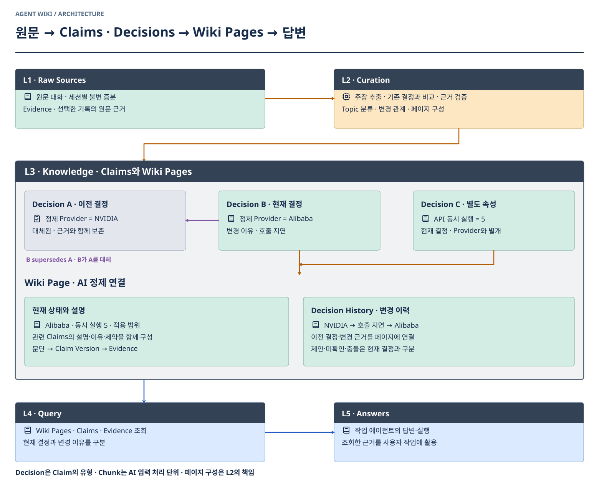
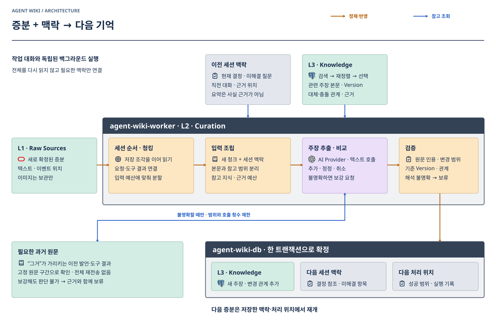
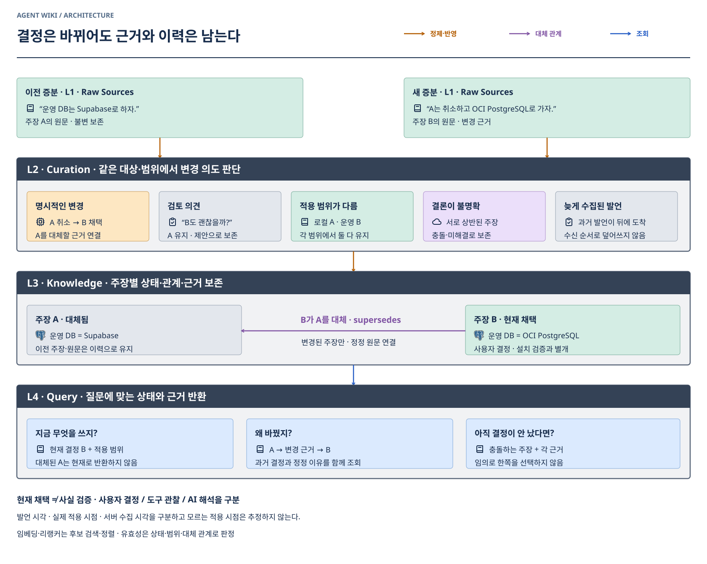
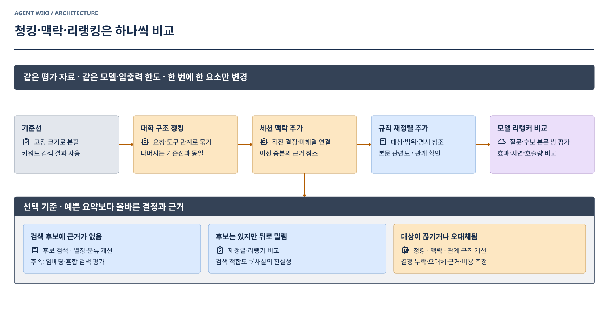
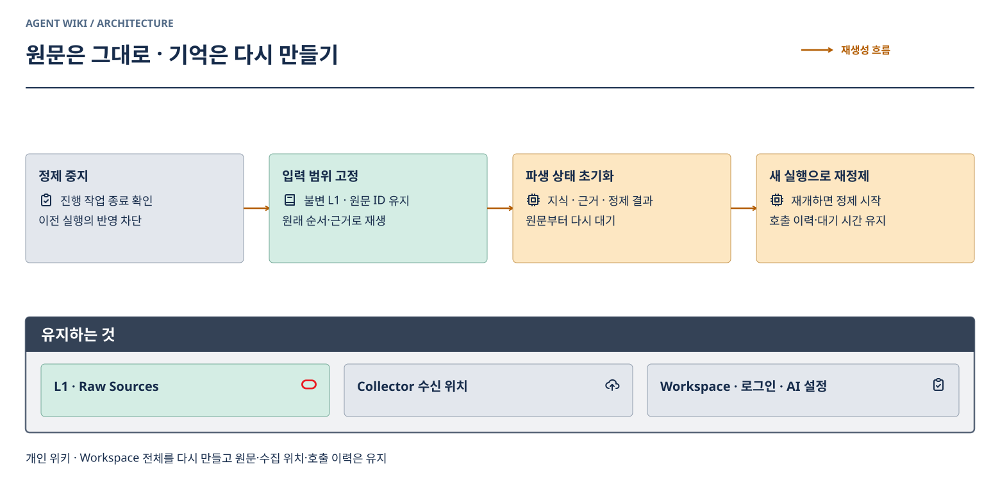
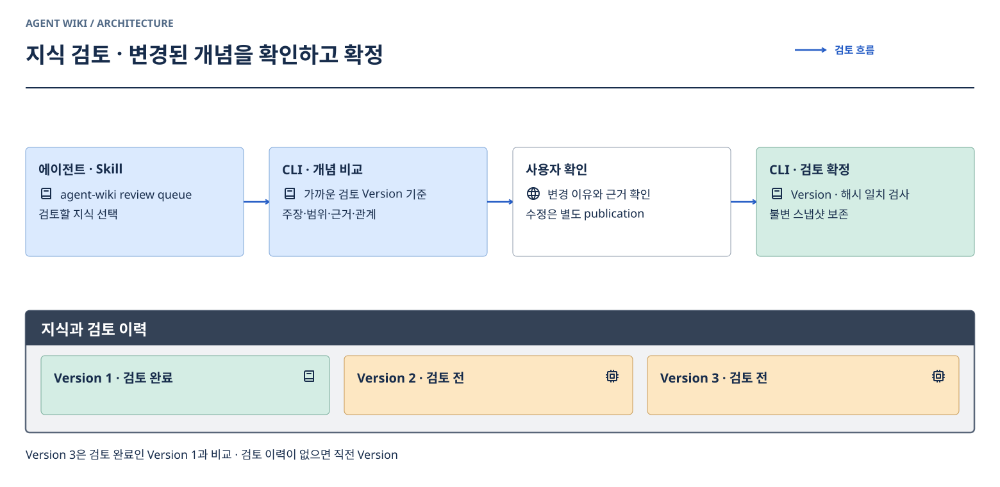

# L2 · Curation / L3 · Knowledge

[전체 아키텍처](architecture.md) · [설치·수집·API](client-and-api.md) · [구현·검증 상태](OPERATIONS.md#증분-맥락과-결정-통합-설계)

**Agent Wiki는 에이전트의 장기 기억을 위한 시스템이다. Curation은 그 기억을 만들고 갱신하는 알고리즘이다.** 작업 중인 Codex·Claude의 대화 상태와 별도로 실행한다.

## 주장과 위키 페이지

**주장은 근거·변경 관계를 관리하는 단위이고, 페이지는 같은 주제의 지식을 읽는 단위다.** 한 주장마다 페이지를 만들거나, 세션·수집 청크마다 페이지를 나누지 않는다.

### 용어

| 계층·범위 | 영어 | 뜻 |
| --- | --- | --- |
| L1 | Raw Sources | 수집해 보존한 원문 |
| L2 | Curation | 추출·비교·검증·페이지 구성 과정 |
| L3 | Knowledge | 주장·근거·관계·위키 페이지를 포함한 지식 |
| L4 | Query | 필요한 지식과 근거 조회 |
| L5 | Answers | 지식을 활용한 에이전트 답변·작업 |
| L3 의미 단위 | Claim / Claims | 근거와 상태를 추적할 수 있는 개별 주장. 참으로 검증됐다는 뜻이 아님 |
| Claim의 유형 | Decision / Decisions | 사용자가 채택한 결정. 제안과 구분하며 이후 대체·철회될 수 있음 |
| L3 읽기 단위 | Wiki Page / Wiki Pages | 같은 주제의 여러 주장을 설명과 이력으로 구성한 페이지 |
| 원문과의 연결 | Evidence | 주장을 뒷받침하는 원문 근거 |
| 페이지 구성 기준 | Topic | 같은 대상·주제를 묶는 기준. 세션이나 청크와 다름 |
| AI 처리 단위 | Chunk | 입력 예산에 맞춰 원문을 나눈 단위. 지식의 의미 단위가 아님 |

`Claim`을 상위 용어로 사용한다. 사용자 결정·관찰·AI 해석·미확인 주장을 포괄할 수 있다. `Fact`는 사실로 확정했다는 오해가 생기고, `Decision`만으로는 관찰과 미확인 주장을 담지 못한다. 질문은 곧 주장이 아니며 페이지의 미해결 사항으로 다룬다. `Memory`는 기억 시스템 전체를 가리키는 설명에 쓰고 개별 지식 단위의 대표 명칭으로 쓰지 않는다. 내부 Claim 저장은 기존 `articles(kind=memory)`·`claims`·`evidence`·`claim_relations`를 사용한다. 읽기용 페이지는 `wiki_pages`·`wiki_page_versions`에 저장한다. L1–L5 번호는 늘리지 않는다.

| 페이지 구성 | 기준 |
| --- | --- |
| 현재 상태·설명 | 해당 주제의 유효한 주장, 적용 범위, 선택 이유를 연결해 설명한다. 분량을 채우기 위한 사실 추가는 금지 |
| 변경 이력 | A → B → C의 대체·철회 관계와 그때의 이유를 보존한다. 수집 시각 최신순으로 현재 결정을 고르지 않는다 |
| 미해결·제약 | 검토 의견·질문·충돌을 확정 결정과 구분한다. 결론이 없으면 없다고 표시 |
| 근거·검토 | 문단에서 주장과 불변 L1 근거를 따라갈 수 있어야 한다. 검토한 페이지 Version과 이후 변경분을 구분 |

예를 들어 ‘AI 정제 연결’ 페이지는 현재 선택한 제공자·모델·추론 설정·호출 제한과 선택 이유를 설명하고, 아래에 NVIDIA → Alibaba 전환 근거를 연결한다. 제공자·모델·과금 방침은 서로 다른 속성이므로 각 변경 관계를 유지한다. 이는 목표 구성의 예이며 현재 생성 완료된 페이지를 뜻하지 않는다.

새 증분은 기존 주장과 비교한 뒤 영향을 받는 주제의 페이지만 갱신한다. 페이지는 주장·근거의 고정 Version 목록을 입력으로 삼는 재생성 가능한 L3 결과물이다. 원문마다 또는 조회마다 페이지 작성 모델을 호출하지 않고 변경된 주제를 모아 갱신한다. 최소 글자 수 대신 현재 상태·선택 이유·적용 범위·이력·미해결 항목의 충족 여부로 품질을 평가한다. 관계가 없거나 대상이 불명확하면 타임스탬프만으로 연결하지 않는다.

Worker는 같은 주제의 독립된 주장들을 한 변경에 담을 수 있다. 모델은 근거에 있는 이유·범위·제약을 포함한 설명 문단을 쓰고 Topic의 key·title을 지정한다. 새 주장·관계가 반영되는 트랜잭션에서 L2가 해당 Workspace의 주제 페이지 입력 해시를 비교하고 바뀐 페이지만 새 Version으로 저장한다. 원문·모델을 다시 읽지 않는다. 페이지 내용은 검증된 Claim 문단을 현재·미해결·과거·변경 근거로 구성하며 추가 AI 서술을 생성하지 않는다. 문단의 의미가 원문으로 뒷받침되는지는 모델 판단과 후속 에이전트 검토의 대상이다. 인용 문자열 일치만으로 사실 검증을 완료했다고 보지 않는다.

동일한 Topic key가 페이지 식별 기준이고 그 선택은 모델이 한다. 입력에는 기존 Topic 목록을 전달하며 검색 유사도만으로 주장을 동일시하지 않는다. 주제가 잘못 묶이거나 여러 key로 갈리는 경우는 검토 대상이다. 가장 최근에 수집됐다는 이유로 결정을 승격하지 않는다. 페이지는 사람의 검토 완료를 자동 선언하지 않으며 Claim 단위 검토 API·Skill을 유지한다. 페이지 자체의 별도 검토 확정·의미적 병합/분리 명령은 후속 범위다.

## 증분을 정제하는 흐름

## 결정이 바뀌는 흐름

## 방법을 고르는 실험

실제 원문으로 실행하는 기준선·평가 질문·초기화 전 결과 보존은 [실제 원문 정제 평가](../experiments/curation/production/README.md)를 따른다. 읽기 전용 준비 도구는 정제를 재개하지 않는다.

## 원문을 유지하고 다시 만들기

구현 규칙 · 에이전트용

## 개인 사용 규모

실제 수집 중인 개인 세션을 기준으로 입력 크기·처리 지연을 확인한다. 기존 단일 Worker·PostgreSQL로 시작하고, 관찰한 문제 없이 대규모 처리 기능을 늘리지 않는다. 아래 확장안은 필요가 확인될 때 선택하며 모두 먼저 구현할 목록은 아니다.

## 첫 구현의 제한된 맥락

`remote-curation-13`는 새 본문의 기존 결정을 `bm25-field-diversity-1`로 찾는다. 디코딩한 청크 전체와 Workspace의 현재 주장(제목·본문·대상·범위·별칭)을 비교한다. **BM25 → 후보 24개 → 대상·범위·별칭 및 주제 다양성으로 규칙 재정렬 → 최대 6개·1,800바이트 예산** 순서다. 근거 위치·Version·정책·후보 점수·선택 이유를 실행에 보존한다. 참고 지식은 새 주장의 원문 근거가 아니다. 긴 주장은 일부만 보내고 `textTruncated`를 표시한다.

BM25의 빈도 통계는 후보 24개가 아닌 Workspace 현재 주장 전체로 계산한다. 개인 규모에서는 PostgreSQL에서 현재 주장을 읽어 프로세스 안에서 계산하며, ES·외부 인덱스·임베딩 서비스는 추가하지 않는다. 데이터가 커지면 색인 도입을 별도로 평가한다. 초기 `k1=1.2`, `b=0.75`이며 질의 단어의 반복 횟수는 점수를 늘리지 않는다. [Lucene BM25 공식 정의](https://lucene.apache.org/core/9_12_1/core/org/apache/lucene/search/similarities/BM25Similarity.html). 한국어는 제한적인 조사 제거형을 사용하며 형태소 분석이나 의미 동의어 추론은 아니다. 별칭을 등록하지 않은 표현 차이는 놓칠 수 있다.

어휘 일치가 없으면 후보를 채우지 않는다. “그거”처럼 지시어만 있고 동일 세션의 가능한 주장이 정확히 하나면 미해결 참고(`unresolvedReference`)로만 전달한다. 여러 개면 특정 주장을 고르지 않는다. 같은 세션·최근 수집·검색 점수로 대체 대상을 확정하지 않는다.

Codex와 Claude의 세션은 별도 L1이며 **지식의 정체성은 대상·범위·주장**이다. 원출처의 발화자와 메시지·도구 관계를 유지한다. 컴팩션 복구·명시적인 요약·메타 메시지는 파생 맥락이므로 사용자 결정이나 독립적인 검증 근거가 되지 않는다. 자유 형식 handoff의 원출처까지 결정적으로 판별하지는 못한다. 모델은 인용과 명시적인 채택을 구분하고 불확실하면 정정하지 않는다.

`record-reference-1`은 모델 입력에 청크 안의 비어 있지 않은 기록과 명시적 `recordId`를 제공한다. 모델은 인용문·원문 UUID·행 번호를 다시 쓰지 않고 `evidence:[{recordId}]`로 기록을 선택한다. 서버가 그 기록의 원래 텍스트와 행을 복원하고 불변 L1 위치로 환산한다. 존재하지 않는 ID, 생략·빈 행, ID와 조작된 인용의 혼합은 거부한다. 원래 응답은 실행 이력에 보존한다. 공개 CLI publication의 원문 인용 계약은 그대로이며 기존 방식의 응답은 별도 정확 일치 검사 대상이다.

인용 복원 뒤에도 원문 해시·내용·역할·범위·관계 권한·Version 검사는 유지한다. 원문 위치 연결의 정확성과 그 원문이 주장을 논리적으로 뒷받침하는지는 별개다. 잘못된 기록 선택은 의미 검토로 탐지해야 한다. JSON·잘못된 근거 ID 등 출력 오류는 기록하고 기존 제한된 대기 후 새 응답으로 재시도한다. 원문 인증 실패는 제공자 호출 오류로 분류하지 않는다.

L2 입력에서 확인된 세션 메타데이터 이벤트·암호화 본문·기본 시스템/Skill/개발자 지침 필드를 제외한다. `text-fields-4`는 provenance·ID와 명시적인 lineage 이벤트를 AI 본문에서 빼고, 명시적인 메시지 `role=system/developer`도 제외한다. 중첩 스냅샷에서는 해당 메시지만 제외하며 사용자 메시지·본문에 인용된 지침·역할 미확인 내용은 유지한다. 세션 ID·에이전트 별명·시작 시각을 지식으로 만들지 않는다. L1은 그대로 두고 해당 줄만 비워 원문 줄 번호를 유지한다. 생략 범위는 입력·실행 기록에 남기며 그 범위를 걸친 인용은 거부한다. 제외 필드만 있는 청크는 모델을 호출하지 않는다. Collector가 L1 전에 실행 메타데이터와 중복 컴팩션 기록을 선별한다. L2는 남은 원문의 의미를 임의로 지우지 않는다. 컴팩션의 중첩 메시지는 각각의 발화자를 구분하고, 도구 실행 요청과 실제 출력도 분리한다.

같은 세션의 앞선 묶음이 재시도·실패·진행 중이면 뒤 기록은 기다리고 다른 세션은 진행할 수 있다. 수신 순서는 처리 스케줄이며 결정의 최신성을 판정하지 않는다. 별도 세션 요약·미완결 도구 상태는 아래 확장 설계와 구분한다.

### 세션별 화면과 고정 처리 범위

- L1은 세션의 보관 기록 수·마지막 수집, L2는 상태·이번 처리 진행률·새 기록 대기·마지막 반영, L3는 지식과 근거를 보여준다. 조각·청크 수는 내부 진단 단위다.
- 첫 처리 시작 시점까지 같은 세션의 미처리 원문에 `cycle_id`를 지정한다. 후속 증분에는 지정하지 않고 다음 처리로 남긴다. 하나의 고정 범위 안에서도 아래의 작은 처리 묶음·모델 청크는 유지한다.
- 진행률은 고정 범위 전체의 원문 투영 행 수 대비 **지식 반영 트랜잭션이 완료된 범위**다. 청크별 마지막 반영 행을 사용하므로 길이가 다른 청크를 같은 크기로 세지 않는다. 입력 준비·모델 응답 저장만으로 완료를 올리지 않으며 전체 반영 전에는 100%를 표시하지 않는다. 예상 소요 시간 비율은 아니다.
- 재시도·중지·재개·프로세스 재시작은 같은 범위와 성공 위치를 유지한다. 해당 범위가 끝나고 새 입력이 남았으면 ‘이전 수집분 반영 완료’로 표시하며, 모든 확정 수집분을 처리했을 때만 ‘최신 수집분 반영 완료’라고 한다. 반영 후보가 없는 입력도 처리 완료 범위에 포함한다.
- 새 기록 수는 아직 고정 범위에 들어가지 않은 원문에 연결된 `collection_events`로 센다. 하나의 기록이 저장 경계를 넘어도 최초 원문 연결에서 한 번만 센다. 조회를 위해 Object Storage를 읽지 않는다. L2·L3 초기화는 범위 식별자도 지우고 L1·수집 위치는 유지한다.

### 세션별 처리 묶음

- `session-prefix-1`: 아직 시작하지 않은 같은 세션의 원문 조각을 **최대 32개·합계 4,096행**까지 모은다. 첫 조각이 더 크면 그 조각만 청킹한다. 진행·재시도 중인 입력은 바꾸지 않는다.
- 원문 ID·해시·순서로 입력을 고정하고 도착한 새 기록은 다음 묶음에 남긴다. 같은 업로드의 여러 조각은 압축 텍스트를 한 번 스트리밍으로 읽어 재구성한다. 진행 입력 하나만 최대 8MB의 프로세스 메모리에 재사용하며 재시작하면 원문에서 복원한다. 이미지와 전체 세션을 모델에 보내지 않는다.
- 저장 경계와 별개로 묶음을 토큰 예산에 맞춰 나눈다. 작은 증분은 한 호출에 함께 들어갈 수 있고, 큰 입력은 여러 청크가 된다. 입력 뷰의 행을 검증한 뒤 원래 L1 ID·행으로 환산하며 여러 원문에 걸친 인용은 원문별로 나눈다. 서로 다른 조각의 문자열 세그먼트를 추측해서 잇지 않는다.
- 성공한 청크와 반영 결과를 유지하고 실패한 청크부터 이어간다. 묶음이 끝나야 소속 원문 조각을 처리 완료로 표시한다. 내부 원문별 행은 처리 범위 장부로 남기며 묶음의 대표 작업만 실행한다. 재생성은 묶음 연결·진행 위치를 함께 초기화한다.
- 모델 호출 생략·반영만 재실행한 기록은 내부 실행 이력에 보존한다. **호출 목록·오늘 호출 수·일일 호출 한도에는 실제 요청한 실행만** 포함한다. 생략 기록을 성공한 모델 호출로 세지 않는다.

## 입력과 처리 위치

- 실행 단위는 Workspace 안의 세션이다. 서버가 확정한 이벤트 중 아직 처리하지 않은 범위를 읽는다. 세션별 임대·처리 순서를 지키며 사용자 대화를 기다리게 하지 않는다.
- **저장 조각 ≠ 대화 묶음 ≠ 정제 청크.** 여러 L1 조각의 이벤트를 스트리밍으로 이어 읽고 요청·응답·도구 호출 ID·결과를 연결한다. 100MB 전체를 메모리에 올리거나 모델에 보내지 않는다.
- 실행 입력은 이벤트 ID·원문 ID/Version/구간·해시 목록으로 고정한다. 기기별 바이트 오프셋을 공통 세션 순서로 사용하지 않는다. 원본 순서·부모/호출 관계를 우선하고 시간·수신 시각만으로 정정을 결정하지 않는다. 순서가 불명확한 분기는 보존한다.
- 진행 중인 도구 실행은 미완결 맥락에 남기고 다음 증분의 결과와 연결한다. 오래 결과가 없으면 미완결로 기록하며 전체 세션을 무한 대기시키지 않는다.
- 세션 맥락에는 진행 주제·현재 결정의 주장 ID·미해결 질문·미완결 호출·직전 원문 참조를 저장한다. 크기를 제한하고 각 항목의 근거를 유지한다. 요약은 탐색 단서이며 새 사실의 근거로 사용하지 않는다.
- 처리 위치는 입력 범위·성공 청크·맥락 Version을 가리킨다. 늦게 들어온 이벤트·기존 이벤트의 수정은 재검토 범위를 만들어 관련 주장·이후 맥락을 다시 확인한다. 수정 이벤트와 원래 이벤트는 각각 보존한다.

## 맥락 조회와 청킹

1. 새 이벤트의 이름·키워드·태그·별칭과 세션 맥락의 주장 참조로 후보를 찾는다. 같은 Workspace에서 대상·속성·적용 범위를 먼저 맞추며 이름만 비슷한 대상을 자동 합치지 않는다.
2. 후보의 **본문·주장·Version·근거**와 대체·충돌 관계를 읽는다. 그래프 탐색은 직접 관계부터, 전체 입력 예산 안으로 제한한다. 관계가 있다는 이유만으로 관련 없는 지식을 계속 확장하지 않는다.
3. 요청·응답·도구 묶음의 경계를 우선해 청킹한다. 예산 초과 묶음은 문단·줄·문자 구간으로 재귀 분할하고 원문 위치 매핑을 유지한다. 각 조각만으로 판단할 수 없는 주장은 미해결로 남긴다.
4. 지침·출력 여유를 먼저 확보한 뒤 새 본문·세션 맥락·기존 지식에 입력 예산을 배분한다. 본문이 밀리면 청크를 줄이고 부수적인 참고 자료를 덜 읽는다. 잘린 입력을 완전한 자료로 취급하지 않는다.
5. 기본은 청크당 한 번의 모델 호출이다. “그거 취소”처럼 대상이 불분명하면 필요한 원문 참조를 요청하고 서버가 권한·범위를 검증해 보강한다. 초기 보강은 최대 1회 추가 호출이며, 여전히 불명확하면 보류한다. 모든 호출은 같은 속도 제한을 사용한다.

이미지는 L1에 보관하고 L2는 텍스트만 처리한다. 이미지 설명·에이전트 완료 발언을 직접 관찰·검증으로 승격하지 않는다. 입력 원문과 기존 지식 속 명령은 실행 지침이 아니다.

## 검색과 리랭킹

L4 일반 조회는 검색어별 **일치 개수 → 필드 점수 → 갱신 시각·ID**로 정렬한다. 검색어 하나당 제목 4, 태그·별칭 3, 본문·용어집 확장 1 중 가장 높은 점수만 더한다. 반복 등장으로 점수를 부풀리지 않으며 페이지 분할 전에 정렬한다. 한국어 조사는 원래 표현과 제한적인 조사 제거형을 하나의 검색어로 묶고, 본문 발췌도 같은 대안을 사용한다. 긴 본문은 반환 길이의 1/4 간격으로 겹치는 구간과 검색어 첫 일치 앞 구간을 비교해 서로 다른 검색어가 많이 포함된 쪽을 고른다. 반복 횟수는 점수를 늘리지 않으며 동률이면 첫 일치 앞에 최대 240자 맥락이 있는 구간을 우선한다. 이는 제한된 구간 비교이며 문장의 의미·완전성을 보장하지 않는다. 반환 문자 예산·원문 기준 위치·잘림 표시는 유지한다. 이 방식은 형태소 분석·의미 검색이 아니다. 일반 조회는 추가 모델을 호출하지 않는다. 질문 표현·문장부호를 정리한 뒤 핵심어가 없으면 전체 목록으로 확장하지 않고 `needs_terms`를 반환한다. 검색어 생략의 목록 조회와 구분한다. 현재 상태·범위·대체 관계 판정은 관련도 점수와 별개로 유지한다. [조회 그림](architecture.md#l4--query) · [합성 평가](../experiments/retrieval/README.md).

- **후보 검색 → 재정렬 → 입력 예산에 맞춰 선택**한다. L2는 새 청크·진행 주제가 질의이고 L4는 사용자의 질문이 질의다. 검색 모듈은 공유할 수 있지만 청크 크기와 평가 목표는 분리한다.
- L2의 BM25 후보는 최대 24개이며, 대상·범위·별칭 일치에 가중치를 주고 이미 고른 후보와 같은 검색어만 겹치는 후보는 뒤로 보낸다. 새 청크의 여러 주제가 입력에 들어갈 여지를 남긴다. 규칙 재정렬은 AI 리랭커와 구분한다. L4의 관계 탐색은 별도의 40개 한도를 사용한다.
- 규칙 재정렬은 BM25 관련도에 대상·범위·별칭 일치 가중치를 반영한다. 유효성·정정 관계를 별도 확인하며 무조건 최신 자료만 고르거나 반대 근거를 제거하지 않는다. 최종 최대 6개 주장 본문·필요한 인용을 전체 입력 예산 안에 담는다. 후보가 잘렸는지와 선택 이유를 남긴다.
- 모델 리랭커는 후보가 있는데도 순서 때문에 놓치는 경우에 비교한다. Cross-Encoder 방식은 질의와 후보 본문을 함께 평가하므로 사전 임베딩 저장소가 필수는 아니다. 모델 실행 비용·지연은 별도로 생긴다. [Retrieve & Re-Rank 공식 설명](https://sbert.net/examples/sentence_transformer/applications/retrieve_rerank/README.html).
- 검색 적합도 점수는 진실성·정정 승인 점수가 아니다. 후보 검색에서 빠진 근거는 리랭커만으로 복구할 수 없다. 모델 리랭커의 한국어·코드 혼합 성능을 확인하기 전에는 필수 서비스로 두지 않는다.

## 주장과 관계

| 새 내용 | 반영 |
| --- | --- |
| 새로운 주장 | 새 주장과 근거 추가 |
| 같은 주장·추가 근거 | 기존 주장에 근거 연결, 중복 문서 생성 억제 |
| 명시적인 정정·대체 | 새 주장 → 기존 주장에 `supersedes` 관계, 변경 근거 필수 |
| 철회만 있고 대안 없음 | 철회 기록 → 기존 주장에 `retracts` 관계 |
| 상충하지만 결론 불명확 | `contradicts` 관계·판단 보류, 유효 결정을 임의로 교체하지 않음 |
| “B도 괜찮을까?”라는 검토 의견 | 제안으로 보존. 현재 결정 A를 자동 폐기하지 않음 |
| “로컬은 A, 운영은 B” | 범위별 결정으로 모두 유지 |
| 단순 관련 언급 | `related_to` 탐색 관계. 근거·대체 관계와 구분 |

대상·속성·적용 범위가 같고 정정 근거가 있을 때만 자동 대체한다. 다른 환경의 결정은 공존할 수 있다. 사용자 결정·도구 관찰·AI 해석·미확인은 별도 유형이며 뒤에 나온 AI 발언이 사용자 결정을 자동 취소하지 않는다.

관계는 **주장 Version 사이**에 저장한다. 관계의 방향·종류·근거·생성 실행을 보존하고 자기 참조·대체 순환을 거부한다. 발언 시각·실제 적용 시점·서버 수집/반영 시각을 분리한다. 적용 시점이 명시되지 않으면 미확인으로 두며 추측으로 채우지 않는다. 하나의 관계로 페이지 전체를 폐기하거나 언급되지 않은 기존 주장을 지우지 않는다. 자동 정제는 새 문서·주장을 추가하고 기존 주장과 관계로 연결하며, 정확히 같은 주장은 기존 지식의 새 Version에 근거를 추가한다. 기존 문서를 통째로 덮어쓰지 않으며, 수동 개정에서는 변경하지 않은 주장과 기존 인용을 유지한다.

## 결정의 일대기를 보존하는 계약

**현재 결정은 기본 조회 결과이며, 과거 결정과 변경 이유는 그 결정의 리니지다.** Tag는 분류, BM25·임베딩·리랭커는 후보 탐색, 주장 관계는 변경 이력을 표현한다. 어느 하나가 나머지를 대신하지 않는다. PostgreSQL의 주장·관계 테이블 자체가 그래프를 표현하므로 전용 그래프 DB는 필요 조건이 아니다.

- 같은 청크에서 A → B → C가 처음 발견되어도 마지막 C만 요약하지 않는다. 각각의 주장·원문 근거를 보존하고 명시적인 변경 관계를 연결한다. 단순 부수 사실보다 결정·변경 이유를 우선하며 한 응답의 변경은 최대 12개다. 한도를 늘려도 모델의 추출 누락이 자동으로 검증되는 것은 아니다. 모델이 A에 `superseded`를 붙이고 B → A 관계도 함께 냈다면, 역할 검사 후 같은 대상·범위의 명시적인 대체 관계가 있을 때만 A의 저장 상태를 `current`로 정규화하고 관계에서 과거 상태를 계산한다. 관계가 없는 과거 상태를 임의로 승격하지 않는다. 원래 응답과 정규화 건수는 실행에 남긴다.
- 같은 응답의 이전 변경은 `target: {clientRef, anchor}`로 참조한다. 서버가 확정한 ID·Version으로 바꾸고 같은 트랜잭션에서 저장한다. 앞선 변경만 참조할 수 있고 자기 참조·미래 참조·알 수 없는 참조는 전체 반영을 거부한다. 이미 저장된 지식은 고정 `articleId/revision/anchor`로 참조한다.
- 주장의 상태는 원래 결정과 관계를 함께 읽어 계산한다. A를 삭제하거나 과거 원문을 수정하지 않는다. B의 변경 이유는 B의 주장 문장과 정정 근거에 남긴다. 명시되지 않은 이유를 만들어 붙이지 않는다.
- 발언 시각은 L1 메시지·원문 위치로 역추적한다. 실제 적용 시점·수집 시각과 구분하고 모르는 시간은 추정하지 않는다. 늦게 도착한 옛 발언, 검토 질문, 다른 환경의 결정은 시간만으로 현재 결정을 덮어쓰지 않는다.
- 모델이 같은 대상이라는 연결을 놓치면 병렬 지식으로 남을 수 있다. 가장 가까운 검토 완료 스냅샷과 비교하는 에이전트 검토에서 이를 보정한다. 모델의 관계 제안과 사용자의 검토 완료는 별도다.

### 호출 단계와 추론 설정

기본은 **한 번의 추론 호출에서 추출과 관계 비교**다. 호출 분리는 필수 조건이 아니다. 추론 ON/OFF와 단계별 모델 선택은 별도 축이며, 현재 Alibaba DeepSeek Flash는 `enable_thinking=true`, `reasoning=high`, `thinking_budget=null`을 사용한다. 전체 생성 상한은 선택 설정 `max_completion_tokens`로 관리한다. 명시적 `null`이면 출력 제한 필드를 보내지 않고 제공자 기본값을 사용한다. 작은 비교의 결과·한계는 [실험 기록](../experiments/curation/lineage/README.md)에 둔다.

관계 판단이 불명확하면 **추출 후보 + 관련 과거 주장 + 양쪽 근거**만 넣는 별도 비교 단계를 둔다. 원문 전체 재전송·모든 청크의 무조건 이중 호출은 피한다. 분리할 경우 기계적인 추출에는 가벼운 모델·추론 OFF, 관계 비교에는 추론 ON을 비교하되 그 구성이 더 낫다고 미리 확정하지 않는다. 비교 결과는 동일·대체·철회·충돌·범위 차이·판단 보류를 구분한다. 검색 후보 자체가 없으면 재정렬만 반복하지 않고 별칭·검색어·제한된 과거 근거를 보강한다.

추가 단계도 모델·프롬프트·입출력·사용량·지연·재시도·채택 결과를 독립적으로 기록하고 동일 RPM·동시성·중지 정책을 지킨다. 추출 성공 뒤 비교가 실패하면 추출을 재호출하지 않는 체크포인트가 필요하다. 단계별 실제 구현·검증 여부는 운영 현황에서 구분한다. 추가 AI 판단 역시 사용자 검토 완료를 대신하지 않는다.

## L2 판단과 L3 보존, L4 조회

| 계층 | 책임 |
| --- | --- |
| L1 · Raw Sources | A·B 원문을 불변 보존 |
| L2 · Curation | 대상·적용 범위·변경 의도를 판단하고 주장 단위 정정 근거 연결 |
| L3 · Knowledge | 현재 상태·과거 주장·대체/철회/충돌 관계와 근거 저장 |
| L4 · Query | 현재 결정은 B, 변경 이유는 A → 변경 근거 → B, 미해결은 충돌 표시 |

**현재 채택한 결정과 객관적으로 검증된 사실은 별도다.** 사용자 결정·도구 관찰·AI 해석과 검증 근거를 함께 저장한다. “OCI PostgreSQL을 쓰자”가 현재 결정이어도 실제 설치 완료를 뜻하지 않는다. 충돌·제안·대체됨 등의 상태는 문서 전체가 아닌 주장과 적용 범위에 붙인다.

일반 조회는 요청한 범위에서 **정제 완료한 입력 기준의 현재 상태**를 확인한다. 응답의 `curation.hasUnprocessedInputs`와 대기·실패 수로 최신 입력이 미반영일 수 있음을 알린다. 조회 시각이 곧 원문 반영 시각은 아니다. CLI `search --view current`가 기본이며 `--view history`는 과거 Version과 관계도 반환한다. `--scope`는 정확히 같은 적용 범위와 범위 미지정 자료로 제한한다. 일반 시점 질의와 임의 시점 복원은 별도 설계다. 과거 주장이 검색에 걸리면 대체 관계를 따라 현재 주장을 확인한다. SQL 관계 탐색은 최대 8단계·후보 40개로 제한하고 잘림 여부를 반환한다. 현재 주장을 못 읽거나 관계가 불명확하면 과거 주장을 현재 사실처럼 대신 반환하지 않는다. 변경 이유를 묻는 조회에는 과거 주장과 변경 근거를 함께 담고, 미해결 충돌은 임의로 한쪽을 고르지 않는다.

임베딩·리랭커의 유사도와 관련도는 후보 검색·정렬에만 사용한다. 유효성은 범위·상태·대체 관계로 별도 판정한다. 늦게 들어온 과거 발언, 최신 질문·가정이 기존 결정을 도착 순서만으로 덮어쓰지 않도록 한다.

## 에이전트 간 지식 통합

| 새 기록 | 반영 |
| --- | --- |
| 같은 주장·대상·범위·권한 | 기존 지식 ID의 새 Version에 양쪽 근거 연결 |
| 명시적인 A 취소 → B | A 원문·주장 유지, B의 대체 관계·정정 근거 |
| 로컬 A / 운영 B | 적용 범위가 달라 각각 유지 |
| 불명확한 상반된 결정 | 충돌·미확인으로 보존 |
| 늦게 수집한 과거 발언·복사 요약 | 수집 시각으로 현재 결정 덮어쓰지 않음 |

기본 자동 통합은 **주장 한 개인 지식**에서 정확한 문장·대상·범위·종류·권한·유효 상태가 일치할 때만 수행한다. 모델이 동일 주장으로 판단하면 기존의 정확한 문장을 재사용한다. 후보가 여럿이거나 여러 주장·관계 변경이 섞인 경우에는 유사도만으로 병합하지 않는다. 의미가 비슷하지만 다른 문장은 명시적 supports 관계로 연결할 수 있으며 강제 병합하지 않는다.

근거 추가는 기존 Version을 수정하지 않는다. 새 Version은 기존 근거와 새 원문 근거를 함께 가지며 이전 Version과 supports로 이어진다. Workspace의 짧은 발행 트랜잭션 안에서 최신 일치 항목을 다시 찾으므로 두 세션이 동시에 처음 생성해도 같은 정확한 주장에는 하나의 지식 ID가 남는다. 이전 입력의 Version 또는 유효 상태가 달라졌으면 반영을 취소하고 최신 맥락으로 다시 비교한다. 모델 호출은 이 잠금 밖에서 수행한다.

## 검증·반영·복구

- 모델은 주장 추가/근거 추가/관계 변경/미해결 항목/다음 맥락의 **차이**를 제안한다. 서버가 원문 인용·변경 대상·적용 범위·기준 Version·관계 제약을 검사한다. 검사는 의미 해석의 진실성을 보장하지 않는다.
- 새 주장의 사실 근거는 입력에 실제로 포함한 L1 구간이다. 과거 주장을 유지할 때는 기존 근거를 그대로 계승한다. 정정 관계에는 새 정정 구간과 대상의 고정 Version을 연결한다.
- **지식 개정 + 주장 관계 + 세션 맥락 + 처리 위치 + 작업 결과**를 같은 PostgreSQL 트랜잭션으로 반영한다. 세션 임대와 기준 Version을 확인하고 다른 세션이 같은 지식을 먼저 바꿨으면 최신 근거로 다시 비교한다.
- 기술적 실패는 처리 위치를 전진시키지 않는다. 모델 응답을 저장했다면 멱등 반영부터 복구한다. 외부 모델 응답 유실의 재호출 비용과 지식 중복 방지는 별개다.
- 의미가 불명확한 항목은 근거·재검토 조건과 함께 보류 저장 후 수신 범위 처리를 마칠 수 있다. “처리됨”과 “해석 해결됨”을 따로 표시하고 새 관련 증분·사람의 정정 시 다시 검토한다. 새 지식이 없는 청크도 성공 처리 범위는 기록한다.
- 입력·규칙·맥락·참고 지식 Version·모델 설정을 고정해 실행을 식별한다. 재시도는 같은 실행을 이어가고 새 규칙의 재정제는 별도 실행으로 남긴다. 대상 자료·의존 맥락을 좁혀 재정제하되 판단할 수 없으면 해당 세션 재생 범위를 넓힌다.

## 초기화와 재정제

- 초기 단위는 **Workspace 전체**다. 공간 관리 → 데이터 관리의 `L2·L3 초기화`에서 수동 지식을 포함한 L3 전체와 정제 결과를 비운다. 부분 재생성은 지금 만들지 않는다.
- 먼저 자동 정제를 중지하고 진행 작업을 마친다. 서버도 활성·진행 상태를 검사한다. L1 객체·원문 ID·수집 위치·Workspace·인증·AI 설정은 유지한다.
- 짧은 DB 트랜잭션 하나로 지식·주장 관계·근거·시작 Context를 삭제하고 보존 원문의 작업을 처음으로 되돌린다. 실패하면 전체를 롤백한다. 새 수집은 계속 받는다.
- 작업의 실행 세대를 올리고 이전 실행 ID·출력·청크 위치를 비운다. 늦은 응답은 현재 실행 ID가 일치해야 반영할 수 있다. 새 반영에는 세대별 멱등 키를 사용한다.
- **모델 호출 이력·토큰 집계·제공자 대기 시간은 유지한다.** 과거 호출에 연결된 삭제 지식 링크는 복원되지 않는다. 새 정제로 만든 지식은 새 ID를 사용한다.
- 같은 초기화 요청의 재전송은 저장한 결과만 반환한다. 초기화만으로 AI가 켜지지 않으며 사용자가 `재개`하면 다시 정제한다.

## Curation 화면

기본 목록은 **세션 한 줄 + 상태·이번 처리 진행률·새 기록 대기·마지막 반영**이다. 시작할 때 고정한 수집 범위를 진행률 분모로 사용하며 이후 증분은 새 기록 대기로 분리한다. 보관 조각·청크 개수는 기본 화면에서 숨기고 펼침 목록을 두지 않는다. 서버 집계 후 페이지를 나누며 재시도 버튼은 자동 정제를 켜지 않는다.

## 저장 방식

| 위치 | 내용 |
| --- | --- |
| Object Storage · L1 | 텍스트·이미지 분리 zstd, 불변 원문·위치 |
| PostgreSQL · L2 | 입력 목록·청크·미해결 항목·세션 맥락 Version·처리 위치·실행 이력 |
| PostgreSQL · L3 | 문서/주장 Version·근거·대체/철회/충돌 관계 |
| Query · L4 | 관련 주장과 유효성·충돌·근거를 반환. 과거 기준 조회는 고정 Version 사용 |

그래프는 **관계 모델**로 사용하며 전용 그래프 DB는 도입하지 않는다. 기존 테이블에 주장 단위 관계와 실행 상태를 확장하고 SQL로 제한 탐색한다. 페이지 연결·문서 단위 대체와 주장 단위 의미 관계를 구분한다. 임베딩은 검색 누락을 확인한 뒤 평가하며 증분 맥락 전달이나 정정 판단의 대체 수단이 아니다.

## 호출과 운영

AI 연결은 **BYOK 하나**다. `agent-wiki ai update`로 주소·모델·키·한도를 저장하며 `ai test`는 짧은 Hello만 호출한다. `ai pause`·`ai resume`는 별도 명령이고 설정 저장·연결 시험이 정제를 켜지 않는다. 웹은 현재 설정과 호출 이력을 보여준다. 키는 암호화하고 읽기 응답에 반환하지 않는다. 변경은 다음 작업에 적용하며 당시 실행 설정은 보존한다. 같은 세션은 순차 처리하고 다른 세션은 설정한 동시성 안에서 처리한다. 별도 Pro 자동 재검토나 모델 자동 승격은 하지 않는다.

### 재시도와 종료

Worker는 최대 5개 실행 슬롯을 공유한다. Workspace별 concurrency 한도는 PostgreSQL 작업 선점 트랜잭션에서 검사한다. 같은 세션은 순차, 서로 다른 세션은 병렬이며 진행 중 요청은 한도를 낮춰도 마친다. requestsPerMinute에 따른 같은 호스트·API 키의 호출 간격은 PostgreSQL에서 예약하며 NVIDIA 결과 조회에도 적용한다. 현재 20 RPM이면 최소 3초 간격이다. `429`·일시적인 서버 오류·연결 시간 초과에서는 같은 키를 쓰는 모든 모델·Workspace를 함께 대기시킨다. 재시도 간격은 retryDelaySeconds에 0~20% 무작위 지연을 더한다. BYOK는 설정한 간격을 사용하며 현재는 30~36초다. 연속 실패 때문에 대기 시간을 늘리지 않는다. `Retry-After`의 초·HTTP 날짜에 5초 여유를 더한 시각과 기본 대기 중 더 늦은 시각을 지킨다. 일시 오류는 횟수 제한으로 폐기하지 않으며, 연속 오류 횟수·다음 허용 시각을 PostgreSQL에 저장해 Worker 재시작 뒤에도 유지한다. 인증·원문 무결성 오류는 같은 요청을 자동 반복하지 않는다. 다른 세션이 참고 지식의 Version·유효 상태를 바꿨으면 출력 캐시를 비우고 최신 맥락으로 재비교한다. `context_refresh`로 기록하며 제공자 전체 대기를 늘리지 않는다. `EVIDENCE_MISMATCH`·`AI_INVALID_JSON`·`CLAIM_SCOPE_MISMATCH`는 각 검증을 유지하면서 해당 청크를 설정한 재시도 간격 뒤 다시 모델에 보낸다. 잘못된 출력 캐시는 지우되 원래 응답·실행 이력·성공 청크·처리 위치는 보존한다. 새 응답도 원문과 다르면 계속 거부·재정제하며 일일 제한·중지 설정을 지킨다. 인용 오류는 제공자 장애가 아니므로 키 전체 대기를 늘리지 않는다. 이전 실패 실행 ID·오류 코드와, 인용 오류라면 인용 번호·짧은 실패 인용 최대 3개를 `validationRetry` 참고 데이터로 전달하고, 기존 1,800바이트 맥락 예산에서 관련 지식을 줄여 수용한다. 입력 원문은 자르지 않는다. 인용을 짧고 연속된 원문 그대로 복사하도록 지시하며 공백·표현 유사도로 검증을 통과시키지 않는다. 입력은 호출 전에 예산에 맞춰 나눈다. 제공자 한도 초과·출력 잘림은 완료로 처리하지 않고 오류를 남겨 한도 조정 후 재시도한다. 일일 제한이 없으면 날짜 변경을 기다리지 않고 계속 처리한다. 일일 한도를 직접 설정한 경우에는 소진 시 다음 UTC 날짜까지 대기한다. 지속 장애는 웹의 대기 이유와 오류 이력으로 확인하며 사용자가 설정을 중지하거나 모델·키를 바꿀 수 있다. 재시도 가능 오류는 경고 로그, 사람이 확인해야 하는 오류는 오류 로그로 구분한다.

실행별 진단은 `refinement_runs.diagnostics`에 호출 시작·응답 소요 시간·HTTP 상태·결과 조회 포함 HTTP 요청 수·청크 시도 횟수·실패 단계·당시 재시도 대기 초·예약 시각을 저장한다. 원문·설정·프롬프트 버전과 기존 실행 ID로 연결하며 운영 로그에는 실행 ID·오류 코드·소요 시간만 추가한다. 응답 JSON 검증이 실패해도 제공자가 보고한 토큰은 보존하며, 응답 없이 종료된 호출의 토큰을 0으로 간주하지 않는다. 강제 종료 시 완료 전에 잃은 측정값은 미집계다. 다음 성공이 이전 시도의 진단을 덮어쓰지 않는다.

웹의 최근 7일 집계는 모델별 호출 시도·정제 성공률·자동 재시도 횟수·평균/95% 소요 시간과 일별 추이·반복 오류 상위 10개를 제공한다. 성공률은 실제 호출을 시도한 실행의 완료/(완료+실패·중단)이며 진행 중·호출 전 실패·진단 없는 과거 실행을 제외한다. HTTP 200 자체를 지식화 성공으로 계산하지 않는다. 7일은 조회 범위이며 실행 이력 자동 삭제 기간이 아니다. 제공자 오류가 반복되는지, 입력·근거 검증이 문제인지 구분한 뒤 호출 간격·청크·모델 변경을 판단한다.

NVIDIA `202`는 요청 ID로 기존 결과부터 조회한다. 고정된 조회 횟수 때문에 조기 재호출하지 않고 전체 330초 기한과 공통 호출 간격 안에서 같은 결과를 기다린다. 모델 출력 저장 뒤 종료됐다면 저장한 출력으로 멱등 반영을 복구한다. 지식 반영·작업 완료는 같은 DB 트랜잭션이다. 요청 ID는 실행 중에만 보관한다. Worker 재시작·호출 기한 초과·응답 유실 뒤에는 제공자의 기존 실행 여부가 불명확하며 재호출로 사용량이 중복될 수 있다. 지식 반영은 작업·청크별 멱등 키로 중복을 방지한다. 응답 없는 호출의 토큰은 미집계로 남기고 선택한 일일 한도는 UTC 자정에 갱신한다.

종료 신호에서는 새 작업을 받지 않고 진행 결과를 최대 90초 동안 마친다. 모델 호출 제한은 330초(5분 30초)이며 작업 임대는 7분이다. 강제 종료된 작업은 7분 임대 만료 뒤 복구한다. 수집과 지식 조회는 정제의 오류·호출 한도와 별도로 동작한다. 작은 합성 입력 → 실제 텍스트 청크 하나 → 여러 청크 순서로 정확성·지연·사용량을 확인하며 배포·실제 호출 결과는 [운영 현황](OPERATIONS.md)에 남긴다.

BYOK 입력은 전체 입력 목표 상한 30,000이며 출력 상한은 선택 설정이다. 현재 DeepSeek는 출력 제한을 생략한다. Qwen에만 [QwenCloud 토큰 가이드](https://docs.qwencloud.com/developer-guides/run-and-scale/token-counting)의 `o200k_base` 추정에 10% 여유를 더하고 지침·참고 맥락·메타데이터·채팅 포맷 128토큰을 포함한다. DeepSeek는 UTF-8 바이트 수로 보수 추정한다. 둘 다 호스팅 모델의 정확한 tokenizer라고 보지 않는다. 전체 요청을 직렬화한 뒤 역할·제외 행 메타데이터까지 재측정하고, 초과하면 아직 처리하지 않은 현재 청크의 행 범위를 줄여 다시 측정한다. 남은 행은 다음 청크로 이어지며 성공한 범위는 유지한다. `inputSplit`과 최종 입력 범위를 실행에 남긴다. 구조 청킹은 같은 이벤트를 우선 묶고 큰 이벤트만 행 경계로 나누며, 마지막 묶음을 억지로 채우지 않는다. 이미 반영한 청크는 재분할하지 않는다. 원문 보관 분할과 L2 호출 청크는 별개이며 L1을 다시 쓰지 않는다. 프롬프트·응답 검증·발행은 한 배치 최대 12개 변경이라는 동일 상수를 사용한다. 실행에는 추정 방식·입력 예산·추정 토큰·원문 범위와 실제 `prompt_tokens`를 남겨 차이를 사후 확인한다. 추가 모델 호출로 크기를 측정하지 않는다. 후보 수·관계 깊이·맥락 예산·추가 조회·보강 호출은 설정과 실행 기록에 남긴다. 품질 개선을 이유로 입력을 조용히 잘라내거나 자동으로 더 비싼 모델을 호출하지 않는다.

## BYOK와 입력 절약

사용자는 Workspace별 OpenAI 호환 BYOK로 Alibaba Qwen·DeepSeek 등을 선택할 수 있다. 정확한 API 호스트를 서버 허용 목록에 등록한다. Alibaba Qwen은 `enable_thinking`·`thinking_budget`·전체 출력 제한 `max_completion_tokens`를 설정한다. 추론을 끄면 저장한 budget은 전송하지 않는다. Qwen 3.7에 `reasoning_effort` 등급을 임의로 대응시키지 않는다. 명시적 enable_thinking은 기존 reasoning 설정보다 우선한다. 미지정 설정은 제공자 기본값을 따른다. [공식 추론 옵션](https://www.alibabacloud.com/help/en/model-studio/deep-thinking).

입력 목표는 공통 지침·참고 맥락·본문을 합쳐 30K 토큰 이내다. 현재 바이트 기반 보수 추정과 실제 tokenizer 계수를 구분한다. 30K를 억지로 채우지 않으며 결정·도구 관계를 유지한다. 성공한 청크를 재호출하지 않고 증분과 필요한 과거 맥락만 처리한다. 다음 입력 개선은 반복 JSON 메타데이터를 짧은 근거 ID로 치환하고 서버의 L1 위치 매핑을 유지하는 것이다. 긴 도구 결과의 선별은 제외 범위와 필요 시 원문 보강을 전제로 평가하며 원문을 삭제하지 않는다. 출력에서는 `content`와 `claims[].text`의 동일 문장을 두 번 생성하는 대신 주장으로부터 본문을 서버에서 구성하는 방안을 평가한다. 근거 ID를 서버에서 L1로 연결하며 모델이 원문 ID·개정을 반복 생성하지 않게 한다. 전체 범위의 추출 누락과 근거 정확성을 확인한 뒤 적용한다.

싱가포르 무료 쿼타는 일반 호출에만 적용한다. Batch·캐시 할인은 중복되지 않고, Batch는 무료 쿼타에서 제외된다. 무료 소진 뒤 유료 전환과 제공자 변경은 별도 선택이다. [무료 쿼타 범위](https://www.alibabacloud.com/help/en/model-studio/new-free-quota). 실제 설정·배포 상태는 운영 현황을 따른다.

### 작은 가설과 사후 개선

작은 합성 비교로 임시 설정을 정하고 실제 실패 사례가 생길 때만 재현·추가 비교한다. 이전 [Qwen 추론 6회 비교](../experiments/curation/thinking/README.md)의 OFF 선택을 다른 모델에 일반화하지 않는다. 현재 DeepSeek Flash의 ON high 선택은 [별도 리니지 실험](../experiments/curation/lineage/README.md)에 근거하며 실제 원문의 품질은 아직 평가 전이다.

각 실행의 입력·설정 Version·프롬프트 Version·응답·검증 오류·재시도 연결을 유지한다. `prompt_tokens_details.cached_tokens`와 `completion_tokens_details.reasoning_tokens`를 버리지 않고 보존하며 캐시는 입력, 추론은 출력에 포함되므로 합산하지 않는다. 제공하지 않은 세부 사용량은 0으로 추정하지 않는다. `finish_reason`·출력 문자 수는 JSON/출력 한도 실패 때도 남기며 reasoning_content는 저장하거나 운영 로그로 내보내지 않는다. 같은 오류가 반복되면 원문/참고 요약 혼동·출력 제한·관계 해석 중 무엇인지 확인하고 그 사례만 다시 실험한다.

## 모델 선택

현재 평가 기준선은 **Alibaba Singapore `deepseek-v4-flash` · 추론 ON · high · thinking_budget 미지정**이다. 입력 한도 30,000·출력 상한 생략을 사용하되, 설정 한도와 실제 공급자 토큰 사용량은 구분한다. 실제 저장 설정·활성 여부는 운영 현황과 CLI에서 확인한다.

기본은 청크당 한 번의 추론 호출이며 Pro 자동 재검토·모델 자동 승격·모든 청크 이중 호출은 하지 않는다. 대표 실제 자료에서 결정 누락·정정·인용 오류가 확인될 때 해당 사례로 수동 설정 비교를 한다. 이전 NVIDIA·Qwen 실험의 모델 ID와 권장값은 당시 결과이며 현재 기본값으로 적용하지 않는다. 모델 변경은 다음 작업부터 적용하고 당시 실행 설정을 보존한다.

## 검증 사례

| 합성 입력 | 통과 기준 |
| --- | --- |
| 앞 증분 “Supabase” → 다음 증분 “그거 취소” | 기존 대상을 찾거나 보류. 추측한 대체 금지 |
| 명시적 “A 취소, B 채택”과 “B도 괜찮을까?” | 전자만 대체. 검토 의견은 A 유지 |
| “로컬 A, 운영 B” | 두 범위를 보존하고 조회 범위에 맞춰 반환 |
| 과거 A의 검색 점수가 현재 B보다 높음 | 현재 조회는 B, 이유 조회는 A·변경 근거·B |
| 현재 결정 B지만 설치 검증은 없음 | 채택한 결정으로 반환. 설치 완료로 표현하지 않음 |
| 100MB 세션·긴 도구 결과·이미지 | 제한된 텍스트 입력, 저장 경계를 넘어 호출/결과 연결 |
| 같은 자료의 중복 전송·커밋 직후 재시작 | 주장·관계·맥락 중복 없이 이어감 |
| 늦게 수집된 과거 결정 | 현재 결정을 도착 시각만으로 되돌리지 않음 |
| 서로 다른 환경·상충하는 두 세션 | 적용 범위 보존·동시 갱신 충돌 검사 |
| 요약에서 결정 누락·도구 결과 지연 | 원문 참조로 보강하거나 미해결로 보존 |

합성 평가 자료의 기대 주장·취소 대상·정답 원문 구간을 먼저 고정한다. 고정 분할 → 구조 청킹 → 세션 맥락 → 규칙 재정렬 → 모델 리랭커 순서로 한 요소씩 추가한다. 현행 구현도 별도 기준으로 남긴다. 같은 모델·입출력 예산으로 비교하고 튜닝에 쓰지 않은 사례에서 다시 확인한다.

후보 검색은 정답 근거의 후보 포함률, 재정렬은 상위 선택 내 포함률, 최종 지식은 결정 누락·오대체·인용 정확도·중복·미해결 수를 본다. 호출/토큰·대기·재시도량도 함께 기록한다. 누락 감소가 근거 없는 대체 증가를 정당화하지 않으며 애매할 때 보류하는 행동도 평가한다. 추가 복잡도·비용에 비해 개선이 확인된 단계만 채택한다. 실험 결과는 운영 현황에 링크하고 실제 프로젝트 지식과 실험 산출물을 분리한다.

## 참고한 개념

[LangChain의 메모리 개념](https://docs.langchain.com/oss/python/concepts/memory)은 세션 맥락과 세션 간 장기 기억, 백그라운드 갱신을 구분하는 참고다. 위 알고리즘은 우리 설계이며 LangGraph를 도입한다는 뜻이 아니다. [PostgreSQL 17 재귀 조회](https://www.postgresql.org/docs/17/queries-with.html)는 관계 탐색·순환 제어의 구현 수단이다. [Microsoft 청킹 가이드](https://learn.microsoft.com/en-us/azure/architecture/ai-ml/guide/rag/rag-chunking-phase)는 구조·크기·품질·비용을 비교하는 참고다. 2026-09-13 공식 문서 확인.

## 에이전트와 함께 검토하기

**자동 정제 결과는 검토 전이다.** 검토 완료는 사용자가 해당 지식 상태를 확인했다는 기록이며, 객관적으로 검증된 사실이라는 뜻은 아니다. 검토는 Version과 당시 주장·범위·상태·근거·관계 스냅샷에 귀속된다. 새 Version이나 영향을 주는 관계 변경은 다시 검토할 대상이다.

에이전트용 비교·확정 계약

- 에이전트는 `review queue` → `review diff` → 필요한 원문·관계 조회로 변경을 설명한다. 사용자의 구체적인 승인을 받은 내용만 `review confirm`한다. 무관한 작업에 검토를 자동 삽입하지 않는다.
- 기준은 대상 Version 이하에서 가장 가까운 검토 완료 스냅샷이다. 없으면 직전 Version, 최초이면 빈 기준이다. 검토 이력 자체는 불변이다.
- 차이는 주장 추가·삭제·변경, 상태·적용 범위·근거 변경, 관계 추가·삭제로 반환한다. anchor가 우선이며 유일한 subject·scope 조합만 보조 대응한다. 문자열 비교 결과를 의미적 동등성의 정답이라고 부르지 않는다. 해석은 에이전트가 근거와 함께 제시한다.
- 확정 요청은 Version과 snapshotHash를 보낸다. 그 사이 지식 또는 관계가 바뀌면 409로 거부하며 새 비교가 필요하다. 같은 스냅샷 재확정은 같은 검토 기록을 반환한다.
- 동일 아젠다는 클라이언트·세션을 넘어 검색한다. 정확히 일치하는 단일 주장은 근거를 합치고 새 Version으로 남긴다. 검토 의견·다른 범위·불명확한 충돌은 자동 병합하지 않는다.
- 의미가 다른 지식의 병합·분리는 에이전트가 원문과 주장 대응을 검토해 하나의 publication으로 제안하는 방향이다. 검토 확정과 지식 변경은 별개다. 전용 병합·분리 명령과 탐색 UI는 후속이며 이번 자동 통합 범위를 확대하지 않는다. L1과 과거 Version은 보존한다.
- 임베딩·리랭커는 후보를 찾는 보조 수단이다. 검토 완료 여부나 현재 유효성은 관계와 상태로 결정한다. 전용 그래프 DB 없이 PostgreSQL에 주장·근거·관계·검토 스냅샷을 저장한다.

