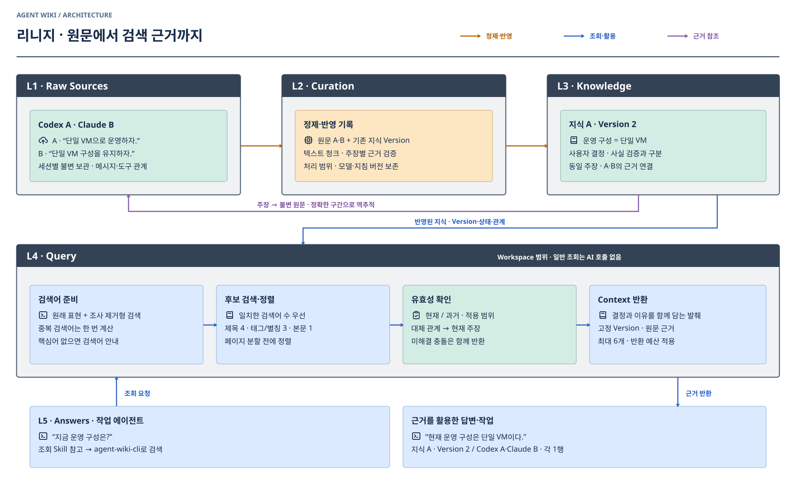

# 에이전트 조회와 백그라운드 수집·정제

**사용자는 Claude·Codex로 하던 작업을 계속한다. 기록 수집과 지식 정제는 그 대화 밖에서 실행한다.** 원격 Wiki에 원문·정제 기록·지식 개정과 근거 연결을 쌓는 것이 목표다.

현재 저장·조회 API와 CLI는 배포되어 있다. **별도 Collector와 자동 군집화·백그라운드 정제는 아직 미구현**이다. 수집 주기, 지원 클라이언트, 정제 실행 위치·모델 인증·사용량 정책은 구현 전에 정한다. [실제 상태](../OPERATIONS.md) · [전체 구조](architecture.md).

## 사용자는 어떻게 쓰나

작업 중 이전 결정이나 근거가 필요하면 에이전트가 Wiki를 조회한다. 예: “왜 단일 VM을 선택했지?” 조회한 개정과 원문을 근거로 답하고, 같은 작업 안에서는 필요한 자료를 재사용한다.

매 턴 수집 명령을 실행하거나 작업 종료 전에 정제·업로드를 요구하지 않는다. 새 세션·컴팩션마다 조회를 강제하지도 않는다. 수집·정제의 실패나 대기 시간이 사용자의 질문·응답 경로로 전파되지 않아야 한다. 조회 실패는 자료 없음과 구분하되 현재 대화로 가능한 작업은 계속한다.

현재 CLI로 필요한 지식을 조회할 수 있다.

```sh
wiki recall --project agent-wiki
wiki search "단일 VM" --project agent-wiki
```

`recall`은 프로젝트의 시작 문서·주제 목차를 가져오는 조회다. 수집이나 정제를 실행하지 않는다. 아직 자동 수집은 없으므로 저장하지 않은 대화를 이미 기억한다고 설명하지 않는다.

## 수집·정제는 별도 경로다

| 주체 | 할 일 | 작업 세션과의 경계 |
| --- | --- | --- |
| Claude·Codex 등 작업 에이전트 | 사용자와 작업, 필요할 때 근거 조회 | 수집·정제를 위한 메시지·자동 훅 없음 |
| 클라이언트 | 자신의 세션 기록 파일 작성 | 기록 파일 형식과 지원 범위를 먼저 확인 |
| Collector·Watcher | 허용한 기록을 읽기만 하고 변경분 전송 | 별도 프로세스. 대화 삽입·원본 수정·응답 대기 없음 |
| 백그라운드 정제 | 원격 원문과 기존 지식 조회, 군집화·정정·근거 연결 | 작업 대화와 별도 실행. 정제 실패도 별도 처리 |
| Wiki 서버 | 불변 원문·지식 개정·근거 저장과 검색 | 수집·정제 완료를 기다리지 않고 기존 지식 조회 제공 |

Collector는 모델을 실행하지 않는다. 프로젝트·세션·시간 등으로 수집 단위를 식별하고, 의미에 따른 군집화는 정제 단계에서 수행한다. 여러 세션을 하나의 지식으로 묶더라도 각 원문과 주장별 근거를 유지한다. Workspace가 다른 자료를 함께 정제하지 않는다.

**Skill은 지침이고 CLI는 통신 도구다. 둘 다 수집기·스케줄러가 아니다.** 정제 Skill은 별도의 백그라운드 실행에서 사용한다. 사용자가 현재 대화에서 명시적으로 기록을 요청한 경우에만 수동 반영을 예외로 제공한다.

백그라운드 정제도 모델 사용량이 필요하다. 개인 플랜으로 별도 실행 가능한지, 어떤 인증 방식인지 아직 확정하지 않았다. 기존 대화에 몰래 작업을 추가하거나 무료 실행·무제한 사용을 가정하지 않는다. Wiki 서버와 CLI에 현재 별도 모델 호출은 없다.

## Collector의 처리 기준

- 최초 한 번 수집 대상·제외 경로·Workspace를 설정한다. 대상 밖의 세션이나 비밀은 보내지 않는다.
- 세션 파일을 읽기만 한다. 작성 중인 마지막 줄은 다음 스캔으로 미루고, 잘림·회전·재작성은 새 파일 세대로 식별한다.
- 기기·클라이언트·세션·파일 세대·이벤트 또는 구간으로 동일 자료를 식별한다. 서버의 보관 성공을 확인한 뒤 전송 체크포인트를 전진시킨다. 응답 유실 때 같은 자료를 재시도해도 중복 원문이 생기지 않는 수집 계약은 추가 구현해야 한다.
- 네트워크 장애는 제한된 로컬 대기 자료와 재시도로 처리한다. CPU·디스크 읽기·전송량을 제한하고 활성 작업의 응답 경로와 연결하지 않는다. 같은 기기 자원 사용까지 물리적으로 0이라고 보장하지 않는다.
- 새 이벤트를 전송할 때 이전 세션 전체를 다시 덮어쓰지 않는다. 대상에서 제외되거나 지워진 파일을 원격 원문 삭제 지시로 해석하지 않는다.

로컬에는 연결 설정·비밀·전송 체크포인트·일시 대기 자료만 둔다. 프로젝트 역사의 영구 보관 위치는 원격 Wiki다. 연결 정보는 `.agent-wiki.json`, 비밀은 Git 제외 `.env.local`에 둔다.

## 원문은 불변, 지식은 개정



클라이언트가 계속 쓰는 세션 파일과 **L1의 고정 보관본**을 구분한다. Collector가 확정된 구간을 보관하면 그 내용은 불변이다. 새로운 대화·정정은 새 원문으로 추가한다. 제외·마스킹·줄바꿈 정규화를 했다면 원본과 동일하다고 하지 않고 실제 보관본의 해시·구간을 근거로 사용한다.

| 계층 | 보관하거나 실행하는 것 | 변화가 생기면 |
| --- | --- | --- |
| L1 원문 | 대화·문서·코드의 고정 보관본 | 새 원문 추가. 기존 내용 덮어쓰기 금지 |
| L2 정제 | 군집화·비교·해석·근거 연결을 수행한 실행 기록 | 새 실행 추가. 당시 입력·주체·지침·시점을 보존 |
| L3 지식 | Memory·Article·Glossary와 주장별 근거 | 새 개정 생성. 이전 개정·대체 관계 보존 |
| L4 조회 | 선택한 지식 개정과 인용 자료 | 답변에 사용한 개정을 고정해서 참조 |
| L5 활용 | 작업 에이전트의 답변·업무 | 실제 사용 기록이 없으면 답변까지 추적했다고 주장하지 않음 |

원문·기존 지식 개정 → 정제 실행 → 새 지식 개정·주장 → 근거 구간을 연결한다. L2의 방법론은 바뀔 수 있지만 과거 실행 기록을 다시 쓰지 않는다. 사용자 결정·관찰·AI 해석·미확인·작성자 진술과 사람의 검토 여부를 구분한다. 관련 문서 링크만으로 근거가 있다고 보지 않는다.

삭제·접근 제한은 불변 내용의 편집과 별개다. 현재 API의 논리 삭제는 접근·검색을 제한하고 근거를 사용 불가로 표시한다. Collector가 자동으로 원격 보관본을 삭제하지 않는다.

## 최소 반영 계약

아래는 **현재 구현된 저장·조회 API**다. 경로 앞에는 `/api/workspaces/:workspaceId`를 붙인다. 자동 Collector의 체크포인트·중복 수집 방지·정제 예약 실행까지 구현됐다는 뜻은 아니다.

| API | 입력·출력 |
| --- | --- |
| `POST /source-records` | 원문 보관. 이름·종류·원래 위치·내용 → 원문 식별자·고정 개정·보관본 해시·줄 범위 |
| `GET /source-records/:id/revisions/:revision` | 보관본 전체 또는 지정 줄 범위 |
| `POST /publications` | 멱등 키·정제 주체·입력·지식 변경·근거 → 적용한 식별자·개정 목록 |
| `GET /publications/:key` | 반영 응답 유실 시 같은 결과 확인 |
| `GET /recall?tag=agent-wiki` | 시작 문서·최근 변경·주제 목차. 모델 호출 없음 |
| `/context`·지식 개정 조회 | 키워드 주변 발췌·고정 개정 링크·근거 상태 |

권한은 `read`·`source:write`·`publish`를 구분한다. 목표 구성에서는 작업 에이전트에 조회, Collector에 원문 등록, 정제 실행에 조회·반영 권한을 분리한다. 현재 토큰이 자동으로 이 역할별로 교체되지는 않는다.

UTF-8 텍스트·Markdown·JSON을 받는다. 현재 원문 100KB 이하, 한 번에 지식 10개 이하·본문 합계 100KB 이하다. 큰 세션은 지원 어댑터에서 완성된 기록 단위로 나누고 출처 범위를 남겨야 한다. PDF·이미지 파싱은 후속이다.

원문 객체를 먼저 저장하고, 지식 변경 묶음·근거·반영 결과는 하나의 DB 트랜잭션으로 처리한다. 객체 저장까지 같은 트랜잭션이라고 설명하지 않는다. 반영 키가 같고 내용도 같으면 같은 결과를 반환하고, 내용이 다르면 충돌이다. 지식 개정 충돌은 최신 개정을 읽어 별도 정제 실행에서 다시 판단한다. 해시·인용 일치 검사가 내용의 진실성까지 보장하지는 않는다.

정제 결과의 정확한 JSON과 CLI 예시는 [정제 실행용 계약](../../packages/cli/skill/references/publication.md)을 따른다. 이는 백그라운드 구현과 수동 관리용 인터페이스이며 사용자의 일상 작업 절차가 아니다.

## 연결과 지침

관리자가 한 번 CLI를 설치하고 Workspace·태그·역할별 키를 연결한다. 에이전트 사용자가 매 작업마다 설치·수집·반영을 반복하지 않는다.

```sh
npm link ./packages/cli
wiki init --project agent-wiki --workspace <Workspace-ID> --tag agent-wiki
wiki skill install
```

Skill 설치는 자동 수집을 켜지 않는다. 현재 지침은 필요한 조회와 명시적 수동 기록, 별도 정제 실행의 근거 계약을 안내한다. 작업 시작·종료·매 턴에 정제를 강제하는 훅은 사용하지 않는다. npm 공개 배포·MCP·Collector 설치는 아직 후속이다.

## 전환 순서

1. 클라이언트 기록 형식·허용 범위를 확인하고 읽기 전용 Collector와 서버의 중복 수집 방지 계약을 만든다.
2. 원격 원문 보관·체크포인트·중단 후 재전송을 검증한다. 이 단계는 모델을 호출하지 않는다.
3. 별도 정제 실행의 위치·모델 연결·사용량 한도를 정한다. 활성 작업 세션을 재사용하지 않는다.
4. 군집화 → 기존 지식 비교 → 근거 연결 → 반영을 비동기로 수행한다. 입력 원문과 정제 실행을 추적한다.
5. 사용자 작업의 응답 대기·자동 메시지 삽입이 없고, 다음 조회에서 새 지식과 고정 근거가 발견되는지 검증한다.

VM·인증서·도메인·로그인·모니터링·현재 Wiki API는 유지한다. 이번 설계 정비에서 Collector 설치, 모델 실행, 데이터 초기화는 하지 않는다. 웹 사용법 문구는 새 설계와 현재 구현 상태에 맞춘다.

## 기존 지식 5개 교체

이전 수동 초안의 초기화와 원문에 근거한 지식 재등록은 이미 수행한 작업이다. [운영 현황](../OPERATIONS.md)의 당시 기록을 따른다. [프로젝트 역사](project-history.md)는 원격 Wiki의 지식이며 로컬 문서를 계속 복제·갱신하지 않는다.

## 실제로 검증할 시나리오

| 시나리오 | 기대 결과 |
| --- | --- |
| 사용자가 Claude·Codex로 계속 작업 | 수집을 위한 대화 삽입·턴 지연·종료 대기 없음 |
| 기록 작성 중·파일 회전·기기 재시작 | 완성된 이벤트만 보관, 누락·중복 여부 확인 |
| 업로드 성공 응답 유실·재시도 | 같은 원문이 한 번만 보관되고 체크포인트 복구 |
| 정제 실패·모델 사용량 소진 | 지식 개정 미완료 상태 보존, 사용자 작업은 계속 |
| 여러 세션을 같은 주제로 묶음 | 각 원문과 주장별 근거·정제 실행을 추적 |
| 과거 결정을 새 대화에서 정정 | 과거 원문·실행은 불변, 새 지식 개정과 대체 관계 생성 |
| 다른 Workspace·틀린 인용·개정 충돌 | 반영 전체 거부, 별도 실행에서 재검토 |
| 작업 에이전트의 근거 조회 | 기존 지식을 즉시 조회. 진행 중인 수집·정제를 기다리지 않음 |

현재 API 검증과 아직 미구현인 Collector·정제 실행의 검증을 구분한다. 수집 범위·지연 때문에 아직 보관하지 못한 내용을 이미 기억한다고 말하지 않는다.
