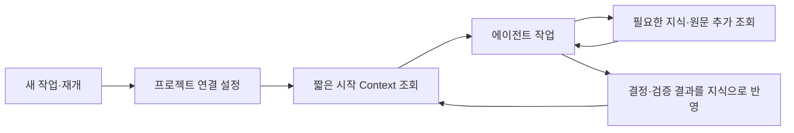

# 에이전트가 정제하고 Wiki가 보관하는 기억

2026-09-12 개인 에이전트 정제·원문 보관·지식 반영·조회와 메뉴별 페이지를 구현했다. 이 문서는 사용법과 현재 계약이며, 운영 전환 상태는 [운영 현황](../OPERATIONS.md)을 따른다.

현재는 **개발 모드**다. 새 스키마의 최초 배포에서 Wiki 지식·개정·원문 메타데이터·API 키와 이전 큐를 초기화한다. 로그인·Workspace·클라우드 인프라·모니터링은 유지한다. 사용자가 운영 모드를 선언하면 보존 기준을 다시 정한다.

## 먼저 써 보기

저장소에서 한 번 설치한다. 토큰은 웹의 **에이전트 연결**에서 발급하고 Git 제외 `.env.local`의 `WIKI_TOKEN`에 보관한다.

```sh
npm link ./packages/cli
wiki init --project agent-wiki --workspace <Workspace-ID> --tag agent-wiki
wiki skill install
wiki recall --project agent-wiki
wiki search "Atlas에서 왜 독립했나" --project agent-wiki
```

`wiki init`은 비밀이 없는 `.agent-wiki.json`을 만든다. Skill은 프로젝트의 `.agents/skills/agent-wiki`에 설치한다. 현재 저장소의 시작·재개 지침에서도 `recall`을 연결한다. npm 레지스트리에는 게시하지 않았다.

에이전트에게 **“이 프로젝트의 현재 결정과 남은 일을 Wiki에서 읽고 이어서 하자”**, 작업 뒤에는 **“방금 결정과 검증 결과를 근거와 함께 Wiki에 남겨줘”**라고 요청하면 된다. 자동으로 모든 대화를 수집하지 않는다.

웹 메뉴는 `/workspaces/<id>/knowledge`, `sources`, `activity`, `connections`, `guide`로 분리했다. 검색어·태그·개정·근거 탭·원문 줄 범위를 URL에 남기므로 새로고침과 뒤로 가기에서도 유지된다.

## 제품의 중심

Wiki는 에이전트의 다음 작업에 필요한 지식을 원격에서 보관하는 도서관이다. 사용 중인 에이전트가 원문을 읽고 정리하며, 서버는 원문·지식 개정·근거 관계를 보관하고 필요한 내용을 반환한다. 웹은 읽기·정정·근거 추적을 돕는다.

에이전트의 대화 맥락은 작업 중 기억이고, Wiki는 세션을 넘어 쓰는 장기 기억이다. Handoff는 Wiki의 최신 지식으로 구성하는 짧은 작업 재개 자료다. 매번 대화 요약을 덧붙이는 하나의 거대한 파일로 만들지 않는다. 개정·출처·찾는 방법이 있어야 잊은 자료도 다시 발견할 수 있다.

| 책임 | 실행 위치 |
| --- | --- |
| 대화·코드·문서에서 결정·근거 추출, 기존 지식과 비교 | 사용자가 이미 쓰는 에이전트 |
| 정제 규칙·충돌 처리·언제 읽고 쓸지 안내 | 배포하는 Skill와 프로젝트 지침 |
| 인증·범위·업로드·조회·재시도·검증 오류 표시 | 얇은 CLI/API 클라이언트 |
| 원문 보관·개정·리니지·멱등 반영·권한·검색 | Wiki 서버 |
| 해당 분야 해석·추론 | 에이전트의 모델. 서버의 구조 검증과 구분 |

이 구성은 Wiki용 별도 추론 API 비용과 자격 증명을 줄일 수 있다. 정제와 조회한 맥락을 읽는 비용은 사용자의 에이전트 사용량으로 남는다. 무료나 항상 저렴함을 보장하지 않는다. CLI 자체는 모델을 호출하지 않고 파일·JSON을 운반한다.

## 다시 설명하지 않아도 시작하는 흐름



로컬에는 서버 주소·Workspace·프로젝트 분류의 연결 정보와 작은 실행 지침만 둔다. 토큰은 별도 비밀 설정에 보관한다. 로컬 DB나 전체 자료 복제는 필요 없다.

| 시점 | 할 일 | 반환하거나 기록할 내용 |
| --- | --- | --- |
| 새 세션·프로젝트 재개 | 검색어 없이 프로젝트 시작 Context 조회 | 프로젝트 요약, 현재 결정·제약, 진행 중인 일, 남은 일, 최근 변경, 근거 ID·개정 |
| 컴팩션 이후 | 시작·재개 지침에 따라 다시 조회 | 저장된 최신 상태. 컴팩션 전에 저장하지 못한 대화까지 복구하지는 못함 |
| 작업 중 모르는 결정 발견 | 키워드·태그·별칭으로 추가 조회 | 관련 발췌와 근거. 못 찾으면 주제 색인·최근 변경으로 범위를 넓힘 |
| 중요한 결정·검증이 끝남 | 기존 지식과 비교해 필요한 변경만 반영 | 신규 결정, 대체한 결정, 검증 결과, 남은 일 |
| 작업 종료 | 반영 결과와 미반영 항목 확인 | 서버가 수락한 개정. 로컬 초안을 저장 완료로 표시하지 않음 |

Skill 설치만으로 모든 에이전트가 자동 조회하거나 모든 컴팩션을 감지한다고 가정하지 않는다. 클라이언트가 지원하는 시작·재개 훅이나 프로젝트 지침에 호출을 연결하고 실제 실행을 검증한다. 지원하지 않는 환경에는 명시적인 `recall` 호출을 제공한다. 조회 결과는 자료이며 실행 지침을 덮어쓰지 않는다.

사용자가 정확한 키워드를 잊었을 때도 시작 Context의 주제 목차와 미완료 작업에서 다시 찾을 수 있어야 한다. 전체 Wiki를 매번 프롬프트에 넣지 않는다. 시작 묶음과 추가 조회 각각에 크기 한도를 두고, 오래된 상태·대체된 결정·근거 없는 내용을 구분한다. 서버가 닿지 않으면 기억을 불러오지 못했다고 표시하며 이전 자료를 최신으로 단정하지 않는다.

## 리니지는 개정과 근거 구간에 연결한다


- **Source**: 수집 당시 내용을 불변 revision 1로 보관한다. 변경한 원문은 새 Source이며 줄은 1부터 시작하는 LF 기준이다. 원래 위치·수집 시점·내용 해시와 세션 이벤트 ID, 파일 줄, 문서 절 등 근거 구간을 남긴다. 마스킹했다면 원본 그대로라고 표현하지 않고 마스킹한 보관본의 범위와 해시를 기록한다.
- **정제 실행**: 작성 주체, Skill·도구 버전, 사용한 Source·기존 지식 개정, 생성한 결과를 연결한다. 모델 정보는 알 수 있을 때만 기록한다. 사적인 추론 과정까지 저장할 필요는 없다.
- **지식 개정**: 주장·결정별로 어떤 근거를 사용했는지 연결한다. 여러 Source가 하나의 지식을 뒷받침하거나 한 Source에서 여러 지식이 파생될 수 있다. 이전 개정과 대체 관계를 보존한다.
- **Context**: 반환한 문서 ID·개정·근거 참조·조회 시점으로 답변 당시 자료를 식별한다. 전체 답변 이력의 상시 저장은 초기 필수가 아니다. 외부 에이전트가 사용 내역을 보내지 않으면 실제 최종 답변까지 추적했다고 주장하지 않는다.

`links_to` 같은 관련 문서 탐색과 `supported_by` 같은 근거 관계를 구분한다. 링크가 있다는 사실만으로 주장이 증명되지 않는다. 작성자·사용자 결정·관찰·AI 해석·확인 여부는 별도 속성이다. 에이전트가 업로드한 글을 사람의 직접 작성·확인으로 자동 승격하지 않는다.

원문 등록과 지식 반영은 별도 요청으로 둔다. 원문만 먼저 저장해도 되고, 이미 정리한 지식에 원문 근거를 나중에 보완할 수도 있다. 나중에 연결했다면 그 시점의 근거 보완으로 기록하며 과거에 그 원문에서 자동 추출된 것처럼 실행 이력을 만들지 않는다. 원문이 없으면 원문 없음·작성자 진술로 남긴다.

## 원문 보관 → 정제 → 반영

아래 CLI를 사용할 수 있다. 정확한 변경 묶음 예시는 [배포하는 Skill 계약](../../packages/cli/skill/references/publication.md)을 따른다.

```text
wiki recall --project agent-wiki
wiki search "VM 선택 이유" --tag agent-observatory
wiki source add decision-excerpt.md
  → source_id, revision, 저장된 근거 구간

# 에이전트가 원문과 기존 지식을 읽어 변경 묶음을 작성
wiki publish changes.json
  → 적용한 지식 ID·개정 또는 충돌·검증 오류
```

변경 묶음에는 새 내용, 기준 지식 개정, 사용한 Source의 고정 참조와 인용 구간, 변경 이유, 정제 실행 정보, 멱등 키를 넣는다. 원문·기존 개정·지식 결과는 모두 같은 Workspace여야 한다.

서버는 원문 존재·해시·인용 구간, 권한, 개정 충돌, 입력 크기·형식, 같은 키의 payload 일치를 검사한다. 지식 개정과 리니지 관계는 같은 DB 트랜잭션에서 반영한다. 원문 객체는 먼저 저장·등록하고, 실패하면 미사용 원문으로 남을 수 있다. DB 밖 객체 저장까지 한 트랜잭션이라고 설명하지 않는다.

기계적인 검증은 주장의 진실성이나 해석의 타당성까지 보증하지 않는다. 기준 개정이 바뀌었으면 덮어쓰지 않고 최신 지식과 비교한다. 기존 근거를 새 주장에 복사해 붙이지 않는다. 오류·중복·COMMIT 응답 유실은 CLI가 같은 키로 결과를 확인하고 처리한다.

정제 Skill은 원천 자료 범위 선택 → 비밀 제외 → 기존 지식 조회 → 결정·관찰·추론 구분 → 근거 구간 연결 → 변경 묶음 작성 → 반영 결과 확인 순서를 안내한다. 턴마다 모든 대화를 다시 분석하지 않고 의미 있는 변경만 처리한다. 임의 문장 수·점수로 지식의 신뢰를 확정하지 않는다.

## 이전 버전에서 바뀐 부분

| 이전 구현 | 새 구현 |
| --- | --- |
| 원문 등록에 `allowExternalAI=true` 필수, 즉시 pg-boss 작업 등록 | 원문 보관은 AI 호출과 분리 |
| Worker가 NVIDIA에 추출 요청 | 사용 중인 에이전트가 정제. 서버 추론 제거 |
| 지식에 단일 `source_id`, 문서 간 링크 | 지식 개정과 원문 개정·구간의 다대다 근거, 정제 실행 기록 |
| 웹 편집 결과를 일괄 `user_authored` 처리 | 실제 작성 주체와 확인 상태를 구분 |
| 에이전트 키는 `read`·원문 접수용 `ingest` | 조회·원문 보관·지식 반영의 범위별 권한. 새 계약의 키로 다시 발급 |
| 검색어 기반 Context, 문서 앞부분 반환 | 검색어 없는 시작 Context + 질문에 맞는 추가 조회 |

L1–L5의 논리적 역할은 유지할 수 있다. L2의 정제는 클라이언트 에이전트가, 구조 검증·저장은 서버가 수행한다. L5의 응답은 사용자의 에이전트가 만든다. 계층 순서는 배포 서버의 직렬 파이프라인을 뜻하지 않는다.

## 최소 반영 계약

아래는 **구현할 API와 데이터 계약**이다. 하위 호환성은 유지하지 않는다. 원문 접수·권한·지식 반영 계약을 새로 정의하고 앱·CLI를 함께 교체한다. 기존 수집 API와 키는 종료하고 새 키를 발급한다.

| API | 입력·출력 |
| --- | --- |
| `POST /source-records` | 원문 보관만 수행. 이름·종류·원래 위치·내용 → Source ID·고정 개정·보관본 해시·줄 범위 |
| `GET /source-records/:id/revisions/:revision` | 보관본 전체 또는 지정 줄 범위. 권한·범위를 검사 |
| `POST /publications` | 멱등 키·정제 실행·지식 변경·근거 연결 → 적용 ID·개정 목록 |
| `GET /publications/:key` | 응답 유실 시 같은 반영의 결과 확인. Workspace 범위 |
| `GET /recall?tag=agent-wiki` | 시작 Article·현재 상태·최근 변경·주제 목차. 모델 호출 없음 |
| 기존 `/context`·개정 조회 | 질문 주변 발췌·고정 개정 링크·근거 상태 보완 |

권한은 `read`·`source:write`·`publish`를 구분한다. CLI에 필요한 조합만 발급한다. 기존 키는 폐기한다. `publish`는 다른 Workspace나 관리자 설정을 수정할 수 없다.

최초 범위는 UTF-8 텍스트·Markdown·JSON, 원문 100KB 이하, 반영 10개 지식 이하·본문 합계 100KB 이하로 시작한다. 큰 문서는 의미 단위로 선택하고 선택 범위·원래 위치를 기록한다. 라인 끝을 LF로 통일하고 서버 마스킹 후 **보관본**의 해시와 1부터 시작하는 줄 범위를 근거 기준으로 반환한다. 보관본이 바뀌면 클라이언트가 이를 다시 읽고 근거를 작성한다. PDF·이미지 파싱과 전체 세션 자동 수집은 후속이다.

```json
{
  "idempotencyKey": "demo-publication-001",
  "producer": {"type": "agent", "client": "demo-client", "skillVersion": "1"},
  "changes": [{
    "clientRef": "single-vm-decision",
    "articleId": null,
    "baseRevision": null,
    "kind": "memory",
    "title": "단일 VM 결정",
    "content": "현재는 단일 VM으로 운영한다. 분리는 후속으로 검토한다.",
    "tags": ["agent-wiki", "oci"],
    "claims": [{
      "anchor": "decision-1",
      "text": "현재는 단일 VM으로 운영한다.",
      "type": "user_decision",
      "evidence": [{"sourceId": "demo-source", "revision": 1, "lines": [1, 1], "quote": "지금은 단일 VM으로 운영하자."}]
    }]
  }]
}
```

합성 요청 예시다. 신규 지식은 `clientRef`로 결과 ID를 대응시키고, 수정은 실제 `articleId`와 `baseRevision`을 넣는다. 서버는 인용이 해당 보관본 구간과 일치하는지 확인하며 확인되지 않은 주체·모델 정보를 채우지 않는다. 사용자 확인 상태는 별도이며 에이전트가 제출한 `user_decision`이 곧 사람의 검토 완료를 뜻하지 않는다. 확인 권한은 소유자 웹 세션에 두고 새 개정은 다시 미확인으로 시작한다.

DB는 새 계약에 맞춰 지식·개정, 원문 개정, 정제 실행, 개정별 주장·근거 연결, 반영 결과, 프로젝트 시작 문서 참조를 설계한다. 기존 테이블 형태·문서 ID·API 계약에 맞추는 마이그레이션은 만들지 않는다. 근거는 `Source revision → claim → Knowledge revision`으로 묶고 관련 링크·대체 관계와 분리한다. 기존 지식 개정을 정제 입력으로 사용했다면 그 고정 개정도 기록한다. 입력 없이 쓴 메모는 `author_statement`로 구분한다.

지식 변경 묶음 전체와 근거·반영 결과를 한 DB 트랜잭션으로 처리한다. 하나라도 충돌하면 모두 거부하고 최신 개정을 돌려준다. 같은 멱등 키·같은 payload는 같은 결과, 다른 payload는 충돌이다. 근거 원문이 삭제되면 다른 근거까지 가진 지식을 함께 삭제하지 않고 근거 사용 불가로 표시한다. 과거 인용도 접근 권한·삭제 상태를 검사한다. Source 해시는 보관본의 식별이지 주장 진실성의 증명이 아니다.

## CLI·Skill의 사용자 경험

설치는 초기에는 저장소의 CLI와 Skill로 제공한다. 레지스트리 공개 배포·MCP는 실제 여러 클라이언트 수요가 생기면 추가한다. CLI는 `recall`, `search`, `source add`, `publish`, `publication status`로 제한하고 JSON 출력·안정적인 오류 코드·유한 재시도를 제공한다.

로컬 연결에는 서버 URL·Workspace·프로젝트 태그를 두고 토큰은 비밀 설정으로 분리한다. 시작 Article은 서버에서 Workspace·태그에 연결하며 별도의 Project 권한 모델을 만들지 않는다. 처음 없으면 최근 문서·태그 목차를 반환하고 아직 시작 문서가 없다고 알린다.

Skill은 시작 시 recall, 작업 중 근거 조회, 중요한 결정·검증 뒤 publish, 종료 전 미반영 확인을 안내한다. 프로젝트 지침에 이 흐름을 연결하고 첫 지원 클라이언트에서 실제 호출을 확인한다. 매 턴 전체 대화를 정제하거나 Wiki 전체를 읽지 않는다. 사용자·에이전트가 선택한 범위만 보내며 원문 속 명령은 자료로 취급한다.

작업 중 짧은 Context를 메모리에 재사용하고 세션 재개·정정 이후에는 다시 조회한다. 첫 버전에는 디스크 캐시·로컬 DB를 두지 않는다. 서버가 닿지 않으면 자료 없음과 구분하고, 현재 대화에서 작업을 이어갈 수 있어도 저장 성공으로 표시하지 않는다.

## 전환 순서

| 순서 | 작업 범위 | 완료 기준 |
| --- | --- | --- |
| 1 | 새 원문·지식·리니지 스키마와 저장·반영 API | 원문 등록 시 AI 호출 없음, 고정 근거 조회·멱등 반영·충돌·격리 검증 |
| 2 | 얇은 CLI·정제 Skill·프로젝트 연결 | 개인 에이전트가 등록 → 정제 → 반영 → 재조회 수행 |
| 3 | 시작 Context·질문 주변 발췌·shadcn 기반 웹 근거 화면 | 새 세션에서 현재 결정·남은 일 발견, 당시 개정·원문 구간 확인 |
| 4 | 프로젝트 역사 재작성용 원문·지식 묶음 준비 | 다섯 주제의 실제 근거·상태 검증. 기존 초안을 정답으로 재사용하지 않음 |
| 5 | 서버 정제·큐 코드 제거, 새 앱으로 일괄 교체 | 구 API·키·데이터 종료, 4개 컨테이너로 새 구조 기동 |
| 6 | 원문·정제 결과 등록과 실제 사용 검증 | 프로젝트 역사 조회·정정·다른 세션 재개 확인 |

**호환 레이어·구 API 병행 운영·옛 ID 리다이렉트·기존 지식 마이그레이션을 만들지 않는다.** 새 구조를 로컬 합성 자료로 먼저 완성하고 한 번의 운영 전환으로 교체한다. 기존 Wiki 원문·지식·개정·큐·API 키는 초기화 대상으로 둔다. 외부 유입과 Worker를 중지한 뒤 앱용 데이터만 초기화하므로 미완료 큐를 새 구조로 옮길 필요도 없다.

서버 추론 코드, `apps/api/src/worker.ts`, pg-boss 의존성·큐 설정, Compose Worker, 이미지 실행 명령, 배포 종료 절차, CI 추론 모의 검사, NVIDIA 런타임 변수·문서를 함께 정리한다. 기존 Worker 종료 뒤 신규 구조에는 API 정상 종료·멱등 재시도만 남긴다.

새로 만드는 범위는 **Wiki 앱·데이터 계약**이다. 이미 운영 중인 VM·볼륨·인증서·도메인·GitHub OAuth·비용/Slack 모니터링은 그대로 사용한다. 원문 버킷은 모니터링 체크포인트도 포함하므로 버킷 전체 삭제를 하지 않는다. 초기화 스크립트는 Wiki 전용 테이블·객체 경로만 대상으로 작성하고 비밀 설정을 보존한다. 새 스키마 버전 표식을 사용해 최초 한 번만 초기화하며 이후 배포에는 반복하지 않는다. 원문 객체와 모니터링 체크포인트는 일괄 삭제하지 않는다.

웹 재구성은 [디자인 규칙](../DESIGN.md)의 shadcn/ui 공식 컴포넌트·Neutral 테마를 기본으로 한다. 원문·개정·리니지 기능을 공식 UI 조합에 담고, 자체 버튼·메뉴 스타일을 새로 설계하지 않는다.

## 기존 지식 5개 교체

기존 글은 수동 등록한 초안이며 원문 Source와 정제 리니지가 없다. 최초 전환에서 삭제하고 새 근거로 다시 작성한다. 목표는 기존 글을 정답으로 삼지 않고 실제 자료에서 다시 작성하는 것이다.

1. 실제 대화 발췌와 고정 커밋의 문서를 선택한다. 원문·비밀·리소스 식별자를 구분하고 비밀은 제외한다.
2. 등록한 보관본으로 역사·분리 이유·검색 선택·VM 선택·검증 상태의 다섯 주제를 다시 정제한다. 기존 요약은 찾을 단서이며 그 요약 자체가 과거 결정의 증거는 아니다.
3. 새 계약의 지식 묶음을 로컬에서 검증한다. 주장의 근거·상태와 문서 간 연결을 확인한다.
4. 운영 전환 때 기존 다섯 문서와 옛 개정·키를 초기화하고 원문 → 새 지식 순서로 등록한다. 새 문서 ID로 시작 문서와 관계를 구성한다.
5. 과거 자동 추출 실행 이력을 꾸미지 않는다. 새 정제 실행은 실제 새 작업 시점으로 기록한다. 이전 ID·검색 결과의 호환성은 제공하지 않는다.

확인할 수 없는 결정 이유는 생략하거나 미확인으로 둔다. 새 정책이 과거 기록을 덮어쓰지 않도록 당시 사실과 현재 결정을 분리한다. 프로젝트 분류와 다중 태그는 [첫 지식 묶음](project-history.md)을 따른다.

## 실제로 검증할 시나리오

| 시나리오 | 기대 결과 |
| --- | --- |
| 처음 연 세션에서 “이 프로젝트 이어서 하자” | 프로젝트 연결만으로 현재 결정·제약·남은 일과 목차 조회 |
| “왜 임베딩 없이 시작했지?” | 관련 구간과 원문 고정 개정 인용. 못 찾으면 미확인 표시 |
| 다른 세션에서 결정을 정정 | 최신 결정 재조회, 과거 결정에는 대체 상태 표시 |
| 웹·두 에이전트가 같은 문서 수정 | 먼저 반영된 개정 유지, 뒤 요청은 충돌. 조용한 덮어쓰기 없음 |
| COMMIT 후 응답 유실·같은 키 재시도 | 하나의 반영·개정만 존재, 원래 결과 반환 |
| 틀린 인용·범위·다른 Workspace | 묶음 전체 거부, 부분 지식·근거 저장 없음 |
| 원문 삭제·다중 근거 | 삭제 근거 사용 불가 표시, 다른 근거·지식 임의 삭제 없음 |
| API 종료 중 조회·반영 | 진행 요청 완료 또는 같은 키로 결과 확인. 중복 반영 없음 |
| 서버 단절·컴팩션 | recall 실패 명시, 미저장 대화를 복구했다고 주장하지 않음 |
| 전환 후 원문·지식 반영 | Wiki 서버의 모델 API 호출 0건, Worker 없이 저장·조회 성공 |

합성 자료로 실패·격리·재시도를 먼저 확인하고, 프로젝트 역사로 실제 사용 흐름을 확인한다. 완료 시 문서·로컬 검증·푸시·배포·운영 조회를 구분해 기록한다. 추론 품질은 한 번의 성공으로 보장하지 않고 잘못된 해석을 정정·추적할 수 있는지 확인한다.
