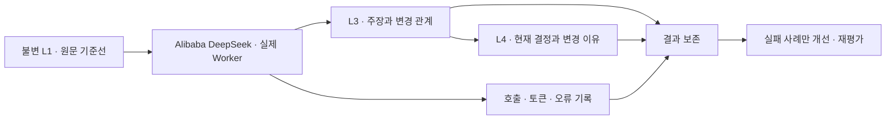

# 실제 원문 정제 평가

**현재 설정으로 기준선 측정 → 실패 원인 분류 → 한 요소 변경 → 미사용 질문 재검증.** 모델 호출과 정제 재개는 사용자가 별도로 요청한 뒤 실행한다.



## 호출 전에 고정한 기준

[cases.json](cases.json)에 실제 대화에서 나온 결정 12개와 질문을 고정했다. 10개는 개선용, 2개는 개선에 사용하지 않을 확인용이다. 기대 문장을 키워드 매칭으로 자동 정답 처리하지 않는다. 원문의 사용자 발언과 변경 관계, 현재 주장의 적용 범위를 에이전트가 읽어 판정한다. 이 평가는 제품의 사용자 검토 완료와 별개이며 `review confirm`을 실행하지 않는다.

| 가설 | 측정 · 실패 원인 |
| --- | --- |
| 30K 한도·추론 high로 중요한 결정을 보존한다 | 기대 결정 누락, 청크당 최대 12개 출력에 의한 누락, 잘림, 실제 입력/출력/추론 토큰 |
| 기존 지식 검색이 세션·증분을 넘는 변경을 연결한다 | 후보가 없었는지, 후보는 있었지만 선택에서 빠졌는지, AI가 잘못 연결했는지 구분 |
| 현재 결정과 변경 이유를 각각 조회할 수 있다 | 같은 주제의 current/history 응답, 과거 주장·정정 원문까지 추적 |
| 반복 입력·출력·재시도부터 줄이는 것이 효율적이다 | 같은 평가 사례의 품질을 유지한 입력/출력 절감과 재호출 토큰. 추론·캐시는 각각 출력·입력의 부분집합 |

판정은 `통과 / 실패 / 미처리 / 판단 보류`와 근거를 함께 남긴다. 미처리 원문의 기대 결정을 추출 실패로 세지 않는다. 최초 잠정 목표는 처리된 개선용 사례 10개 중 9개 이상에서 결정·근거를 찾고, 확인용 2개는 별도 보고하는 것이다. 근거 없는 대체·과거 결정으로 회귀·허위 검증·범위 혼합은 한 건도 허용하지 않는다. 작은 표본의 점수로 전체 정확도를 주장하지 않는다. 모든 중간 결정의 완전성을 이 12개가 보장하지 않는다.

## 실행 전후 보존

저장소 루트에서 실행한다. 현재 설치된 Client 연결과 `.runtime/k3s-ssh.json`의 기존 VM 연결을 사용한다. 별도 클라우드 자원·모델·스케줄러는 만들지 않는다.

`prepare`의 원문 탐색 문구는 Git 제외 `.runtime/curation-evaluation/selectors.json`의 `{caseId: [검색 문구]}`로 제공한다. 현재 환경에는 작성해 두었다. 실제 원문 인용과 탐색에 쓴 사용자 문장도 저장소에 넣지 않는다. `capture`·`compare`는 이 파일을 요구하지 않는다.

```bash
# 최초 한 번: 원문 ID/해시, 설정, 기존 지식/호출, 사용자 근거 후보, 검색 기준선
node experiments/curation/production/capture.mjs prepare baseline

# 사용자 재개 지시 직전: 새 수집·설정 변화와 시작 시점을 다시 기록
node experiments/curation/production/capture.mjs capture before-first-run

# 사용자가 실행을 승인한 별도 단계에서 CLI로 재개. 이 도구는 재개하지 않는다.
# 점검 시 CLI로 중지하고 진행 작업 종료 후 아래 실행
node experiments/curation/production/capture.mjs capture after-first-run
node experiments/curation/production/capture.mjs compare before-first-run after-first-run first-report
```

- DB의 repeatable-read/read-only 트랜잭션에서 원문 목록·처리 위치·원본 모델 출력·주장·Version·근거·관계·발행 기록을 읽는다. 원문 본문 전체, API 키, 암호화 키, 추론 본문은 내보내지 않는다. 근거 후보는 원문 해시를 검증하고 구조상 user인 행에서 찾되 복사·전달·가정 여부는 사람이 아닌 작업 에이전트가 추가 검수한다.
- 자동 정제 활성 또는 진행 작업이 있으면 스냅샷을 거부한다. 검색 응답은 그 뒤 읽으므로 평가 중 다른 Client의 수동 지식 변경도 하지 않는다. 원문 수집은 계속될 수 있다.
- 실제 자료·근거 인용·내부 ID는 Git에서 제외된 `.runtime/curation-evaluation/`에만 저장한다. 폴더 0700·파일 0600, 기존 결과 덮어쓰기 금지, JSON SHA-256 동반 저장. Git에는 코드·합성 테스트·평가 기준만 둔다. 이 결과는 임시 실험 자료이며 제품 역사 문서가 아니다.
- 비교는 이전부터 있던 호출 ID를 제외한다. 초기화 후에도 보존되는 과거 토큰을 새 실험 사용량에 합산하지 않는다. 모델 요청 생략은 호출 수에서 제외하고, 미보고 사용량은 0으로 보지 않는다.
- 각 캡처의 `.scorecard.json`에 판정·주장/관계/검색 근거·실패 단계를 적는다. `anchors-final.json`은 기준선 후보 중 실제 직접 지시와 질문·전달 지침을 검수한 로컬 파일이다. 원문 범위를 아직 처리하지 않았으면 미처리로 둔다. 점수표 작성은 원격 지식의 검토 완료를 변경하지 않는다.
- **이 도구는 평가 원문 목록을 고정하지만 Worker의 큐를 그 목록으로 제한하지 않는다.** 첫 실행은 실제 운영 흐름의 관찰 기준선이다. 수집 증분이 달라지면 `sameInputs=false`로 표시하며 동일 입력 A/B 비교로 보고하지 않는다. 엄밀한 반복 비교가 필요해진 경우, 실패 사례의 고정 원문·선행 맥락을 격리 재생하는 단계로 좁힌다. 현재 구현하지 않은 부분 재생성·자동 중단을 제공한다고 표현하지 않는다.
- L2·L3 초기화 전에는 반드시 중지 → 진행 0 → after 스냅샷과 해시 확인 → 비교 기록 순서로 보존한다. L1과 수집 위치는 초기화하지 않는다. 다음 실행도 `before` 스냅샷을 새로 만들고 이전 결과와 혼동하지 않는다.

## 첫 실행의 점검과 중단 기준

사용자가 재개를 지시하면 기존 CLI로 시작하고 **처음 완료한 처리 묶음과 첫 10회 모델 요청 전후**에 점검한다. 상주 자동 감시 기능은 추가하지 않았다. 작업 에이전트가 진행 중 직접 조회하며, 관측 사이 동시 요청 때문에 10회가 정확한 상한은 아니다. 첫 실행을 켜두고 무인 반복 초기화하지 않는다.

- 원문 무결성·인증 오류 또는 허위 대체를 발견하면 중지한다. 이미 진행 중인 최대 5개 실행은 종료 절차에 따라 마무리될 수 있다.
- 같은 청크에서 동일한 출력 검증 오류가 3회 연속이면 계속 비용을 쓰기 전에 멈추고 사례를 조사한다. 일시적인 429/5xx 한 건은 기존 재시도를 관찰한다.
- 첫 10회에서 절반 이상 실패하거나 10분간 반영 진척이 없으면 원인을 조회한다. 일시적인 실패만으로 실험을 포기하지 않으며 동일 오류의 무진척 반복일 때 중지한다. 요청 성공과 지식 반영 성공을 구분한다.
- 비용 계측은 입력·출력과 실패/재시도분을 각각 보고한다. 무료 쿼타 잔량·과금은 공급자 별도 확인 사항이며 이번 준비가 쿼타를 예약하거나 과금을 차단하지 않는다. 재개 직전 공급자의 해당 모델 Stop-on-Exhaust 상태를 확인한다.
- 첫 결과 이후 유력한 개선 하나만 작은 실패 사례로 확인한다. 예: 반복 메타데이터 축약, 관련 지식 선택, 과도한 출력 중복. 모델·청크·추론을 한꺼번에 바꾸거나 전체 원문을 무조건 3회 재처리하지 않는다.

사용자는 소액 비용과 일시적 실패를 허용한다. 원문 바이트만으로 비용이 크다고 결론내리거나 실행 전 과도하게 최적화하지 않는다. 첫 실행의 실제 입력·출력 사용량과 실패 재호출분을 합산하고 필요하면 Alibaba 사용량 화면과 대조한 뒤 다음 실험 규모를 정한다.

현재 DeepSeek 입력 카운터는 UTF-8 바이트 기반 보수 추정이다. 설정의 30K가 실제 공급자 입력 30K를 채운다는 뜻은 아니다. 첫 호출의 `diagnostics.inputBudget.estimatedTokens`와 실제 `prompt_tokens` 비율도 확인한다. 전송량 축소나 추정기 변경 전에 근거 위치·긴 도구 결과·사용자 결정 누락에 미치는 영향을 확인한다.

구현·실제 준비 결과는 [운영 현황](../../../docs/OPERATIONS.md)에 둔다. 실험 방향은 [L2·L3 기억 설계](../../../docs/l2-l3-memory.md)를 따른다.
